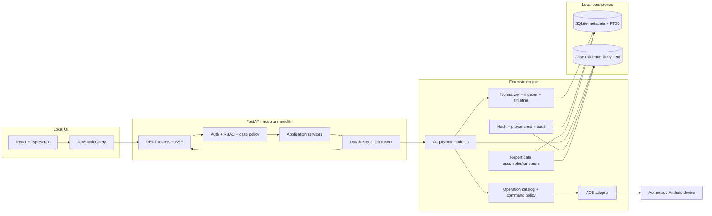
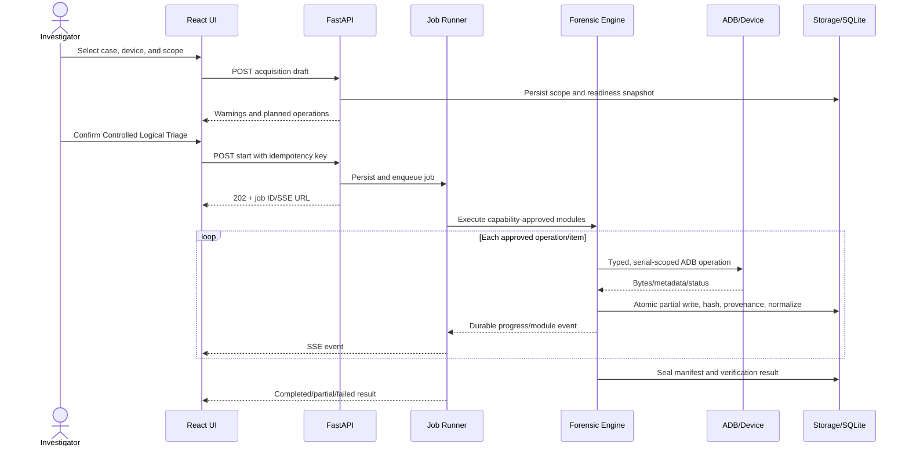
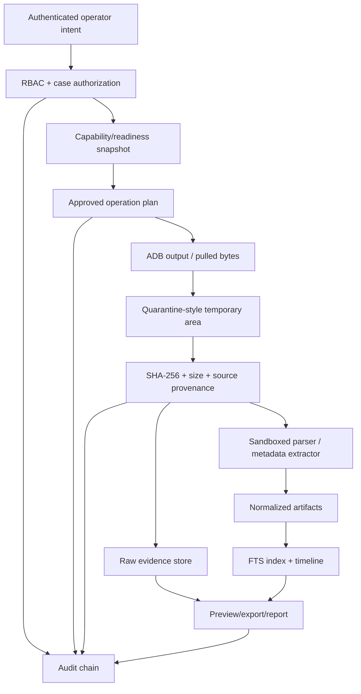
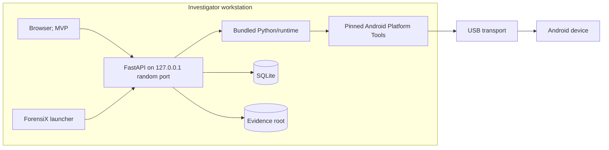
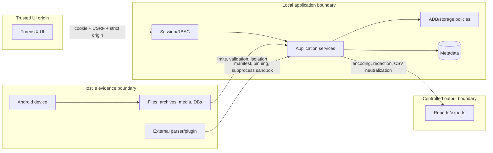
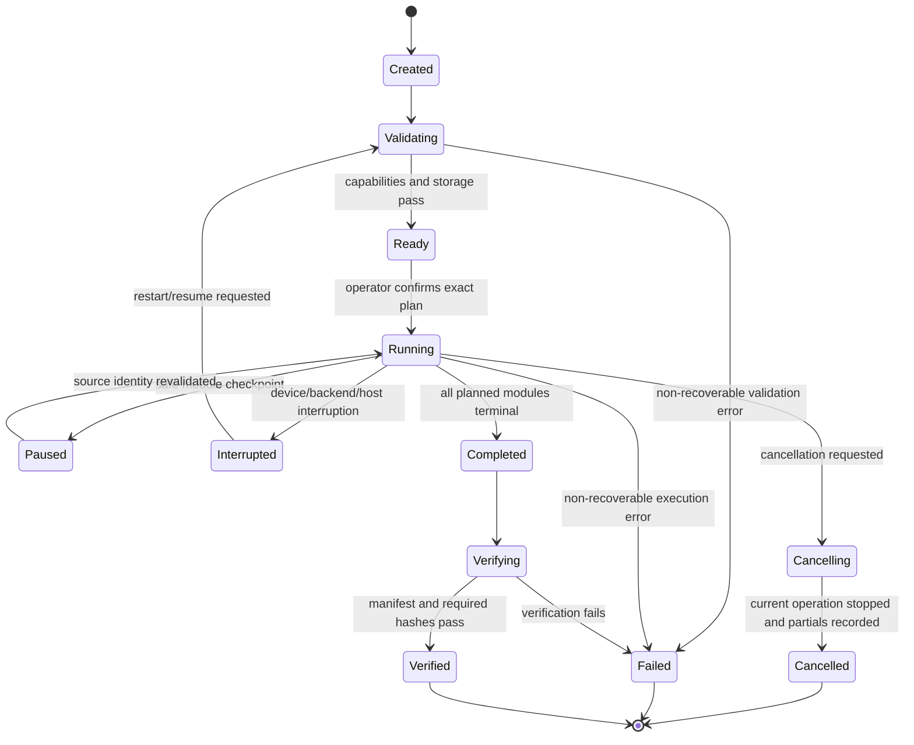

# ForensiX Implementation Plan

**Product:** ForensiX - Android Rapid Evidence Triage and Forensic Preview Platform  
**Document status:** Architecture baseline for engineering review  
**Source:** `android_forensic_triage_srs.pdf`, version 1.0, dated 14 July 2026  
**Planning assumption:** 3-5 engineers, eight-week prototype/MVP window, production hardening afterward

> ForensiX is a workstation application, not an Android APK. Its default mode is **Controlled Logical Triage Mode**. ADB is not a hardware write blocker: operations can change device state, timestamps, logs, caches, or USB/ADB state. The product must disclose those limitations in the UI, command ledger, acquisition manifest, and every report.

## 1. Executive Summary

ForensiX should be built as a modular local application with a React/TypeScript browser UI, a localhost-only FastAPI backend, an isolated Python forensic engine, SQLite metadata storage, and an append-oriented evidence filesystem. The MVP deliberately targets what is repeatable on a modern, unlocked, ADB-authorized, non-rooted Android device: device metadata, package metadata, accessible shared-storage media/documents, hashes, provenance, indexing, evidence preview, timeline derivation, audit/custody records, and preliminary reports.

The SRS contains 100 functional requirements. Fifty-eight can be implemented directly or with ordinary product constraints in the MVP; 18 are suitable for Version 1; 24 require elevated access, controlled inputs, research validation, or are not reliably supportable on stock modern Android. In particular, ADB authorization does not grant access to private application sandboxes. SMS, call logs, contacts, Wi-Fi credentials, private browser history, notifications, and messaging/social-app databases are generally unavailable to `shell` on non-rooted production devices. Deleted-file recovery is not a defensible MVP promise because file-based encryption, flash translation layers, and TRIM prevent dependable unallocated-space recovery.

The MVP architecture is a modular monolith rather than microservices. A durable single-process job runner persists work state to SQLite and publishes progress through Server-Sent Events (SSE). Evidence bytes are never stored in the database; they are written through a storage service into UUID-based case/acquisition paths, hashed during or immediately after collection, and referenced by immutable provenance records. A strict operation catalog maps approved acquisition modules to fixed ADB command templates. No API accepts arbitrary shell text.

The eight-week target is credible only if the team freezes the MVP scope and uses a mock ADB adapter plus pre-seeded evidence for deterministic demonstrations. Production readiness requires a later validation campaign across Android/OEM versions, parser isolation, signed releases, encryption-at-rest policy integration, and external review of forensic methodology.

## 2. SRS Analysis

### 2.1 Requirement inventory

| Group | IDs | Count | Planning interpretation |
|---|---:|---:|---|
| Device detection and validation | FR-1..10 | 10 | MVP; capability results must be evidence, not assumptions |
| Case management | FR-11..16 | 6 | MVP except multi-device UX may be limited |
| Acquisition control | FR-17..26 | 10 | MVP after replacing “read-only” with controlled logical triage; full resume is V1 |
| Artifact extraction | FR-27..51 | 25 | Nine accessible-storage/metadata modules in MVP; private/system artifacts are research/elevated-access |
| Evidence preview and analysis | FR-52..65 | 14 | MVP, with timeline limited to available source timestamps |
| Deleted-data recovery | FR-66..70 | 5 | Research only; data model/UI states may ship without recovery capability |
| Integrity and audit | FR-71..77 | 7 | MVP; “immutable” is corrected to tamper-evident and append-oriented |
| Reporting and export | FR-78..85 | 8 | PDF/JSON/CSV MVP; HTML and final approval workflow V1 |
| Security and administration | FR-86..95 | 10 | MVP core; encryption configuration and concurrent multi-device execution V1 |
| Extensibility/interoperability | FR-96..100 | 5 | REST/schema migrations MVP; ALEAPP/plugin SDK/downstream formats V1 |
| **Total** | **FR-1..100** | **100** | Traceable through this plan and the detailed design backlog |

Non-functional requirements group into performance (5 s detection, 30 s first preview, 3 s search), scalability (1,000 cases and database migration path), reliability/recovery, offline availability, maintainability/versioning, security, evidence integrity, portability, accessibility, auditability, compliance support, usability, interoperability, resource use, backup, and privacy/redaction.

### 2.2 Actors and responsibilities

| Actor | Core authority | Explicit boundaries |
|---|---|---|
| Administrator | bootstrap/manage users, settings, paths, parser policy, audit access | cannot rewrite evidence, hashes, audit, or custody history |
| Investigator | create/manage assigned cases, assess devices, run acquisitions, review/export evidence | no arbitrary ADB commands; cannot finalize own report unless policy allows |
| Analyst | search, correlate, bookmark, tag, note, verify hashes, draft reports | no acquisition by default; no source modification |
| Supervisor | review cases/custody, approve/finalize reports, view audit | approval creates a new signed/hashed version; does not mutate drafts |
| Reviewer | read approved report packages and explicitly shared evidence | no write or acquisition authority |
| System/operator service | execute policy-approved jobs, write manifests/audit entries | acts only under authenticated user intent and records initiator |

### 2.3 Primary workflows

1. Bootstrap an offline administrator and configure an approved evidence root.
2. Authenticate; create or reopen a case with legal-authority/agency metadata.
3. Detect a USB device; classify missing, unauthorized, offline, authorized, or multiple-device state.
4. Assess capabilities from fixed commands; show supported, unsupported, unknown, and warning states.
5. Select acquisition scope; review commands, side effects, storage estimate, and limitations; confirm.
6. Execute modules; preserve partial files, hash, normalize, index, and publish durable progress.
7. Review evidence, provenance, thumbnails, search, timeline, bookmarks, tags, and analyst notes.
8. Verify hashes; add custody events; assemble a preliminary report and structured exports.
9. Close or suspend the case without deleting evidence; later reopen with an audit event.

### 2.4 Major components and dependencies

The system consists of a browser/Tauri-ready UI, versioned REST API, SSE event stream, local job runner, ADB adapter/command policy, capability assessor, acquisition orchestrator, module/parser registry, storage service, normalizer/indexer, timeline/hash/report engines, SQLite database, and case filesystem. External dependencies are Android Platform Tools, operating-system USB support/drivers, PDF renderer, image/metadata libraries, optional ALEAPP, and future downstream export adapters. Core workflows have no cloud dependency.

### 2.5 Security and forensic-integrity interpretation

- Treat every device-derived file, filename, metadata value, archive, image, and database as hostile input.
- Bind the backend to loopback, use an unpredictable local port, strict CORS/origin checks, secure HttpOnly cookies, CSRF protection, RBAC, and object-level case authorization.
- Canonicalize and contain all paths under a configured evidence root; reject symlinks/reparse-point escapes.
- Permit only registered ADB operations with typed arguments and command-specific validation.
- Keep raw evidence append-only; derived thumbnails/text live separately and can be regenerated.
- Hash files, manifests, exports, and reports with SHA-256. Chain audit entries using canonical serialization, while clearly calling the result tamper-evident, not immutable or tamper-proof.
- Preserve original timestamps and source strings; normalized UTC values include source, timezone basis, parser version, and confidence.
- Do not state legal admissibility. The product supports documented handling and repeatability; admissibility remains jurisdiction-, process-, operator-, and court-dependent.

### 2.6 Ambiguous, constrained, and missing requirements

| SRS requirement | Concern | Realistic interpretation | Disposition |
|---|---|---|---|
| FR-9, “determine USB debugging status” | If no ADB transport is exposed, the workstation cannot distinguish disabled debugging from cable/driver/port failure | Report observed transport state and troubleshooting hypotheses, never a definitive device setting unless ADB responds | MVP with limitations |
| FR-17, “read-only logical acquisition” | ADB can create device-side side effects and is not a write blocker | Rename to Controlled Logical Triage Mode; catalog/log commands and side-effect class | MVP with limitations |
| FR-20, “broader logical acquisition” | Undefined scope and privilege assumptions | Execute only capability-approved modules; display exclusions before start | MVP with limitations |
| FR-26, resumable sessions | ADB pull is not universally resumable and remote files can change | MVP restarts incomplete items and deduplicates verified files; byte-range resume only after validation | V1 |
| FR-28..30 | Contacts/SMS/calls typically live behind protected providers/databases | Import only from lawfully obtained backups/exports or validated elevated-access adapters | Research/elevated access |
| FR-36..44 | Browser, clipboard, Wi-Fi, Bluetooth, notifications, calendar, notes, and location are OS/app-private on modern Android | Per-artifact research matrix; no default non-rooted promise | Research spike |
| FR-45..51 | App sandboxing and encryption protect social/messaging databases; schemas change frequently | Parse only lawfully acquired databases/backups with versioned parsers and validation corpora | Future release |
| FR-66..70 | FBE, TRIM, flash controllers, and no block access defeat generic recovery | Data model supports recovered states; recovery engine accepts controlled images/databases later | Research only |
| FR-75, “immutable audit trail” | Local administrators can alter SQLite/files | Hash-chain and export/sign checkpoints; call it tamper-evident | MVP corrected |
| FR-85, report finalization | Approval authority and signature semantics are unspecified | Preliminary-only MVP; supervisor approval produces a new immutable report version in V1 | MVP/V1 split |
| “evidence admissibility” language | Software cannot guarantee admissibility | Report methodology, tool version, limitations, provenance, and validation status | Never guarantee |

Missing decisions that must become policy/ADRs: lawful-authority fields and retention rules; supported Android/OEM matrix; minimum workstation specification; timezone rules; maximum file/archive/report sizes; encryption-at-rest/key recovery; malware handling; case export/import; backup verification; report approval; plugin trust/signing; dependency update policy; audit checkpoint export; data purge authorization; localization; and incident-response procedures for suspected evidence tampering.

### 2.7 Phase 0 proof-of-concept gates

Phase 0 must validate: ADB discovery/version; device-state parsing; serial-scoped property reads; package listing; shared-storage listing/pull/stat; source and destination hash behavior; filename/path edge cases; progress and cancellation; disconnect/reconnect; Windows driver, Linux udev, and macOS USB behavior; non-rooted Android 10-16 access matrix; and ALEAPP’s supported input/output contract. A failed gate removes or narrows the corresponding MVP feature rather than delaying the entire product.

## 3. Requirement Feasibility Matrix

Legend: **H** high, **M** medium, **L** low, **X** experimental, **E** unsupported without elevated/lawfully obtained access. “Unlocked” means screen unlocked where an operation/OEM requires it, not a bypass.

| ID | Requirement / module | Feas. | Device state and Android limitation | Root | USB debug | Unlocked | Release | Test and risk |
|---|---|:---:|---|:---:|:---:|:---:|---|---|
| FR-1..3 | Detection/state/authorization | H | Driver/cable/OEM can mask state | No | Yes | For authorization | MVP | Recorded `adb devices -l`; medium |
| FR-4..8 | Serial/properties/first seen | H | Some properties redacted/spoofable | No | Yes | Usually no | MVP | Device matrix; low |
| FR-9..10 | Debug/readiness assessment | M | No transport cannot prove debug setting | No | For positive result | Sometimes | MVP | Negative-state matrix; medium |
| FR-11..16 | Case management | H | Workstation-only | No | No | No | MVP | API/RBAC/migration tests; low |
| FR-17..25 | Acquisition control | M | ADB is not write-blocked; pulls can interrupt | No | Yes | Usually | MVP | Fault injection; high |
| FR-26 | True resume | M | Remote changes and pull semantics | No | Yes | Usually | V1 | disconnect/restart KAT; high |
| FR-27 | Device metadata | H | Capability/property variance | No | Yes | Usually no | MVP | Golden outputs; low |
| FR-28 | Contacts | E | Protected provider/app data | Usually | Yes | Yes | Research | Controlled backup/root fixtures; high |
| FR-29 | SMS/MMS | E | Protected telephony provider/database | Usually | Yes | Yes | Research | Known database fixture; high |
| FR-30 | Call logs | E | Protected provider/database | Usually | Yes | Yes | Research | Known database fixture; high |
| FR-31 | Installed applications | H | Package list visibility can vary | No | Yes | Usually no | MVP | Android/OEM matrix; medium |
| FR-32 | Photos/EXIF | H | Only shared/accessible paths; media may be cloud-only | No | Yes | Sometimes | MVP | Known media/hash set; medium |
| FR-33 | Videos | H | Shared/accessible files only | No | Yes | Sometimes | MVP | Large-file/disconnect tests; medium |
| FR-34 | Audio | H | Shared/accessible files only | No | Yes | Sometimes | MVP | MIME/hash fixtures; medium |
| FR-35 | Documents/download files | H | Scoped storage and app-specific areas excluded | No | Yes | Sometimes | MVP | Filename/path corpus; medium |
| FR-36 | Browser history | E | App-private databases; browser-specific | Usually | Yes | Yes | Research | Versioned database fixtures; high |
| FR-37 | Download history | L | Files accessible; system history provider often not | Maybe | Yes | Sometimes | MVP files only | Compare Files/Downloads; medium |
| FR-38 | Clipboard | E | Foreground/default-IME restrictions and no historical store | Usually | Yes | Yes | Excluded | Controlled research only; high |
| FR-39 | Wi-Fi records | E | Credential/config files protected | Yes | Yes | Yes | Research | Rooted fixtures, redact secrets; high |
| FR-40 | Bluetooth records | E | System data protected; OEM schemas | Usually | Yes | Yes | Research | Rooted device matrix; high |
| FR-41 | Notifications | E | Requires notification listener/app or protected DB | Usually | Yes | Yes | Excluded | Controlled app PoC; high |
| FR-42 | Calendar | E | Provider access not granted to shell | Usually | Yes | Yes | Research | Export/root fixtures; high |
| FR-43 | Notes | E | Vendor/app-specific private databases | Usually | Yes | Yes | Research | Parser corpora; high |
| FR-44 | Location | E | Multiple encrypted/private sources | Usually | Yes | Yes | Research | Known tracks/database KAT; high |
| FR-45 | WhatsApp | E | Sandbox + encrypted/versioned stores | Usually | Yes | Yes | Future | Lawfully acquired backup fixtures; critical |
| FR-46 | Telegram | E | Sandbox, caches, cloud/session semantics | Usually | Yes | Yes | Future | Versioned fixtures; critical |
| FR-47 | Signal | E | Strong local database/key protection | Yes/backup | Yes | Yes | Future research | Controlled fixtures only; critical |
| FR-48 | Messenger | E | Sandbox/versioned stores | Usually | Yes | Yes | Future | Versioned fixtures; critical |
| FR-49 | Instagram | E | Sandbox/versioned caches | Usually | Yes | Yes | Future | Versioned fixtures; high |
| FR-50 | Facebook | E | Sandbox/versioned stores | Usually | Yes | Yes | Future | Versioned fixtures; high |
| FR-51 | Snapchat | E | Ephemeral/cloud semantics + sandbox | Usually | Yes | Yes | Future research | No coverage claim; critical |
| FR-52..62 | Preview/search/bookmark/note/dashboard | H | Operates on acquired data | No | No | No | MVP | UI/API/a11y/load tests; medium |
| FR-63..65 | Timeline/conflicts | M | Source timestamps can be absent/ambiguous | No | No | No | MVP | Timezone/conflict corpus; high |
| FR-66..70 | Deleted recovery/status | X | No block access; FBE/TRIM | For device recovery | Yes | Yes | Research | Controlled images/databases; critical |
| FR-71..74 | Hash/verification | H | Workstation data path | No | No | No | MVP | NIST vectors and tamper tests; low |
| FR-75 | Tamper-evident audit | M | Local admin can alter storage | No | No | No | MVP corrected | Chain mutation tests; high |
| FR-76..77 | Custody/action history | H | Depends on operator correctness | No | No | No | MVP | Append/amend/RBAC tests; medium |
| FR-78..81,83..84 | Preliminary PDF/JSON/CSV | H | Derived from normalized evidence | No | No | No | MVP | Golden report/schema tests; medium |
| FR-82,85 | HTML/final approval | H | Needs template/approval policy | No | No | No | V1 | Snapshot/signoff tests; medium |
| FR-86..94 | Auth/RBAC/admin/settings/offline | H | Local credential/key recovery policy needed | No | No | No | MVP | OWASP auth/RBAC tests; high |
| FR-95 | Concurrent multi-device execution | M | ADB/USB/disk contention | No | Yes | Usually | V1 | Two-device stress; high |
| FR-96 | ALEAPP integration | M | ALEAPP inputs/support change | Depends on input | Depends | Depends | V1 | Pinned-version contract tests; high |
| FR-97 | Downstream export | M | Target formats must be specified | No | No | No | V1 | Import into target tool; medium |
| FR-98 | Plugin SDK | M | Untrusted code isolation/signing | No | No | No | V1 | Malicious plugin tests; high |
| FR-99..100 | Schema migrations/REST API | H | Version discipline required | No | No | No | MVP | Migration/API contract tests; medium |

## 4. Assumptions and Constraints

- The investigator has lawful authority, physical possession, and organizational approval; ForensiX records but does not determine authority.
- MVP reference device: Android 10-16, screen unlock available, USB debugging enabled and authorized, no root, accessible shared storage present.
- No USB debugging, no authorization, lock, encryption, OEM policy, work profile, or damaged transport can be bypassed.
- Evidence collection is local and offline. Optional updates/cloud features remain disabled in core flows.
- One acquisition executes at a time in MVP; additional detected devices can be assessed but are queued.
- SQLite runs in WAL mode for metadata durability, with a single writer policy. Evidence files remain outside SQLite.
- Supported ordinary workload target: 1,000 cases, 1 million normalized artifacts per large case, 2 GB RAM ceiling, and storage sized by the operator.
- MVP stores UTC plus original timestamp text/offset/source. Investigator-selected case timezone is presentation-only.
- Encryption at rest depends on OS full-disk encryption in MVP; application-managed encryption and key escrow are V1 after policy design.
- Production evidence claims require validation against named devices, Android versions, module/parser versions, and known-answer datasets.

## 5. Product Scope Definition

ForensiX is a forensic triage and preview tool for accessible logical evidence. It is not a physical imaging tool, exploit platform, mobile-device-management agent, password cracker, malware execution sandbox, cloud evidence collector, or legal case-management system. The supported boundary begins at an observable ADB transport or an explicitly imported lawful evidence package and ends at hashed local evidence, normalized metadata, analysis views, custody/audit history, and preliminary exports.

Success means an operator can understand device readiness, perform a reproducible supported collection, see exactly what was and was not collected, inspect provenance, and generate a limitation-aware report without internet access.

## 6. MVP Scope

MVP includes local bootstrap/authentication (administrator, investigator, analyst, supervisor, reviewer permission model), case lifecycle, one-device-at-a-time detection and capability assessment, Controlled Logical Triage Mode, configurable scopes, device/package metadata, accessible shared-storage inventory and collection, images/videos/audio/documents/download-folder files, EXIF/basic metadata, durable jobs/SSE progress, cancellation/interruption preservation, hashing/manifests, normalization, FTS5 search/filter/sort, thumbnails and safe preview, timeline, bookmarks/tags/notes, tamper-evident audit records, append-only custody events, preliminary PDF, JSON/CSV export, dark mode, keyboard-accessible primary flow, backup/export, mock device, and Windows/Linux/macOS developer validation.

MVP explicitly excludes private app/system artifacts, deleted recovery, arbitrary shell access, byte-perfect resume, simultaneous acquisition, HTML report, final approval/digital signatures, ALEAPP execution, public plugin SDK, Autopsy-specific export, built-in evidence encryption, cloud sync, iOS, OCR, and AI features.

## 7. Version 1 Scope

Version 1 adds validated ALEAPP import/orchestration, multi-device cases and resource-controlled concurrent jobs, item-level resume where source identity can be proven, improved correlation, HTML/versioned templates, redaction, supervisor finalization workflow, evidence bundles/import, Autopsy-targeted output, parser SDK with signed manifests and process isolation, enhanced RBAC, external audit-chain checkpoints, application-managed encryption when policy/key recovery are defined, signed installers, and a Tauri desktop shell.

Every V1 parser must declare supported evidence-source versions, access requirements, expected inputs, limitations, confidence rules, side effects, fixtures, and validation report. “Plugin installed” never implies “parser output forensically validated.”

## 8. Future Scope

Research tracks may evaluate imported Android backups, rooted-device and filesystem-image adapters, SQLite WAL/journal/free-page recovery, thumbnail/cache remnants, OCR, media classifiers, investigator-assist summaries, iOS adapter interfaces, agency-controlled metadata synchronization, digital signatures/timestamps, and memory acquisition. These remain separately labeled prototypes until repeatability, false-positive/negative rates, operator safeguards, privacy, and validation are documented.

No roadmap item includes lock bypass, exploit development, guaranteed deleted recovery, or guaranteed evidentiary admissibility.

## 9. System Architecture

### 9.1 Architectural style and communication

Use a modular monolith with explicit ports/adapters. React calls versioned FastAPI endpoints through a generated TypeScript client. Commands enter application services, which authorize case access, persist intent, enqueue durable jobs, and call forensic interfaces. The forensic layer cannot import web routers or UI code. All ADB processes go through `AdbRunner` and `CommandPolicy`; all filesystem mutations go through `EvidenceStorage`. Domain events feed the audit/custody ledger and SSE stream. SQLAlchemy repositories own metadata transactions; raw bytes never pass through JSON APIs.

### 9.2 Component diagram



### 9.3 Acquisition sequence



### 9.4 Data-flow diagram



### 9.5 Deployment diagram



MVP deployment is a launcher plus local browser. Docker is for reproducible development/backend testing, not the primary acquisition runtime because container USB passthrough is inconsistent across desktop operating systems. A polished release uses Tauri to manage the local backend sidecar while keeping the same API boundary.

### 9.6 Trust-boundary diagram



The authenticated browser is not trusted for authorization or command construction. Device data and plugins are hostile. The localhost network boundary is still security-relevant: another local process or malicious site must not be able to drive ForensiX through CORS, DNS rebinding, guessed ports, or CSRF.

## 10. Repository Structure

```text
ForensiX/
├── apps/
│   ├── web/                       # React/Vite application
│   │   └── src/{app,features,components,lib,generated,styles}/
│   └── api/                       # FastAPI composition root
│       └── src/forensix_api/{routers,dependencies,middleware}/
├── packages/
│   ├── ui/                        # Accessible design-system components
│   └── api-client/                # Generated OpenAPI TypeScript client
├── forensic/
│   └── src/forensix_forensic/
│       ├── adb/                   # Adapter, runner, policy, recorded/mock clients
│       ├── capabilities/          # Device assessment and readiness
│       ├── acquisition/           # State machine, plans, orchestrator, checkpoints
│       ├── modules/               # Built-in acquisition modules
│       ├── parsers/               # Parser contracts/registry and isolated workers
│       ├── normalization/         # Artifact/timestamp/provenance normalization
│       ├── storage/               # Safe filesystem port and implementation
│       ├── hashing/               # Streaming hashes/manifests/verification
│       ├── timeline/              # Timeline materialization/correlation
│       └── reporting/             # Data assembly and render adapters
├── server/
│   └── src/forensix_server/
│       ├── auth/                  # Password, sessions, CSRF, RBAC
│       ├── cases/                 # Domain/service/repository per feature
│       ├── devices/
│       ├── acquisitions/
│       ├── artifacts/
│       ├── reports/
│       ├── custody/
│       ├── audit/
│       ├── jobs/
│       ├── settings/
│       ├── db/{models,migrations}/
│       └── schemas/               # Pydantic transport contracts
├── plugins/
│   ├── sdk/                       # V1 versioned interfaces and manifest schema
│   └── bundled/                   # Reviewed, pinned first-party plugins only
├── infrastructure/
│   ├── docker/                    # Dev/test images and Compose
│   ├── packaging/                 # PyInstaller/Tauri/installer definitions
│   └── scripts/                   # Bootstrap, OpenAPI generation, validation
├── docs/
│   ├── adr/                       # Architecture decision records
│   ├── architecture/
│   ├── api/
│   ├── forensic-validation/
│   ├── schemas/
│   └── user-guides/
├── tests/
│   ├── fixtures/{adb,files,media,databases}/
│   ├── integration/
│   ├── security/
│   └── e2e/
├── sample-data/                   # Synthetic/non-sensitive demo data
├── pyproject.toml                 # Python workspace/tool configuration
├── pnpm-workspace.yaml
├── package.json
└── docker-compose.yml
```

Import rules are enforced by tests/linting: routers may import schemas and application services, never repositories/ADB directly; server services depend on forensic ports, not concrete subprocess/filesystem implementations; `forensix_forensic` does not import FastAPI/SQLAlchemy; frontend feature modules import `packages/ui`, generated API types, and shared primitives but not other feature internals. OS-specific process/path/permissions code lives behind `PlatformAdapter` in `forensic/adb/platform` and `forensic/storage/platform`.

OpenAPI is the transport source of truth. CI starts the API schema generator, produces `packages/api-client`, and fails on an uncommitted generated diff. Domain models remain Python-native and are not falsely shared with TypeScript. Plugin imports are forbidden in the core process in V1; the registry launches a pinned worker protocol with a versioned JSON/Protobuf-like message schema, restricted working directory, resource limits, and no implicit network access.

## 11. Frontend Architecture

### 11.1 Technology choices and state ownership

Use React 19 + TypeScript strict mode + Vite; React Router for route/data boundaries; TanStack Query for all server state, invalidation, retries, pagination, and SSE reconciliation; Zustand only for ephemeral cross-route UI preferences such as panel sizes and masked/unmasked display; React Hook Form + Zod for forms; TanStack Table + Virtual for large evidence grids; Radix primitives with a project-owned Tailwind design system; `react-aria` patterns where Radix does not supply the required semantics; date-fns for presentation; and Vitest/RTL/axe/Playwright for tests. Do not mirror case/evidence records into Zustand.

Sessions use `Secure`, `HttpOnly`, `SameSite=Strict` cookies issued by the local API. A readable CSRF token is delivered separately and echoed on state-changing requests. The UI keeps no bearer token in localStorage. A route loader calls `/auth/me`, and server-side authorization remains definitive.

### 11.2 Route and layout map

```text
/login
/dashboard
/cases
/cases/new
/cases/:caseId                       CaseLayout
  /overview
  /devices
  /acquisitions
  /acquisitions/:acquisitionId
  /evidence
  /evidence/:artifactId
  /timeline
  /reports
  /custody
  /audit
/audit                               global audit; Admin/Supervisor
/users                               Admin
/settings                            Admin; personal subset for all users
```

`AppShell` owns skip link, top bar, role-aware navigation, connection/job indicators, theme, and global errors. `CaseLayout` owns case identity/status and tabs. Feature routes own queries, forms, and permission-specific actions. Every route has a typed error boundary; skeletons preserve layout; empty states explain prerequisites and offer one permitted next action; stale SSE reconnects fall back to polling the persisted job state.

### 11.3 Screen specification

Common acceptance rule: every page is keyboard operable, warnings use text/icon plus color, loading announces status, failures expose a request ID without secrets, and unauthorized actions are absent from navigation and rejected by the API.

| Screen | Purpose/users | Data, actions, API | Empty/loading/error and permission acceptance |
|---|---|---|---|
| Login | All users authenticate | username/password; `POST /auth/login`, `GET /auth/me` | Generic failure, lockout countdown; focus moves to error; successful login redirects safely |
| Dashboard | Assigned work and system readiness | recent cases/jobs/devices, integrity warnings; cases/jobs/health endpoints | No-cases CTA; cards skeleton; only authorized case summaries appear |
| Cases | Search/create/reopen cases | server-paginated list, status/agency filters; cases endpoints | Empty create CTA; closed-case edits disabled by policy |
| Case overview | Case summary and next action | metadata, members, devices, acquisitions, counts; case endpoints | Missing case -> 404; unauthorized -> generic 404; status transitions confirmed |
| Devices | Detect, select, assess | device states, properties, capabilities/warnings; detect/assess endpoints | Explains missing/unauthorized/offline/multiple states; unsupported modules cannot be selected |
| Acquisition wizard | Define and confirm scope | readiness snapshot, modules, side-effect classes, disk estimate; acquisitions | Confirmation records exact plan version; start disabled on stale readiness/high-risk unresolved warning |
| Acquisition progress | Monitor/cancel/recover | job/module/item progress, command summaries, errors; acquisition/events/SSE | Refresh reconstructs state; cancellation is two-step; partial evidence remains navigable |
| Evidence explorer | Search/filter/sort/preview | virtualized rows, categories, dates, tags, status; artifacts endpoints | URL stores filters; first page under target; preview never executes active content |
| Artifact detail | Inspect provenance and derivations | raw/normalized metadata, hashes, relationships, preview, bookmark/tag/note | Sensitive values masked by default; source bytes read-only; download is audited |
| Timeline | Correlate available events | virtualized events, confidence/source/timezone filters; timeline endpoint | Uncertain/conflicting time visually and textually marked; source link opens artifact |
| Reports | Draft, generate, download, verify | templates, selection, redaction, jobs, hashes; reports endpoints | Preliminary label always visible in MVP; generation errors preserve job diagnostics |
| Custody | Append/review custody | chronological events, amendments; custody endpoints | No edit/delete controls; correction links prior event and requires reason |
| Case audit | Inspect case action chain | filter/export/verify chain; audit endpoints | Chain failure is a high-severity persistent banner; access limited by role |
| Users | Administer local accounts | create/disable/reset roles; users endpoints | Cannot remove last active admin; self-demotion guarded; actions audited |
| Settings | Paths/policy/theme/logging | validated settings and capability checks; settings endpoints | Evidence-root change requires empty/new policy or migration workflow; secrets never echoed |

Evidence preview supports safe server-generated thumbnails, escaped text, metadata, and explicit download. PDFs/HTML/archives are never embedded with active content in MVP. Image decoding for thumbnails occurs in a limited worker, output is re-encoded, dimensions/pixels are capped, and failures display metadata-only.

## 12. Backend Architecture

`create_app(settings)` is the composition root. It initializes structured logging/request IDs, database/migrations check, storage-root validation, platform/ADB adapters, repositories, services, durable job runner, routers, security middleware, and shutdown hooks. Pydantic Settings reads defaults, OS-specific config, an optional protected config file, and environment overrides used in development; startup logs effective non-secret settings.

Routers are thin: validate transport input, require permissions/case scope, call a service, and map domain errors. Services own transaction boundaries and idempotency. Repositories expose aggregate-focused operations and never return ORM entities past the service boundary. SQLAlchemy 2 models and Alembic migrations are used instead of SQLModel to keep persistence and transport schemas separate. SQLite uses foreign keys, WAL, `busy_timeout`, explicit indexes, and serialized write jobs.

Use a durable custom local job runner, not FastAPI `BackgroundTasks`, Celery, RQ, or Dramatiq. A dispatcher claims persisted jobs with a lease, executes bounded async orchestration plus subprocess/thread workers, checkpoints steps, observes cancellation, and recovers abandoned leases at startup. This avoids a broker for a single workstation while retaining an upgrade path: keep `JobRepository`, `JobExecutor`, and event interfaces so a PostgreSQL/worker implementation can replace the dispatcher.

Use SSE for one-way job/event progress. SSE reconnects with `Last-Event-ID`, works through ordinary HTTP, and is simpler than WebSockets because commands still use authenticated REST. Persisted events are authoritative; SSE is a delivery optimization.

API prefix is `/api/v1`. OpenAPI defines tagged operations and generated clients. All list endpoints use cursor pagination where stable event/artifact ordering matters and bounded offset pagination for small admin lists. Exports stream from opened, authorized file handles and set safe filenames. Health endpoints are `/health/live` and `/health/ready`; readiness verifies database, evidence-root writability policy, runner state, and ADB availability separately without requiring a device.

Security middleware enforces host/origin allowlists, CORS for the launched UI origin only, CSRF, session lookup, request/body limits, content security headers, and no-store on sensitive API responses. Rate limits target login and expensive generation endpoints; normal localhost reads are bounded by pagination/concurrency rather than a cosmetic global limiter.

## 13. Forensic Engine Architecture

The engine exposes typed ports: `DeviceTransport`, `CapabilityAssessor`, `AcquisitionPlanner`, `AcquisitionExecutor`, `EvidenceStorage`, `Hasher`, `ParserRegistry`, `ArtifactSink`, `TimelineBuilder`, and `ReportDataAssembler`. Each operation receives an immutable `OperationContext` containing case/device/acquisition/operator IDs, plan/readiness versions, cancellation token, storage capability, clock, and audit sink.

Execution stages are plan -> acquire to `.partial` -> fsync/atomic finalize -> hash -> provenance record -> parse derived output -> normalize -> index/timeline -> verify manifest -> seal result. A failure after finalization does not delete prior evidence; it records stage, error code, retryability, and validation status. Parsers never rewrite raw files. Derived output contains parent hashes and tool/parser versions.

The MVP modules are `device_metadata`, `package_inventory`, `shared_storage_inventory`, `image_files`, `video_files`, `audio_files`, `document_files`, `downloads_files`, `exif_metadata`, and `generic_file_metadata`. The recovery manager exists only as an interface and maturity registry in MVP; it must not label an artifact recovered without a validated recovery method.

## 14. ADB Communication Design

### 14.1 Interfaces and operation policy

```python
class AdbClient(Protocol):
    async def server_info(self) -> AdbServerInfo: ...
    async def list_transports(self) -> tuple[AdbTransport, ...]: ...
    async def get_properties(self, serial: DeviceSerial) -> DeviceProperties: ...
    async def list_packages(self, serial: DeviceSerial, options: PackageListOptions) -> PackageResult: ...
    async def list_files(self, serial: DeviceSerial, request: RemoteListRequest) -> RemoteListResult: ...
    async def pull_file(self, serial: DeviceSerial, request: PullRequest, sink: BinarySink) -> PullResult: ...
    async def stat_file(self, serial: DeviceSerial, path: ApprovedRemotePath) -> RemoteStat: ...
    async def cancel(self, operation_id: UUID) -> CancelResult: ...
```

There is intentionally no public `shell(serial, string)`. Built-in operations may use an internal runner only after the `OperationCatalog` resolves an operation ID to an executable, fixed argument template, typed parameters, timeout/output limits, allowed states/paths, and side-effect classification. Remote paths are opaque typed values validated against module-declared roots; serials must match an enumerated transport exactly; subprocess invocation always uses an argument array with `shell=False`.

ADB discovery order is explicit setting -> bundled signed/pinned Platform Tools -> PATH. Validate executable identity, `adb version`, supported version range, and file hash for bundled binaries. The service may start the ADB server, but records that side effect. Every device command includes `-s <serial>`. Multiple transports without an explicit serial cause a safe error.

Runner behavior: platform-specific hidden process group; monotonic timeout; cooperative cancellation followed by bounded process-tree termination; separate bounded stdout/stderr capture; streaming for pulls; exit-code and known-error classification; no retry for authorization/policy failures; at most one jittered retry for proven transient transport errors; reconnect requires identity/readiness revalidation. Output truncation is recorded, never silently accepted for evidence-producing commands.

Each command ledger entry stores operation/command ID, catalog version, case/device/acquisition/operator, sanitized argv, start/end wall and monotonic times, exit code/signal, byte counts, result/error summary, retry number, device state before/after when observable, and side-effect class (`none_observed`, `transport`, `read_like_with_possible_os_side_effect`, `device_mutating`, `prohibited`). MVP catalogs no `device_mutating` operations.

### 14.2 Capability assessment

`DeviceCapabilitySnapshot` stores serial, manufacturer/model, Android/API version, fingerprint, patch level, transport/authorization state, observed screen/unlock indicators with confidence, `adbd` privilege, `su` observation, accessible storage roots, package-list access, deprecated backup-command observation, encryption indicators, module decisions, warnings, evidence commands, assessment time, and assessor version.

Each module decision is `supported`, `unsupported`, `unknown`, or `blocked`, with reason code, required state, confidence, and evidence. The UI renders this snapshot and cannot enable a module unless the current plan references the same unexpired snapshot. Device reconnect, serial/fingerprint mismatch, authorization change, or configurable age invalidates it.

Example reasons include `ADB_UNAUTHORIZED`, `DEVICE_OFFLINE`, `SCREEN_UNLOCK_REQUIRED`, `REMOTE_ROOT_UNREADABLE`, `PRIVATE_APP_DATA_INACCESSIBLE`, `ELEVATED_ACCESS_REQUIRED`, and `MODULE_NOT_VALIDATED_FOR_API_LEVEL`. “Unknown” is never treated as supported.

### 14.3 Mock and recorded adapters

`MockAdbClient` is scenario-driven and deterministic: no device, authorized, unauthorized, offline, multiple devices, timeout, disconnect at byte N, corrupt output, changing remote file, and low disk. `RecordedAdbClient` replays redacted command outputs with fixture version/schema and expected parser results. Neither fixture may contain real personal data or stable real-device identifiers.

## 15. Artifact Extraction Framework

```python
class AcquisitionModule(Protocol):
    descriptor: ModuleDescriptor
    def evaluate(self, capabilities: DeviceCapabilitySnapshot) -> ModuleDecision: ...
    def plan(self, context: PlanningContext) -> tuple[PlannedOperation, ...]: ...
    async def acquire(self, context: OperationContext, operation: PlannedOperation) -> AsyncIterator[AcquiredItem]: ...
    async def validate(self, item: AcquiredItem) -> ValidationResult: ...
    async def derive(self, item: AcquiredItem) -> AsyncIterator[DerivedArtifact]: ...
```

`ModuleDescriptor` declares ID/name/version, categories, required capabilities/access, supported API/OEM evidence, input roots, operation IDs (not raw commands), outputs, parser IDs, time/size limits, risk/side effects, validation method, fixture set/version, maturity, and known limitations. `plan` is pure and produces a reviewable frozen operation plan. Cleanup only removes module-owned temporary/partial files after their state is recorded; it cannot delete sealed raw evidence.

| MVP module | Acquisition and output | Validation |
|---|---|---|
| Device metadata | Fixed `getprop`/transport observations -> JSON snapshot | Required properties parsed; raw output hash retained |
| Package inventory | Fixed package-manager listing -> package artifacts | Count/format checks; raw listing retained; visibility limitation reported |
| Shared-storage inventory | Bounded traversal of approved roots -> remote file candidates | Root/readability, path/type/size, duplicate identity checks |
| Images/videos/audio/documents | Pull selected candidates through streaming sink | Destination size, transfer status, SHA-256, optional source hash if safe/available |
| Downloads | Same engine with Downloads roots and category tag | Root mapping, file metadata/hash |
| EXIF metadata | Parse a sealed local copy in constrained worker | Parser success, bounded fields, parent SHA-256/version |
| Generic metadata | MIME sniffing, size, local timestamps, remote stat | Original/raw values preserved; contradictions flagged |

Research modules for contacts, SMS/MMS, calls, Wi-Fi, Bluetooth, browsers, notifications, calendar, notes, location, and named messaging/social apps begin with an acquisition-source study, legal/access assumptions, versioned fixture corpus, parser KATs, false-positive/negative measurement, and an explicit decision. A parser for an imported database does not imply ForensiX can acquire that database from a stock phone.

## 16. Evidence Normalization Model

`Artifact` fields: UUID, case/device/acquisition IDs, category/subtype, title/summary/content text, source URI/path, evidence-file ID, original filename, detected/declared MIME, size, created/modified/accessed/event timestamp values, original timestamp strings, timestamp source, UTC value, offset/timezone basis, confidence, active/deleted/recovered/partial/corrupted/unverified status, parser/module ID and version, primary SHA-256, provenance ID, tags/bookmark projections, metadata JSON, schema version, and created time.

Provenance is a graph, not a free-text field. A provenance node records source device/path, operation and command-ledger IDs, acquisition time, raw evidence hash, transformation/parser/tool versions, input parent hashes, output hash, operator/job, and validation status. Artifact relationships model parent-child, attachment, conversation membership, duplicate-of, derived-from, and temporal correlation.

Timestamp rules: retain integer/text source exactly; parse with overflow/range checks; store UTC only when a timezone/offset is known or a documented case assumption is explicitly applied; store naive values separately; record precision; do not invent seconds; conflicting sources create separate values and a conflict flag. Presentation can use case/local timezone without rewriting stored values.

Duplicate detection uses SHA-256 for identical acquired bytes. A remote path/size/mtime tuple may optimize planning but never proves identity. Cross-acquisition duplicates remain distinct provenance instances linked to a canonical content object. FTS indexes only normalized/escaped searchable text and selected metadata, not secrets excluded by policy.

## 17. Database Design

IDs are UUIDv7 text (time-sortable without exposing case numbers). Timestamps are RFC 3339 UTC text plus source-specific fields where needed. Enumerations use checked text values. JSON is reserved for versioned, non-relational extension metadata; searchable/authorized fields are columns. Foreign keys are `RESTRICT` for evidence/case lineage. Evidence has no cascade delete. Soft deletion means an administrative tombstone request, never hidden row removal; actual purge is a separate policy workflow excluded from MVP.

| Table | Purpose and principal columns | Constraints and indexes |
|---|---|---|
| `users` | id, username, display_name, password_hash, active, failed_count, locked_until, created/updated | unique normalized username; last-admin guard in service |
| `roles` / `user_roles` | role code/description; user_id, role_id | unique role code and user-role pair |
| `sessions` | id hash, user_id, CSRF hash, issued/expires/last_seen/revoked, client metadata | index user/expiry; never store raw token |
| `cases` | id, case_number, title, agency, authority_ref, description, status, presentation_tz, owner, opened/closed, version | unique case number; status/updated indexes |
| `case_members` | case_id, user_id, case_role, added_by/at, removed_at | unique active membership; object authorization index |
| `devices` | id, case_id, stable display label, serial protected/display hash, manufacturer/model, first/last seen | case FK restrict; case/serial-hash index |
| `device_capabilities` | id, device_id, snapshot/version/assessed_by/at, transport/fingerprint/API, result JSON, invalidated_at | device/time index; immutable snapshots |
| `acquisitions` | id, case/device/operator, scope/plan versions, state, readiness_id, started/ended, progress, error, manifest_file_id, version | state/updated, case/time indexes; optimistic version |
| `acquisition_modules` | id, acquisition_id, module/version, order, state/progress, checkpoint JSON, result/error | unique acquisition/module/order |
| `acquisition_events` | id sequence, acquisition/job, type, payload JSON, created | unique job sequence; acquisition/time index |
| `command_records` | id, acquisition/module/operation/catalog, sanitized argv JSON, timings, exit/bytes/results, side_effect | acquisition/time; append-only service |
| `evidence_files` | id, case/device/acquisition, storage key, source path, name, size, status, sealed_at, primary_hash_id | unique storage key; source/acquisition indexes; no cascade |
| `artifacts` | normalized fields described in section 16, evidence_file_id, metadata JSON | case/category/event-time, acquisition, status, parser indexes |
| `artifact_relationships` | from_id, to_id, relationship, confidence, provenance | unique triple; both-direction indexes |
| `tags` / `artifact_tags` | case-scoped tag; artifact/tag/actor/time | unique normalized tag per case and pair |
| `bookmarks` | artifact_id, user_id, reason, created/removed | unique active user/artifact; case via artifact |
| `analyst_notes` | id, artifact/case, author, body, created, supersedes_id, withdrawn_at | append/amend; artifact/time index |
| `timeline_events` | id, case/artifact/acquisition, category, UTC/original time, source, confidence, conflict_group, summary | case/time/category compound indexes |
| `hashes` | id, object_type/id, algorithm, value, size, tool/version, calculated_at | unique object/algorithm/value; hash lookup |
| `hash_verifications` | id, hash_id, verifier, observed_value, result, verified_at, tool/version | hash/time index; append-only |
| `jobs` | id, type/state, owner, case/acquisition, progress/step/module, lease, cancel, resume, result/error, timestamps, version | state/lease/updated indexes |
| `reports` | id, case, creator, template/version, state, selection/redaction JSON, file_id, SHA-256, preliminary, created/completed | case/time/state; immutable completed versions |
| `report_artifacts` | report_id, artifact_id, inclusion reason/order | unique pair; restrict deletes |
| `custody_events` | id, case, object refs, event type, actor/time/location/purpose/from/to/notes, acknowledgement, amendment_of, audit_id | case/time; no update/delete |
| `audit_logs` | sequence, event_id, case/user/action/outcome, canonical payload, previous_hash, entry_hash, created | unique sequence/event/hash; append-only |
| `settings` | scope/key, typed value JSON, schema version, updated_by/at | unique scope/key; secrets are references, not values |
| `parser_registry` | parser/module ID/version, manifest hash, status, validation level, installed/enabled info | unique ID/version; enabled/version index |
| `export_jobs` | job/report/case, format/schema version, file_id/hash/state | case/time; file restrict |
| `system_events` | id, severity/type, request/job, safe detail, created | severity/time/type indexes; retention policy |

FTS5 uses an external-content `artifact_search` table keyed by artifact rowid with title, summary, content, source name, and tags. Application code updates it transactionally through one indexing service; a rebuild command verifies counts. Start with prefix-enabled Unicode tokenizer; record tokenizer/schema version. Migrations create identity/security, cases/members, devices/capabilities, acquisitions/jobs/events, evidence/hashes, artifacts/FTS/timeline, reports/custody/audit, then settings/registry. Every migration has upgrade, downgrade where safe, fixture migration, and copy-and-verify backup for destructive SQLite changes. PostgreSQL migration later replaces UUID/timestamp/JSON types and FTS implementation behind repositories; do not use SQLite-specific SQL outside adapters.

## 18. API Design

### 18.1 Conventions

All responses include `request_id`; errors use `{error:{code,message,details,request_id}}`, with `details` allowlisted. Validation is 422, unauthenticated 401, unauthorized case access is usually 404 to reduce enumeration, conflict/stale version is 409, policy refusal 403, storage exhaustion 507, dependency unavailable 503. Mutation requests accept `Idempotency-Key` where retries could duplicate work; persisted responses are scoped to user+route+body hash. Lists use `limit<=200`, stable sort allowlists, and opaque cursors. Every mutation and every sensitive read/download emits an audit action and outcome.

### 18.2 Endpoint catalog

Abbreviations: A administrator, I investigator, N analyst, S supervisor, R reviewer; case membership and object permission always apply.

| Method/path | Roles | Request -> response | Validation, errors, audit, idempotency, acceptance |
|---|---|---|---|
| POST `/auth/login` | public | credentials -> user/session | bounded fields; generic `AUTH_FAILED`/423; audit success/fail; idempotency N/A; cookie+CSRF issued |
| POST `/auth/logout` | all | CSRF -> 204 | revoke current session; audit; repeat is 204 |
| GET `/auth/me` | all | - -> user/roles/session expiry | 401 if expired; no sensitive profile fields |
| POST `/auth/refresh` | all | CSRF -> renewed session | rotation/revocation checks; audit anomalies; old token unusable |
| GET/POST `/cases` | all / A,I | filters or create schema -> page/case | unique case number, authority fields; audit create; POST idempotent; membership filtering proven |
| GET/PATCH `/cases/{id}` | members / A,I | versioned patch -> case | field/status permission; 404/409; audit changed fields, not secrets; idempotency key; stale update rejected |
| POST `/cases/{id}/close` | A,I,S | version/reason -> case | active-job/custody policy; 409; audit; duplicate returns same closed version |
| POST `/devices/detect` | A,I | optional timeout<=5 -> observed transports | runner availability/multiple states; 503; audit invocation; short-lived idempotency; states correctly classified |
| GET `/devices` | case members | case cursor/filter -> page | case required; safe serial display; read audit by policy |
| GET `/devices/{id}` | case members | - -> device/latest assessment | object auth; no raw secrets; 404 concealment |
| POST `/devices/{id}/assess` | A,I | expected transport -> job/snapshot ref | case/device state; 409/503; audit; idempotent; unsupported remains disabled |
| POST `/acquisitions` | A,I | case/device/scope -> draft plan | snapshot current, modules supported; 409; audit; idempotent; returns operations/warnings |
| POST `/acquisitions/{id}/start` | A,I | plan version/confirmation -> job | exact readiness/plan, disk check; 409/507; audit; idempotent; one execution only |
| POST `/acquisitions/{id}/cancel` | A,I | reason/version -> accepted state | terminal-state handling; audit; idempotent; partials preserved |
| POST `/acquisitions/{id}/resume` | A,I | checkpoint/version -> job | V1 capability/source identity; 409; audit; idempotent |
| GET `/acquisitions/{id}` | members | - -> state/progress/summary | object auth; reconstructs after refresh |
| GET `/acquisitions/{id}/events` | members | cursor -> event page or SSE | cursor/Last-Event-ID; heartbeat; reconnect no gaps |
| GET `/artifacts` | members | case, query, filters, sort, cursor -> page/facets | allowlists/date parsing; 422; sensitive query audit; target latency met |
| GET `/artifacts/{id}` | members | - -> artifact/provenance/relations | object auth; preview URLs short-lived/session-bound |
| POST/DELETE `/artifacts/{id}/bookmark` | I,N,S | reason / - -> bookmark/204 | append/remove marker; audit; idempotent |
| POST `/artifacts/{id}/notes` | I,N,S | body/supersedes -> note | length/content, no source change; audit; idempotent; amendments linked |
| POST `/artifacts/{id}/tags` | I,N,S | tag IDs/names -> tags | case-scoped normalization; audit; idempotent set semantics |
| GET `/cases/{id}/timeline` | members | filters/cursor -> events/facets | ambiguous timezone filter; source links valid; target latency |
| POST `/hashes/verify` | A,I,N,S | object IDs -> job/result | case auth/file containment; audit; idempotent; mismatch raises system event |
| POST/GET `/reports` | I,N,S / members | case/template/selection/redaction -> job; filters -> page | valid artifact set/template; audit; POST idempotent; preliminary enforced |
| GET `/reports/{id}` | members | - -> metadata/status/hash | reviewer only if approved/shared policy; object auth |
| GET `/reports/{id}/download` | members | - -> stream | file containment/hash state; download audit; safe disposition/name |
| GET/POST `/cases/{id}/custody` | members / A,I,S | cursor or event schema -> page/event | event types/actor/transfer fields; no update/delete; audit; idempotent |
| GET `/audit-logs` | A,S; case I by policy | case/action/time/cursor -> entries | payload redaction; access audited; chain status included |
| GET/POST `/users` | A | filters or user/roles -> page/user | password/role policy, unique name; audit; idempotent create; no hash returned |
| PATCH `/users/{id}` | A | versioned status/roles/reset -> user | last-admin/self-lockout guards; 409; audit; idempotent |
| GET/PATCH `/settings` | A; personal subset all | keys or versioned values -> settings | schema/path probes; secrets masked; audit; 409 stale; atomic application |
| GET `/health/live` | launcher/local | - -> status | no sensitive details; process liveness only |
| GET `/health/ready` | authenticated/launcher token | - -> dependency states | DB/storage/runner/ADB distinct; 503 when core not ready |

Generated OpenAPI examples include all state/error variants. Contract tests assert role matrix, case isolation, pagination stability, idempotency replay/mismatch, request IDs, and that no endpoint accepts ADB command text or raw filesystem destination paths.

## 19. Authentication and RBAC

Passwords use Argon2id with parameters calibrated to roughly 250-500 ms and bounded memory on recommended hardware; store algorithm/parameters in the encoded hash and rehash after successful login when policy changes. Minimum 12 characters, reject known-compromised/common passwords using an offline bundled list/filter, allow long passphrases, do not impose composition rules, and never truncate silently.

Sessions use 256-bit random opaque tokens; store only a keyed hash, rotate on login/refresh/privilege change, expire after 30 minutes idle and 8 hours absolute by default, and revoke on logout, disable, password reset, or role change. Five failed attempts trigger escalating time-based lockout without revealing account existence. First launch requires an interactive bootstrap secret and creates exactly one admin; the secret is invalidated. Offline reset uses a local recovery procedure requiring OS-level access plus a recorded recovery event; it never exposes the old password.

| Permission | Admin | Investigator | Analyst | Supervisor | Reviewer |
|---|:---:|:---:|:---:|:---:|:---:|
| Manage users/system policy | Yes | No | No | No | No |
| Create/manage assigned case | Policy/all | Yes | No | Review | No |
| Detect/assess/start/cancel acquisition | Policy | Yes | No | Optional policy | No |
| Search/view assigned evidence | Policy | Yes | Yes | Yes | Selected only |
| Bookmark/tag/note | Policy | Yes | Yes | Yes | No |
| Verify hashes | Yes | Yes | Yes | Yes | Read result |
| Draft report/export | Yes | Yes | Yes | Yes | No |
| Finalize report (V1) | Policy | No | No | Yes | No |
| Append custody event | Yes | Yes | No | Yes | No |
| View global audit | Yes | No | No | Yes | No |

Permissions are checked as `(role capability) AND (active case membership/object policy) AND (case state allows action)`. UI guards improve usability only. Repository queries require a `PrincipalScope` so accidental unscoped reads are difficult. Authentication events record username hash/display-safe identifier, outcome/reason class, time, request/session IDs, and local client metadata without passwords/tokens.

## 20. Case Management Design

A case aggregate contains immutable internal ID and case number, title/description, agency and lawful-authority reference, owner/members, status, presentation timezone, retention classification, devices/acquisitions, and optimistic version. Suggested states are `open`, `suspended`, `under_review`, and `closed`; closed cases are read-only except custody, audit, verification, and supervisor-approved reopen. Reopen records reason and creates audit/custody events.

Case number generation is configurable, defaulting to `FX-YYYY-NNNNNN`, allocated transactionally with a unique constraint. User-supplied case numbers remain metadata and never become paths. Linking a device creates a case-scoped device record; observed serial/fingerprint changes require explicit confirmation and never merge evidence automatically. MVP queues acquisitions globally, so multiple cases/devices do not race ADB/disk resources. Case deletion is not exposed. Export/backup produces a manifest-hashed package; restore/import is V1 after collision and trust rules are specified.

## 21. Acquisition Workflow

### 21.1 State machine



`Completed` means acquisition stages ended; `Verified` means required manifest/file checks passed. An acquisition with optional module failures may be `Verified` with result `partial_success`, provided every failure/exclusion is in the sealed manifest. `Paused` is only permitted at a durable checkpoint; MVP generally uses `Interrupted` and restart-incomplete-item semantics rather than pretending arbitrary ADB pulls pause cleanly.

### 21.2 Scope plans and execution

- **Quick Triage:** device/package metadata, shared-storage inventory, policy-bounded recent media/documents/download files, basic metadata/timeline.
- **Media:** accessible images, videos, audio, EXIF, generic metadata.
- **Documents:** accessible documents/downloads; archives are collected as opaque evidence and not recursively extracted by default.
- **Expanded logical:** all approved accessible shared-storage roots and enabled validated modules, with disk estimate/warning.
- **Custom:** operator selects only capability-supported modules; the plan records exclusions.

Before start, freeze the capability snapshot, module/catalog versions, approved roots, selection filters, estimates, warnings, and operator acknowledgement into a canonical plan. Recalculate disk headroom using known sizes plus configurable safety margin (max of 10 GB or 15%). On execution, each file has a stable item ID, remote source metadata, `.partial` destination, byte count, hash state, and checkpoint. A disconnect marks the current item partial and the acquisition interrupted. Restart re-stats the source; if identity cannot be established, it restarts into a new item version and retains the old partial.

Every acquired item receives case/device/acquisition/module/operation IDs, source path and raw stat, command ledger reference, collection start/end, operator/job, destination storage key, byte count, SHA-256, validation status, tool/module versions, and limitations. The final manifest lists collected, skipped, failed, changed, partial, and excluded items.

## 22. Evidence Preview Design

The evidence explorer is a three-pane desktop-first experience: filter/navigation rail, virtualized results, and detail/provenance panel. The URL encodes query/filter/sort/cursor-safe state for review reproducibility; opening detail does not lose the list position. Category counts are computed from the current authorized case and filter set.

Preview tiers are metadata-only, generated thumbnail/text excerpt, and explicit audited download. Server workers cap input bytes, decoded pixels, output dimensions, CPU time, and memory. They re-encode image thumbnails to a safe format, escape text, and never render scripts, external URLs, macros, embedded media, or archive contents. Unsupported/corrupt files show hashes, source, type evidence, and parser error without repeatedly crashing the worker. Sensitive content is masked by default; unmasking is session-local, permission checked, visually obvious, and optionally audited by agency policy.

Source evidence has no edit/delete UI. Bookmarks, tags, and notes are separate records. Note correction appends a replacement linked to the earlier version. Any derived artifact names its parent hash and parser/tool version. Acceptance target: a user can move from a search result to raw provenance, hash, source timestamps, parser limitations, and related timeline events in no more than two actions.

## 23. Search and Filtering Design

Use SQLite FTS5 with an external-content index for text plus ordinary indexed columns for structured filters. `LIKE` is only a fallback for tiny administrative lists. The search service compiles a typed query AST; it never concatenates raw FTS/SQL. Phrase/prefix syntax is deliberately limited and documented. Invalid syntax returns a safe 422 with the position, not a database error.

Filters cover case (mandatory), device, acquisition, category/subtype, event/source date range, detected MIME/file extension, source root/module/parser, status, bookmark, tags, parser validation level, and timestamp confidence. Sort allowlist is relevance, event time, collected time, category, source name, and size, each with UUID tie-breaker for stable cursor pagination. Facets are bounded and can be computed asynchronously on very large cases.

Performance dataset: one million artifact rows, at least 250,000 searchable text rows, realistic tag/timeline relationships, and skewed categories. Target is first page in under 3 seconds at p95 on the reference workstation with a warm local database; query plan tests prevent full scans for common filters. Reindexing is a durable job that builds a new index, verifies count/checksum samples, then swaps atomically.

## 24. Timeline Design

Timeline events are materialized from artifact timestamp claims rather than overwriting artifacts. Each event has category (`device`, `file`, `media`, `communication`, `application`, `location`, `system`, `acquisition`, `custody`), source artifact, timestamp type, UTC/naive value, original value, timezone basis, precision, confidence, parser/module, and conflict group.

Rules: invalid dates are preserved as parser warnings but not placed chronologically; missing timezone stays naive unless the source format has a documented default; case timezone conversion is display-only; filesystem created/modified/accessed times are separate events; EXIF offset is preferred over case assumption; DST ambiguity reduces confidence; materially different claims for the same semantic event are grouped and flagged, never averaged. Clicking an event opens the source artifact/provenance. Timeline rebuild is deterministic for the same normalized inputs and engine version, and records build version/hash.

## 25. Hashing and Integrity Design

Use streaming SHA-256 with 1-8 MiB buffers and no requirement to load files into memory. Hash acquired files immediately after atomic finalization (or incrementally during write with a post-finalize verification for high-risk paths), evidence bundles, manifest JSON, JSON/CSV exports, report bytes, and report data snapshots. Store algorithm, lowercase hex value, object type/ID, storage key, size, calculated time, implementation/tool version, and validation state.

The canonical acquisition manifest is UTF-8 JSON using RFC 8785-style JSON canonicalization, integer byte counts, RFC 3339 UTC timestamps, sorted arrays by stable item ID, and no floating-point values where exactness matters. Each item contains source/destination storage key (not unsafe absolute path in portable exports), size, SHA-256, times, module/operation, status, error code, provenance ID, and limitations. Verification opens files through contained storage keys, recomputes size/hash, appends a verification record, raises a high-severity system/audit event on mismatch, and never overwrites the expected value.

Completed report generation order is data snapshot -> render temporary -> finalize -> compute SHA-256 -> persist report row/hash -> emit audit/custody event. Displayed report hash is therefore metadata beside the PDF, not text inside the same hashed bytes.

## 26. Audit Logging Design

Audit entries are append-only through one service and contain sequence, event UUID, actor/session/request, case/object, action, outcome, canonical safe payload, previous hash, entry hash, and UTC time. The genesis entry uses a documented zero hash and instance ID. `entry_hash = SHA256(previous_hash || canonical_entry_without_hash_fields)`. Canonical bytes use the same fixed JSON canonicalization as manifests.

Database triggers deny updates/deletes by the application database role/connection path; service tests ensure no update API exists. This is tamper-evident, not immutable: a host administrator can replace database and chain together. Mitigation is periodic signed or externally stored checkpoint export in V1, OS permissions, backups, chain verification at startup/export, and prominent failure alerts. Chain verification checks sequence continuity, previous hash, canonical rehash, and checkpoint matches; it produces a non-destructive verification report.

Application operational logs are separate and can rotate; audit records follow case retention. Audit payloads exclude passwords, tokens, raw private content, and unsanitized commands. Security-sensitive reads such as report/evidence download are audited, while high-volume ordinary list reads can use policy-configurable summary events to avoid unusable noise.

## 27. Chain-of-Custody Design

Custody event types include evidence/device registered or received, case opened/reopened/closed, device connected, acquisition started/completed/interrupted, evidence exported/transferred, hash verified/mismatch, report generated/approved, and amendment. Fields are event/case IDs, device/evidence/report reference, actor, timestamp, location, purpose, from/to custodian, notes, related file/hash, digital acknowledgement method, and audit event ID.

Events are never edited or deleted. A correction is an `amendment` event referencing the original, explaining the error, and supplying corrected assertions; UI shows both. Transfers require both custodian identities and purpose; MVP acknowledgement is authenticated actor confirmation, not a cryptographic signature. Report approval/digital countersignature is V1. A custody export includes ordered events, linked object hashes, audit references, schema/tool versions, and its own manifest hash.

## 28. Reporting System

Separate `ReportDataAssembler` from renderers. The assembler creates a versioned, canonical, authorization-filtered snapshot containing cover/preliminary warning, case/investigator metadata, device and capability snapshot, acquisition scope/times/modules/command summaries, limitations/exclusions/errors, evidence/category summary, selected artifacts, timeline summary, hash manifest, custody summary, methodology, and tool/parser versions. The snapshot is retained and hashed so a renderer can be reproduced.

Use WeasyPrint for MVP PDF generation from controlled Jinja2 HTML/CSS because it supports page layout, headers/footers, tables, and cross-platform Python packaging better than hand-drawing complex reports. Keep ReportLab as a fallback only if packaging validation rejects WeasyPrint. JSON uses a published JSON Schema; CSV uses one table per category or a documented flattened schema and prefixes formula-leading cells (`=`, `+`, `-`, `@`, tab, CR) with an apostrophe. HTML export is V1 and self-contained with scripts disabled.

Templates have ID, semantic version, compatible data-schema range, source hash, change log, and validation snapshots. User-controlled values are escaped; images are re-encoded/capped; large evidence tables become summaries plus appendices/structured attachments; redaction produces a new snapshot/report and never changes evidence. Names use `ForensiX_<case-number-safe-display>_<report-type>_<UTC>_<short-id>.pdf`, while the filesystem path uses UUID storage keys. Page numbers, confidentiality marking, preliminary label, limitations, generation time, and tool version appear consistently. Generation is a durable cancellable job; failed temporary output is quarantined/cleaned by policy and never presented as a report.

## 29. Deleted-Data Recovery Strategy

MVP exposes status vocabulary and recovery provenance but no generic recovery button. Maturity states are `not_available`, `experimental`, `controlled_dataset_validated`, `rooted_device_validated`, and `production_validated`. UI/report eligibility follows maturity and access source.

Research order: imported SQLite databases -> WAL/journal parsing -> thumbnail/application caches -> lawfully obtained backup/filesystem images -> rooted controlled devices -> shared-storage remnants. For each, measure known inserted/deleted records, false positives/negatives, overwrite/TRIM/FBE effects, schema versions, confidence rules, and repeatability. Unallocated flash recovery is generally unavailable through ordinary ADB because the shell lacks block access and flash translation/TRIM/encryption destroy useful assumptions.

Recovered artifacts must include recovery method/version, source image/database/hash/offset/page, active/deleted/recovered/partial/corrupted/unverified classification, confidence with documented basis, parser, limitations, validation status, and parent provenance. Fragments are stored separately and never merged silently with active evidence.

## 30. Security Architecture

### 30.1 Threat model

| Threat/scenario | Impact / likelihood | Prevention and detection | Required test / residual risk |
|---|---|---|---|
| Unauthorized local user opens cases | Critical / medium | OS permissions, Argon2id, session/RBAC/case scope, idle expiry | Role/case isolation; privileged OS user remains residual |
| Malicious website drives localhost API | High / medium | random port, launcher token/bootstrap, Host/Origin/CORS/CSRF, SameSite cookies | DNS rebinding/CSRF suite; local malware residual |
| ADB command/argument injection | Critical / medium | no shell API, fixed catalog, typed argv, `shell=False`, serial/path validation | metacharacter/fuzz tests; ADB defects residual |
| Unsafe ADB operation alters device | High / medium | approved catalog, side-effect classification, frozen plan/confirmation, ledger | catalog review/device diff test; unavoidable OS effects residual |
| Path traversal/absolute/UNC/reparse escape | Critical / high | UUID storage keys, canonical containment, no user paths, symlink/reparse rejection | traversal/race corpus; filesystem race residual |
| Malicious media/parser exploit | Critical / medium | worker process, caps/timeouts, re-encode, patched libs, no active embed | malformed corpus/crash isolation; decoder zero-day residual |
| Archive/zip bomb | High / high | collect opaque by default; bounded safe extraction V1, ratio/count/depth limits | bomb/symlink archive suite; novel formats residual |
| CSV formula injection | High / medium | neutralize dangerous prefixes, schema/version warning | spreadsheet payload tests; consumer behavior residual |
| HTML/PDF template injection | High / medium | autoescape, no remote resources/scripts, controlled CSS, re-encoded images | injection corpus; renderer bugs residual |
| Evidence overwrite/tamper | Critical / medium | append-only storage policy, atomic writes, hashes/manifests, verification alerts | modify/swap/truncate tests; host admin residual |
| Audit/custody rewrite | Critical / medium | append-only service, hash chain, checkpoints/backups | mutation/chain tests; local chain recreation residual |
| Session/credential theft | High / medium | HttpOnly/SameSite, token hashes/rotation, CSRF, secret-free logs | fixation/replay/logout tests; host malware residual |
| Privilege/case escalation | Critical / medium | centralized permission service, scoped repositories, deny by default | endpoint matrix/IDOR tests; policy bugs residual |
| Malicious/untrusted plugin | Critical / high | disabled MVP; signed manifest, pinned version, subprocess isolation V1 | malicious plugin suite; sandbox escape residual |
| Dependency/supply-chain compromise | Critical / medium | lockfiles/hashes, SBOM, CodeQL/Semgrep, Dependabot review, signed artifacts | build provenance/scans; upstream compromise residual |
| Secret/PII in logs/errors | High / medium | structured allowlists, redaction, safe error codes, output limits | canary-secret scan; operator notes residual |
| Insecure temporary files | High / medium | private temp root, random names, exclusive create, cleanup ledger, no shared temp | permission/symlink/crash tests; disk remanence residual |
| Disk exhaustion/partial write | High / high | preflight/headroom, quotas, streaming, atomic partial state, 507 | fault-injected full disk; unexpected growth residual |
| Hash/report/export substitution | Critical / low | contained handles, post-render hash, object binding, download verification | swap/race tests; host admin residual |
| Backup/export disclosure | Critical / medium | explicit scope/redaction, manifest, restricted destination, encryption policy | unauthorized export tests; removable-media handling residual |

### 30.2 Security controls

Default bind is loopback only; no “listen on LAN” setting in MVP. Apply CSP, `X-Content-Type-Options: nosniff`, frame denial, restrictive referrer policy, and no-cache sensitive responses. Validate declared and sniffed MIME separately; a mismatch is evidence metadata, not an automatic rename. Size limits exist at HTTP, ADB output, file, thumbnail, parser, report, and export layers. Storage directories use owner-only permissions where the OS supports them; Windows ACL, macOS/Linux modes, and network/removable filesystem caveats are startup checks.

Application-managed encryption at rest is not improvised for MVP. Require/document BitLocker, FileVault, or LUKS for production-like use. V1 encryption design must include key generation, OS keychain integration, agency escrow/recovery, backup/rotation, memory exposure, and corruption recovery before implementation.

## 31. Privacy and Data Protection

Apply data minimization: show case labels instead of evidence snippets on global pages; mask device serials, phone numbers, message text, GPS, and account identifiers by default; scope previews/exports by case membership; never send telemetry or content off-host in MVP. Reports require an explicit artifact selection policy, preview of included sensitive fields, and a limitations/redaction summary. Redaction creates derived output with an audit event and hash.

Retention, legal hold, purge authority, and cross-border/storage-location rules are agency policy inputs, not hard-coded legal claims. MVP supports no evidence deletion. Backups and exports inherit sensitivity, hashes, custody, and access warnings. Test/demo fixtures are synthetic; bug reports/log bundles exclude evidence by default and require operator review.

## 32. Error Handling

Domain errors have stable codes, safe messages, retryability, severity, and optional operator guidance. Examples: `ADB_NOT_FOUND`, `ADB_UNSUPPORTED_VERSION`, `NO_DEVICE`, `MULTIPLE_DEVICES`, `DEVICE_UNAUTHORIZED`, `DEVICE_OFFLINE`, `CAPABILITY_STALE`, `MODULE_UNSUPPORTED`, `COMMAND_TIMEOUT`, `DEVICE_DISCONNECTED`, `SOURCE_CHANGED`, `PATH_POLICY_VIOLATION`, `DISK_SPACE_LOW`, `STORAGE_FULL`, `PARSER_FAILED`, `HASH_MISMATCH`, `AUDIT_CHAIN_INVALID`, `REPORT_RENDER_FAILED`, `JOB_CONFLICT`, and `CASE_ACCESS_DENIED`.

The API maps errors consistently and includes request/job IDs. UI guidance never suggests bypassing a lock or security control. Full command stdout, exception traces, paths, and evidence content stay out of responses; protected diagnostic logs may contain sanitized summaries. A single item/parser failure can produce partial success; policy/integrity/storage failures stop the acquisition. Every caught failure records stage, object/module, safe context, disposition, and preservation action.

## 33. Background Jobs and Progress Tracking

Jobs cover assessment, acquisition, parsing, indexing, hashing, timeline, report, export, and verification. Fields are ID/type/state, owner/case/object, progress basis points, current step/module/item-safe-label, timestamps, lease owner/expiry, heartbeat, cancellation request, resume capability/checkpoint, result reference, error code/message, and optimistic version.

The runner has one acquisition lane in MVP plus bounded CPU/IO lanes for thumbnails/report/indexing so expensive derivation cannot starve device collection. Progress is weighted by planned bytes where known and module weights otherwise; it never reports 100% before terminal verification. Events are persisted with sequence before SSE publication. Browser refresh/reconnect resumes from `Last-Event-ID`; if delivery gaps are compacted, client fetches the current snapshot.

| Failure/event | Required behavior |
|---|---|
| Backend restarts | Expired running leases become `interrupted`; startup recovery offers eligible restart after integrity/storage checks |
| Device disconnects | Stop new commands, terminate bounded current process, mark item partial, preserve prior items, require identity/readiness revalidation |
| Disk full | Abort writes safely, record 507/storage event, retain valid sealed files and `.partial` ledger; never claim completion |
| ADB hangs | Timeout, terminate process tree, classify/retry once only if transient policy allows |
| Parser crashes | Worker failure recorded; raw evidence remains sealed; continue independent parsers/modules when safe |
| User cancels | Set durable cancel flag, stop at safe point, finalize statuses/manifest; cancellation itself is audited |
| Hash mismatch | Quarantine object state, high-severity alert, stop dependent export/report; retain expected/observed values |

## 34. Session Recovery

On startup, acquire a single-instance lock, verify database migration state and audit chain, scan expired job leases, reconcile `.partial`/sealed files against metadata, and create a recovery summary. Do not auto-resume ADB operations. The operator opens the original case, reviews last checkpoint/device identity/source changes, and explicitly restarts or abandons the incomplete module. Both decisions are audited.

Recovery is idempotent: it may add reconciliation events but never duplicate sealed evidence. Orphan files are quarantined under acquisition recovery storage and not indexed until provenance is resolved. Missing sealed files or hash mismatches place the case in integrity-warning state. Browser/session expiry does not stop an authorized already-running job; job ownership and action authorization were frozen at start, while later cancel/view requires a current permitted session.

## 35. Cross-Platform Packaging

MVP: browser frontend, local FastAPI process, and OS-specific launcher script/executable. This is easiest to debug and validates the architecture without a desktop-shell schedule risk. Polished V1: Tauri shell with the FastAPI/Python application packaged as a managed sidecar. Prefer Tauri over Electron for smaller distribution and a tighter native shell, while accepting sidecar/process/update complexity.

Bundle a pinned Android Platform Tools build per OS only after license review; verify its hash at startup. Allow an administrator-approved external path. Windows guidance covers OEM/Google USB drivers, WinUSB conflicts, hidden backend process, ACLs, and signed MSIX/installer. Linux covers udev rules/groups and AppImage/deb/rpm permissions. macOS covers notarization, quarantine/Gatekeeper, USB prompts, app bundle paths, and universal binaries. Use OS application-data directories for metadata/config/logs and a separately configured evidence root.

Launcher chooses a free loopback port through an inherited socket/handshake, passes a one-time bootstrap secret to the UI, monitors backend lifecycle, avoids duplicate instances, and collects sanitized diagnostics. Signed updates are V1 and cannot run during acquisition. Code signing/notarization and SBOM/provenance are release gates, not optional polish.

## 36. Docker and Environment Setup

Docker Compose provides API/web development, lint/test parity, mock ADB, and synthetic data; it does not promise reliable USB acquisition on Docker Desktop. Native developer scripts install pinned Python (3.12 target), Node LTS, pnpm, Platform Tools, pre-commit hooks, and create local config. Lock Python with `uv.lock` and JS with `pnpm-lock.yaml`; record supported tool versions.

Services: `api`, `web`, optional `mock-adb`, and test-only `mail` is unnecessary because the product is offline. Mount synthetic fixtures only. Never mount a real evidence root into a general development container by default. Configuration profiles are dev/test/production; production rejects debug, wildcard origin/host, world-writable storage, default credentials, and unsigned plugin settings.

## 37. Testing Strategy

| Layer | Tools and scope | Fixtures/CI and pass criteria |
|---|---|---|
| Frontend unit/component | Vitest, RTL, MSW, axe | role/state/error/keyboard fixtures on every PR; no critical axe violation and deterministic tests |
| Frontend E2E | Playwright | mock ADB + seeded case; Chromium each PR, Firefox/WebKit nightly; complete primary flow |
| Backend unit/API | Pytest, AnyIO, httpx, Hypothesis | temporary SQLite/storage, role matrix, validation/idempotency/errors; all protected routes deny by default |
| Repository/migrations | Pytest/Alembic | empty and prior-version fixtures; upgrade preserves counts/hashes/FKs; downgrade only where declared safe |
| ADB | mock/recorded client, subprocess fakes | no/one/unauthorized/offline/multiple, timeout, disconnect, output cap, source change; no unapproved argv |
| Forensic modules | known-answer corpus | exact hashes/provenance/timestamps/parser outputs; repeat runs materially identical |
| Storage/hash | Pytest/Hypothesis | traversal/symlink/reparse/long/Unicode names, full disk, atomicity, NIST hash vectors; no containment escape |
| Reports/exports | JSON Schema, snapshot/text extraction, PDF render | golden structured data and rendered page QA; hash/reproducibility, escaping, CSV neutralization |
| Security | Semgrep/CodeQL plus targeted Pytest/Playwright | injection, IDOR, CSRF, session, archive/media, secrets, permissions; no open critical/high finding |
| Performance | Locust/custom benchmark, Playwright traces | one-million-artifact fixture; SRS p95 targets on recorded reference hardware |

The E2E acceptance path is login -> create case -> detect mock device -> assess -> confirm scope -> acquire with SSE -> review/filter -> bookmark/note -> timeline -> verify -> custody -> preliminary report/export -> close. Negative E2E paths cover unauthorized device, disconnect, stale readiness, cancel, storage full, parser crash, hash mismatch, and forbidden role.

## 38. Forensic Validation Strategy

Maintain controlled devices across Android 10, 12, 14, and 16 where available, at least Pixel plus Samsung and one additional OEM, with rooted devices isolated to research. Matrix states include locked/unlocked, debugging disabled/enabled, unauthorized/authorized/offline, work profile, encrypted default, low storage, and cable disconnect. Record exact build fingerprint, patch, ADB/tool/module/parser versions, cable/host OS, settings, and dataset version.

Known datasets contain generated media/documents with hashes, Unicode/edge filenames, known UTC/offset/naive timestamps, EXIF variants, duplicate files, corrupt media, package expectations, and controlled deletions only for recovery research. Perform three repeat acquisitions per supported configuration, compare manifests/artifact counts/hashes/timestamp claims, and explain all variance. Measure parser true/false positives/negatives on labeled corpora; no parser graduates without thresholds approved in its validation protocol.

Validation report template: objective/scope, tool/build hashes, team/reviewer, environment/device matrix, source dataset/hash, procedure/commands/side-effect observations, expected vs observed results, repeatability, false-positive/negative metrics, performance, deviations, limitations, defects, supported claim, unsupported claim, evidence attachments/hashes, reviewer decision, and expiry/revalidation triggers. Any Platform Tools, Android/OEM, module/parser, storage, or normalization change triggers impact-based revalidation.

## 39. DevSecOps Plan

GitHub Actions workflows:

- `frontend.yml`: pnpm frozen install, ESLint (correctness/a11y rules), Prettier check, TypeScript strict check, Vitest/coverage, production build.
- `backend.yml`: uv locked sync, Ruff format/lint, mypy, Pytest/coverage, Alembic upgrade from empty/prior fixture.
- `contracts.yml`: export OpenAPI, regenerate client, fail on diff, validate JSON export schemas.
- `e2e.yml`: launch mock stack and run Playwright primary/negative flows with artifacts on failure.
- `security.yml`: Gitleaks secret scan, pip-audit/pnpm audit with reviewed exception file, Bandit for Python patterns, Semgrep project rules, CodeQL, and Trivy image/filesystem/SBOM scan.
- `package-matrix.yml`: Windows/Linux/macOS sidecar/launcher builds and smoke tests; nightly until release phase.
- `release.yml`: tagged, approved build; tests; SBOM; artifact hashes; code signing/notarization; provenance attestation; draft release.

Ruff replaces Black/isort to reduce overlapping formatters; mypy enforces typed boundaries; Bandit complements semantic review but is not treated as proof of security. Dependency exceptions require owner, rationale, exploitability assessment, expiry, and tracking issue. Branch protection requires review, signed/verified commits where feasible, all required checks, and no direct release from an unreviewed workstation.

## 40. Observability and Logging

Use structured JSON logs with UTC timestamp, level, event code, service/module, request/job/acquisition IDs, safe case/object IDs, duration, outcome, retry, and sanitized error code. Keep application, job/forensic command ledger, security, and audit streams logically distinct. Never log tokens, password fields, raw evidence content, unsanitized device output, or full serials by default.

Local dashboards expose health, runner queues, current job, ADB availability/version, storage free space, database/FTS state, last backup/chain verification, and parser worker failures. No external telemetry is enabled. Configurable rotation defaults to size + retention; audit/custody are database records and not rotated as logs. A support bundle requires user preview/consent, redacts identifiers/paths, includes versions/config schema and safe recent errors, and excludes evidence/database by default.

## 41. Performance Plan

Budgets: device enumeration p95 <=5 s; readiness p95 <=10 s excluding authorization wait; quick-triage first indexed preview <=30 s when an eligible small artifact is accessible; search first page p95 <=3 s on the reference million-row case; idle CPU <10%; ordinary triage RSS <2 GB. Report targets are size-dependent and displayed as jobs rather than synchronous API timeouts.

Optimize by streaming pulls/hashes/exports, bounded queues/backpressure, thumbnail caching by parent hash+renderer version, FTS5 and compound indexes, cursor pagination, row virtualization, avoiding ORM N+1, incremental timeline/index batches, and one SQLite writer. Collect per-stage timings/bytes/queue depth locally. Benchmarks pin hardware, OS, dataset, cache state, and tool versions; regressions over 15% require explanation or correction.

## 42. Accessibility Plan

Target WCAG 2.2 AA for primary workflows. Requirements include semantic landmarks/headings, skip link, visible focus, complete keyboard operation, logical tab order, accessible dialogs, no color-only status, 4.5:1 text contrast, reflow at 200% zoom, reduced-motion support, scalable text, accessible names for icons, and live-region announcements that throttle progress changes.

Evidence tables use a documented grid pattern with row/column semantics, keyboard navigation, non-virtualized accessible fallback where necessary, and a detail view that exposes the same data. Timeline has a chronological list alternative to visual plotting. Dark/light themes both pass contrast. Automated axe checks run on components/routes, while manual tests cover screen readers (NVDA on Windows plus VoiceOver on macOS), keyboard-only acquisition/report flows, zoom, and high-contrast mode before MVP sign-off.

## 43. Milestones and Development Phases

### 43.1 Release milestones

| Milestone | Duration | Outcome and exit gate |
|---|---:|---|
| Phase 0 - technical validation | Week 1 | Recorded ADB/access matrix on target OS/Android versions, mock scenarios, path/hash/disconnect PoCs, architecture ADRs; unsupported assumptions removed from MVP |
| Phase 1A - product foundation | Weeks 2-3 | Auth/RBAC, cases, database/storage, device detection/readiness, UI shell; API/security tests pass |
| Phase 1B - acquisition/evidence | Weeks 4-5 | Frozen plans, durable runner/SSE, accessible-storage collection, hashes/provenance, indexing/preview; interruption preserves evidence |
| Phase 1C - analysis/integrity | Week 6 | Search, timeline, notes/tags/bookmarks, audit chain, custody and verification; known-answer tests pass |
| Phase 1D - reporting/release | Weeks 7-8 | Preliminary PDF/JSON/CSV, cross-platform launcher, threat tests, validation report, demo fallbacks and documentation; MVP checklist passes |
| Phase 2 - Version 1 | 12-20 additional weeks | Tauri/signed packaging, ALEAPP, resume/concurrency, redaction/HTML/finalization, isolated plugin SDK, migration/validation campaign |
| Phase 3 - research | Evidence-driven backlog | Imported/rooted/image parsers, deleted-data studies, OCR/AI/iOS/cloud only after separate ethics, privacy, security, and validation gates |

### 43.2 Critical staffing and ownership

For a three-person team, assign one frontend/full-stack engineer, one backend/data/security engineer, and one forensic/ADB/QA engineer, with architecture/product responsibilities shared and code review crossing roles. With five people, separate QA/validation and DevSecOps/packaging. No engineer validates their own forensic parser alone; known-answer expectations and results require peer review.

### 43.3 Architecture Decision Records

| ADR | Decision | Alternatives and consequences | Security / migration |
|---|---|---|---|
| ADR-001 Monorepo | pnpm + Python workspace in one repo | Split repos add contract/release overhead; monorepo needs ownership rules | CODEOWNERS; packages can split later |
| ADR-002 React architecture | Feature routes + generated client + TanStack Query | Global Redux rejected for mostly server state | Central auth/error client; features remain extractable |
| ADR-003 FastAPI architecture | Layered modular monolith | Microservices add offline deployment failure modes | Central policy enforcement; modules can become workers later |
| ADR-004 SQLite MVP | WAL, FK, single writer, evidence outside DB | PostgreSQL unnecessary locally; flat JSON lacks integrity/querying | Repository boundary enables PostgreSQL migration |
| ADR-005 Local job runner | Durable SQLite leases/checkpoints | BackgroundTasks not durable; Celery/RQ require broker | Bounded lanes/permissions; interface supports external worker later |
| ADR-006 SSE | Persisted events + SSE delivery | WebSockets unnecessary for one-way progress; polling less responsive | Same auth/origin controls; polling fallback |
| ADR-007 Evidence layout | UUID storage keys, append-oriented raw/derived separation | Case-title paths unsafe; content-address-only loses acquisition layout | Containment/atomicity; bundle adapter later |
| ADR-008 ADB policy | Typed operation catalog; no public shell | Raw shell flexible but unacceptable injection/side-effect risk | Catalog review/versioning; new operations added explicitly |
| ADR-009 Plugin architecture | No third-party plugins MVP; isolated signed workers V1 | In-process imports simpler but risk full compromise | Versioned worker protocol permits future sandbox upgrades |
| ADR-010 Authentication | Local Argon2id + opaque HttpOnly sessions | JWT/localStorage rejected; external IdP breaks offline bootstrap | Optional enterprise identity adapter later |
| ADR-011 Audit design | Canonical SHA-256 chain + exported checkpoints | Plain logs undetectable; “immutable SQLite” false | Tamper-evident only; external signing/checkpoint V1 |
| ADR-012 Packaging | Native launcher/browser MVP, Tauri sidecar V1 | Electron larger; Docker USB unreliable | Loopback handshake/signing; shell swap does not change API |
| ADR-013 Search | SQLite FTS5 + structured indexes | LIKE too slow; Elasticsearch violates simple offline goal | Search adapter enables PostgreSQL FTS later |
| ADR-014 Reporting | Versioned data snapshot + WeasyPrint renderer | Direct ReportLab harder to template; browser print less reproducible | Escape/no remote resources; renderer replaceable |
| ADR-015 Deletion | No evidence deletion API; amendments/tombstone policy | Cascades/soft-hide undermine lineage | Approved purge workflow can be separately designed |

Each ADR file uses status, context, decision, considered options, consequences, security/forensic implications, validation evidence, and supersession/migration path. ADR changes that alter forensic output trigger validation-impact review.

### 43.4 Documentation deliverables

Required before MVP: root README, architecture overview/diagrams, developer setup, Windows/Linux/macOS install notes, USB debugging/authorization guide, investigator and administrator guides, forensic methodology, known limitations/support matrix, API/OpenAPI guide, evidence storage and JSON/CSV schemas, security/threat model, custody workflow, validation report, demo guide, backup/recovery guide, and troubleshooting/support-bundle guide. V1 adds parser/plugin development, redaction/report approval, signed release/update, encryption/key recovery, ALEAPP/downstream integration, and incident-response documentation.

## 44. Sprint-by-Sprint Implementation Plan

### 44.1 Eight-week execution schedule

| Sprint/time | Goal and deliverables | Work by discipline | Dependencies, risks, demo, exit |
|---|---|---|---|
| S0, days 1-3 | Scope freeze, repo/tooling, ADRs, synthetic fixtures | FE shell spike; BE composition/config; forensic ADB/version/device PoCs; DB/storage spike; security threat baseline; QA matrix; docs setup | Physical devices/host OS access; demo recorded device states; exit when access claims are evidence-backed |
| S1, days 4-5 | Executable vertical skeleton | FE login/app shell; BE health/auth skeleton; DB initial migration; mock ADB endpoint; CI lint/type/test; bootstrap docs | S0 architecture; risk packaging/tool mismatch; demo login + mock device; all CI green |
| S2, week 2 | Auth, roles, cases, storage root | FE case pages/forms; BE session/RBAC/case services; DB users/cases/audit; security CSRF/IDOR; QA role matrix; user docs | S1; risk last-admin/authorization bugs; demo create/reopen case; isolation tests pass |
| S3, week 3 | Device detection and capability readiness | FE device states/warnings; BE device/assessment APIs; forensic typed runner/catalog/mock/recorded; DB snapshots/commands; QA OS/state matrix | Real ADB/tooling; risk OEM variance; demo authorized/unauthorized/offline; no raw command API |
| S4, week 4 | Durable acquisition and accessible collection | FE wizard/progress/cancel; BE jobs/SSE/state machine; forensic inventory/pull/hash/storage; DB jobs/acquisitions/evidence; security path/process limits; QA disconnect/full-disk | S3 readiness/storage; USB/disks risk; demo interrupted quick triage; sealed partial results verified |
| S5, week 5 | Normalize, index, and preview | FE virtual grid/detail/thumbnail; BE artifact/search endpoints; forensic metadata/EXIF/normalizer/indexer; DB artifacts/FTS/relations; security hostile-file worker; QA KAT/performance seed | S4 evidence; parser/memory risk; demo filter recent images and provenance; million-row query baseline |
| S6, week 6 | Analysis and integrity | FE timeline/bookmarks/notes/custody/audit; BE services; forensic timeline/hash verification/audit chain; DB related tables; security mutation tests; QA repeatability | S5 normalized model; timezone/audit claims risk; demo correlation and tamper detection; KATs pass |
| S7, week 7 | Reports, exports, backup, recovery | FE report selection/jobs/download; BE assembler/render/export; forensic manifests; DB reports/export; security injection/redaction; QA render/schema/session recovery; docs | S6 integrity; PDF packaging risk; demo preliminary PDF+CSV/JSON hash; golden outputs pass |
| S8, week 8 | Release hardening and forensic validation | FE a11y/perf polish; BE error/observability; forensic device repeats; DevOps native launchers/packages; security full threat suite; QA E2E/matrix; all guides/demo fallbacks | Feature freeze; device/package risks; final live and mock demo; MVP acceptance/validation sign-off |

### 44.2 Actionable engineering backlog

Each item is scoped to one engineer for 1-3 working days. “Tests/docs” names the minimum evidence required in the same pull request; project Definition of Done still applies.

| ID | Epic / concrete output | Owner | Dependencies | Effort | Priority / risk | Acceptance, tests, and documentation |
|---|---|---|---:|---:|---|---|
| ARCH-001 | Record MVP scope and unsupported Android claims | Architect/forensic | - | 1d | P0/high | Signed scope table maps FR-1..100; peer review; known-limitations page |
| ARCH-002 | Create monorepo workspace and import-boundary rules | Architect/full-stack | ARCH-001 | 2d | P0/medium | Web/API/forensic packages install; boundary lint test; structure doc |
| ARCH-003 | Write ADR-001..015 files | Architect | ARCH-001 | 3d | P0/medium | All decisions/options/security/migration recorded; review checklist |
| ARCH-004 | Define OpenAPI/error/pagination/idempotency conventions | Backend architect | ARCH-002 | 2d | P0/high | Example routes/client compile; contract tests; API guide |
| ARCH-005 | Define module/parser/provenance contracts | Forensic architect | ARCH-001 | 3d | P0/high | Typed interfaces and sample descriptor; type/unit tests; parser guide draft |
| ARCH-006 | Define OS platform/storage/transport ports | Architect | ARCH-002 | 2d | P1/medium | Windows/Linux/macOS adapter stubs pass contract suite; ADR links |
| FE-001 | Bootstrap strict React/Vite/Tailwind app | Frontend | ARCH-002 | 1d | P0/low | Build/type/lint test; developer setup |
| FE-002 | Implement accessible AppShell and route guards | Frontend | FE-001, BE-002 | 2d | P0/medium | Keyboard/nav/role tests and axe pass; route map doc |
| FE-003 | Implement login/session-expiry UI | Frontend | FE-001, BE-003 | 2d | P0/high | Generic errors/lockout/redirect tested; auth help |
| FE-004 | Implement case list/create/edit workspace | Frontend | FE-002, BE-005 | 3d | P0/medium | Empty/loading/error/version conflict tests; user guide |
| FE-005 | Implement device detection/state screen | Frontend | FE-002, BE-007 | 3d | P0/high | All five transport states via MSW; USB guide links |
| FE-006 | Implement capability/readiness report | Frontend | FE-005, BE-008 | 2d | P0/high | supported/blocked/unknown reasons accessible; limitations help |
| FE-007 | Implement acquisition scope/confirmation wizard | Frontend | FE-006, BE-010 | 3d | P0/high | stale plan/warnings/disk/capability guards tested; methodology link |
| FE-008 | Implement SSE progress/cancel/reconnect view | Frontend | FE-007, BE-011 | 3d | P0/high | reconnect/gap/cancel/partial tests; recovery guidance |
| FE-009 | Implement virtual evidence explorer/filter URL state | Frontend | FE-002, BE-013 | 3d | P0/medium | million-row mocked navigation, keyboard and query tests; search guide |
| FE-010 | Implement safe artifact detail/thumbnail/provenance | Frontend | FE-009, BE-014 | 3d | P0/high | masking/unsupported/corrupt/download audit tests; preview limits doc |
| FE-011 | Implement timeline, bookmark, note, tag, custody views | Frontend | FE-010, BE-015 | 3d | P1/medium | conflict/amendment/source-link/a11y tests; analyst guide |
| FE-012 | Implement report selection/job/download/verify UI | Frontend | FE-010, BE-017 | 3d | P0/high | preliminary/redaction/error/hash states tested; report guide |
| BE-001 | Implement settings/config validation and production guards | Backend | ARCH-002 | 2d | P0/high | profile/path/origin/debug tests; config reference |
| BE-002 | Implement FastAPI factory, middleware, health endpoints | Backend | BE-001, ARCH-004 | 2d | P0/medium | startup/shutdown/request-ID/health tests; operations doc |
| BE-003 | Implement Argon2id bootstrap/login/session/CSRF | Backend/security | BE-002, DB-001 | 3d | P0/high | rotation/expiry/lockout/replay tests; auth runbook |
| BE-004 | Implement permission and case-scope service | Backend/security | BE-003, DB-002 | 2d | P0/critical | complete role/IDOR matrix denies by default; policy doc |
| BE-005 | Implement case service/repository/API | Backend | BE-004, DB-002 | 3d | P0/medium | unique ID/status/version/membership tests; OpenAPI examples |
| BE-006 | Implement safe error mapping and idempotency store | Backend | BE-002, ARCH-004 | 2d | P0/high | replay/body mismatch/no-leak tests; error catalog |
| BE-007 | Implement device detect service/API | Backend | BE-006, ADB-005, DB-003 | 2d | P0/high | state/multi/timeout tests; API doc |
| BE-008 | Implement capability assessment service/API | Backend | BE-007, ADB-008 | 3d | P0/high | snapshot invalidation/reasons tests; readiness schema |
| BE-009 | Implement durable leased job repository/dispatcher | Backend | DB-004, BE-002 | 3d | P0/critical | claim/heartbeat/restart/cancel/concurrency tests; runner design |
| BE-010 | Implement acquisition draft/start/cancel services | Backend | BE-008, BE-009, FOR-003 | 3d | P0/critical | stale plan/idempotency/transitions tested; API examples |
| BE-011 | Implement persisted job events and authenticated SSE | Backend | BE-009 | 2d | P0/high | Last-Event-ID/gap/expiry tests; event schema |
| BE-012 | Implement contained file/preview/export streaming | Backend/security | FOR-002, DB-005 | 3d | P0/critical | traversal/race/auth/range/filename tests; storage API doc |
| DB-001 | Create user/role/session migrations | Data/backend | ARCH-002 | 2d | P0/high | upgrade/FK/index/fixture tests; schema notes |
| DB-002 | Create case/member/audit base migrations | Data/backend | DB-001 | 2d | P0/high | no cascade and unique/status tests; ER update |
| DB-003 | Create device/capability/command migrations | Data/backend | DB-002 | 2d | P0/medium | immutable snapshot/index tests; dictionary |
| DB-004 | Create acquisition/module/job/event migrations | Data/backend | DB-003 | 2d | P0/high | lease/state/FK/index tests; state mapping |
| DB-005 | Create evidence/hash/provenance migrations | Data/backend | DB-004 | 3d | P0/critical | restrict/no cascade/hash uniqueness tests; schema doc |
| DB-006 | Create artifact/relation/tag/note/bookmark/FTS migrations | Data/backend | DB-005 | 3d | P0/high | FTS sync/rebuild/filter plan tests; search schema |
| DB-007 | Create timeline/report/custody/export migrations | Data/backend | DB-006 | 3d | P1/high | append/version/restrict tests; dictionary |
| DB-008 | Build backup-before-migrate and schema compatibility checks | Data/backend | DB-007 | 2d | P1/high | corrupt/prior/current migration tests; recovery runbook |
| ADB-001 | Detect configured/bundled/PATH ADB and verify version/hash | Forensic | ARCH-006 | 2d | P0/high | missing/invalid/unsupported fixtures; install guide |
| ADB-002 | Parse `adb devices -l` into typed transport states | Forensic | ADB-001 | 2d | P0/high | no/authorized/unauthorized/offline/multiple/odd output KATs; format notes |
| ADB-003 | Implement serial and approved-remote-path value objects | Forensic/security | ARCH-005 | 2d | P0/critical | fuzz/metacharacter/Unicode tests; policy spec |
| ADB-004 | Implement subprocess runner with timeout/cancel/output caps | Forensic | ADB-001, ADB-003 | 3d | P0/critical | process-tree/timeout/truncation tests on OS matrix; runner doc |
| ADB-005 | Implement typed operation catalog and policy rejection | Forensic/security | ADB-004 | 3d | P0/critical | every argv mapped; arbitrary shell impossible; catalog review guide |
| ADB-006 | Implement property retrieval/parser | Forensic | ADB-005 | 2d | P0/medium | malformed/missing property KATs; provenance mapping |
| ADB-007 | Implement package inventory operation/parser | Forensic | ADB-005 | 2d | P0/medium | package visibility/format KATs; limitation text |
| ADB-008 | Implement capability assessor and reason codes | Forensic | ADB-002, ADB-006, ADB-007 | 3d | P0/critical | Android/state decision table tests; supported matrix |
| ADB-009 | Implement scenario-based mock and recorded adapters | Forensic/QA | ADB-002, ARCH-005 | 3d | P0/high | required scenarios deterministic; fixture authoring guide |
| ADB-010 | Implement disconnect/source-change/retry classification | Forensic | ADB-004 | 2d | P0/high | injected disconnect/change/retry tests; operator guidance |
| FOR-001 | Implement UUID-contained case storage layout/permissions | Forensic/security | ARCH-006 | 3d | P0/critical | traversal/symlink/reparse/ACL tests; layout spec |
| FOR-002 | Implement atomic partial/final writer and reconciliation | Forensic | FOR-001 | 3d | P0/critical | crash/full-disk/fsync/orphan tests; recovery notes |
| FOR-003 | Implement acquisition state machine/frozen plan/checkpoints | Forensic | ARCH-005, ADB-008 | 3d | P0/critical | transition/property tests; state diagram |
| FOR-004 | Implement shared-storage inventory with bounded roots | Forensic | ADB-005, FOR-003 | 3d | P0/high | path/size/limit/permission fixtures; module descriptor |
| FOR-005 | Implement streaming pull for media/document categories | Forensic | FOR-002, FOR-004 | 3d | P0/critical | bytes/hash/disconnect/large-file KATs; module docs |
| FOR-006 | Implement streaming SHA-256/manifests/verification | Forensic | FOR-002, DB-005 | 3d | P0/critical | NIST/tamper/canonicalization tests; manifest schema |
| FOR-007 | Implement generic metadata/MIME and isolated EXIF worker | Forensic/security | FOR-005 | 3d | P0/high | malformed/bomb/pixel/time limits; parser validation note |
| FOR-008 | Implement normalizer/provenance graph/duplicate links | Forensic/data | FOR-006, DB-006 | 3d | P0/critical | timestamp/parent/version/dedup KATs; model schema |
| FOR-009 | Implement FTS indexer and deterministic timeline builder | Forensic/data | FOR-008, DB-006 | 3d | P1/high | rebuild/count/timezone/conflict/repeat tests; rules doc |
| FOR-010 | Implement report data assembler and PDF/JSON/CSV renderers | Forensic | FOR-006, FOR-009, DB-007 | 3d | P0/high | golden render/schema/injection/hash tests; template guide |
| SEC-001 | Formalize threat model and data-flow boundaries | Security | ARCH-001 | 2d | P0/high | reviewed assets/threats/residuals; threat doc |
| SEC-002 | Implement Host/Origin/CORS/CSP/CSRF security middleware | Security/backend | BE-002, BE-003 | 2d | P0/critical | malicious-origin/DNS-rebind/CSRF tests; header doc |
| SEC-003 | Implement storage path/symlink/reparse race test corpus | Security/QA | FOR-001 | 2d | P0/critical | zero escape across OS matrix; corpus README |
| SEC-004 | Implement command injection/fuzz security suite | Security/QA | ADB-005 | 2d | P0/critical | shell metacharacter/property fuzz all rejected; findings note |
| SEC-005 | Implement malicious media/archive/parser corpus and limits | Security/forensic | FOR-007 | 3d | P0/high | worker survives/crashes isolated; corpus provenance doc |
| SEC-006 | Implement CSV/HTML/PDF output injection defenses | Security | FOR-010 | 2d | P0/high | formula/script/resource payload tests; export warning doc |
| SEC-007 | Implement audit hash chain and verifier | Security/backend | DB-002, FOR-006 | 3d | P0/critical | insert/mutate/delete/reorder/checkpoint tests; limitation doc |
| SEC-008 | Add secret/PII-safe logging and support-bundle redaction | Security/backend | BE-002 | 2d | P1/high | seeded canary never appears; logging policy |
| SEC-009 | Configure dependency/secret/SAST/SBOM scans | Security/DevOps | ARCH-002 | 2d | P1/high | CI blocks unexcepted critical/high/secret; exception policy |
| SEC-010 | Conduct release threat-model verification and abuse tests | Security | SEC-001..009 | 3d | P0/critical | residual risk sign-off/no open critical/high; release report |
| QA-001 | Build synthetic known-answer media/document dataset | QA/forensic | ARCH-001 | 3d | P0/high | published generator, hashes, times, labels; dataset README |
| QA-002 | Build Android/OEM/host/state validation matrix | QA/forensic | ADB-008 | 2d | P0/high | devices/builds/states/owners scheduled; protocol |
| QA-003 | Implement backend role/case/API contract suite | QA/backend | BE-004, ARCH-004 | 3d | P0/critical | every route/role/object/error/idempotency covered; matrix report |
| QA-004 | Implement Playwright primary workflow | QA/frontend | FE-012, ADB-009 | 3d | P0/high | complete workflow repeatable offline; demo script |
| QA-005 | Implement Playwright negative/recovery workflows | QA/frontend | FE-008, BE-011 | 3d | P0/high | unauthorized/disconnect/cancel/full-disk/hash cases; recovery guide |
| QA-006 | Build million-artifact performance fixture/benchmarks | QA/data | DB-006, FOR-009 | 3d | P1/medium | reproducible seed and p95 report; hardware spec |
| QA-007 | Run three-repeat forensic acquisitions per supported cell | QA/forensic | FOR-009, QA-001, QA-002 | 3d/cell | P0/critical | variance explained and manifests retained; validation report |
| QA-008 | Validate PDF/JSON/CSV reproducibility and visual layout | QA | FOR-010 | 3d | P0/high | rendered pages inspected, schemas/hashes checked; golden update process |
| QA-009 | Conduct accessibility manual/automated assessment | QA/frontend | FE-012 | 2d | P1/high | WCAG primary-flow checklist, NVDA/VoiceOver results; a11y report |
| QA-010 | Execute MVP acceptance and defect triage | QA/product | all MVP tasks | 3d | P0/critical | all P0 criteria pass, no critical/high defect; signed release checklist |
| DEVOPS-001 | Configure pnpm/uv lockfiles and local bootstrap | DevOps | ARCH-002 | 2d | P0/medium | clean Windows/Linux/macOS setup smoke; setup guide |
| DEVOPS-002 | Add frontend/backend/contracts CI | DevOps | DEVOPS-001 | 2d | P0/medium | required checks pass/fail correctly; CI doc |
| DEVOPS-003 | Add E2E/security/package matrix workflows | DevOps | DEVOPS-002, SEC-009 | 3d | P1/high | mock E2E/scans/OS smoke artifacts; workflow runbook |
| DEVOPS-004 | Create mock-only Docker Compose environment | DevOps | BE-002, FE-001, ADB-009 | 2d | P1/medium | one command offline demo; no real evidence mount; compose doc |
| DEVOPS-005 | Build MVP native launchers and single-instance handshake | DevOps/backend | BE-002 | 3d | P0/high | random loopback port/lifecycle/duplicate tests on OS matrix; launcher guide |
| DEVOPS-006 | Produce signed-hash release artifacts and SBOM | DevOps/security | DEVOPS-003, DEVOPS-005 | 3d | P0/high | hashes/SBOM/provenance attached; release procedure |
| DEVOPS-007 | Implement backup/support-bundle/recovery utilities | DevOps/backend | DB-008, SEC-008 | 3d | P1/high | corrupt/interrupted/redaction tests; admin runbook |
| DOC-001 | Write investigator quick-start and Controlled Logical Triage method | Tech writer/forensic | ARCH-001, ADB-008 | 2d | P0/high | accurate supported/unsupported flow reviewed; screenshots |
| DOC-002 | Write cross-platform install/USB troubleshooting guides | Tech writer/DevOps | DEVOPS-005, QA-002 | 2d | P0/medium | clean-host walkthroughs validated; driver/udev/Gatekeeper notes |
| DOC-003 | Publish API, schema, storage, manifest, and export references | Tech writer/backend | ARCH-004, FOR-010 | 3d | P1/high | generated references/examples validate; version policy |
| DOC-004 | Write security, privacy, custody, backup, and limitations guides | Tech writer/security | SEC-010, DEVOPS-007 | 3d | P0/high | threat/residual/legal-overclaim review; admin checklist |
| DOC-005 | Produce demo guide and forensic validation report | Tech writer/QA | QA-007..010 | 3d | P0/critical | live/mock/seeded paths timed and reviewed; evidence hashes included |
