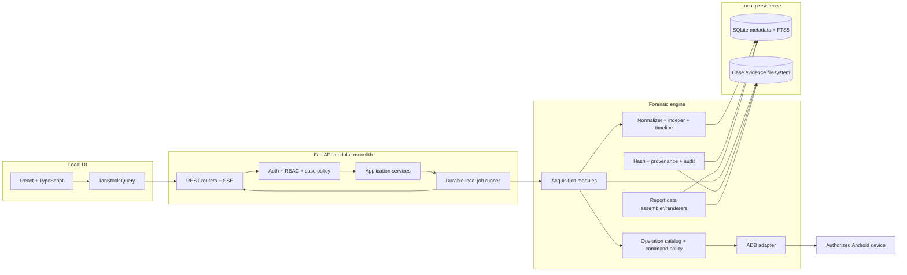
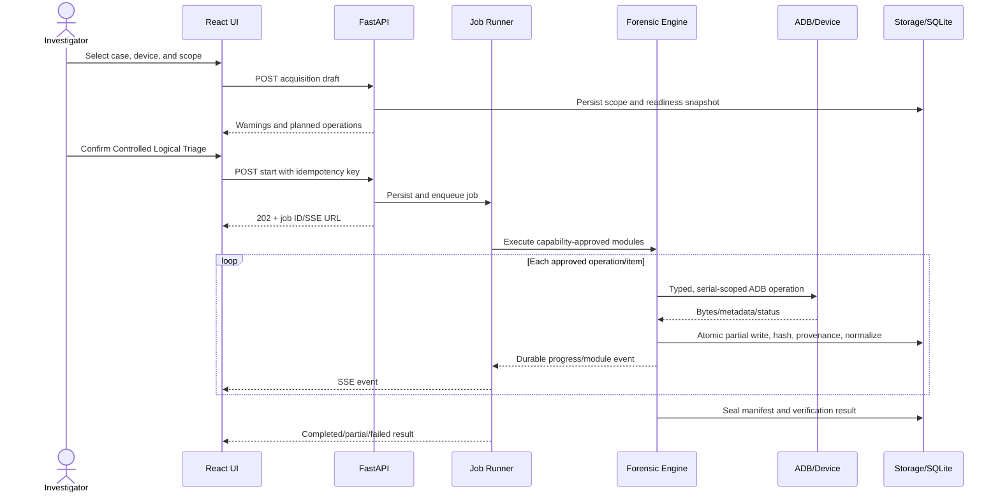
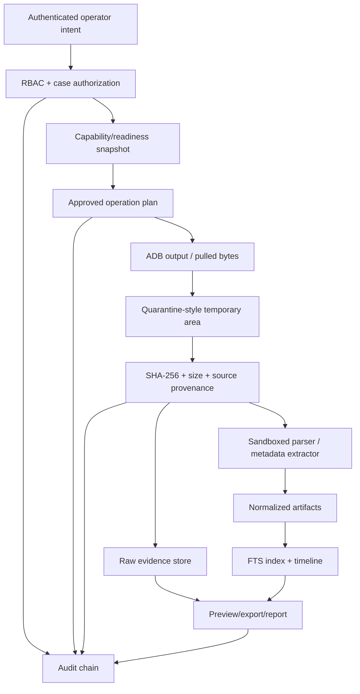
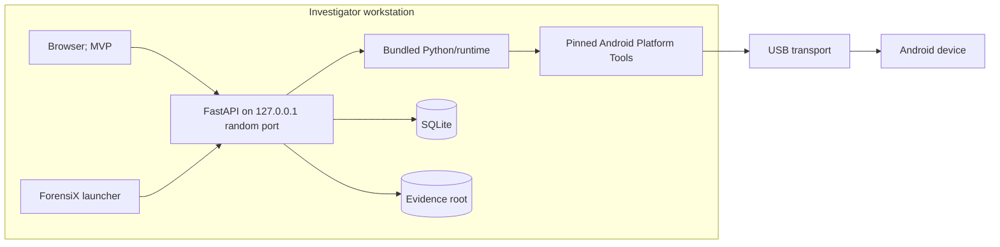
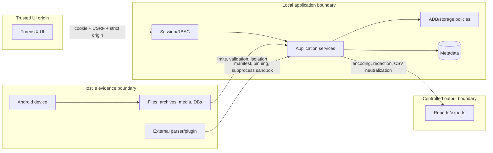

# ForensiX Implementation Plan

**Product:** ForensiX - Android Rapid Evidence Triage and Forensic Preview Platform  
**Document status:** Architecture baseline for engineering review  
**Source:** `android_forensic_triage_srs.pdf`, version 1.0, dated 14 July 2026  
**Planning assumption:** 3-5 engineers, eight-week prototype/MVP window, production hardening afterward

> ForensiX is a workstation application, not an Android APK. Its default mode is **Controlled Logical Triage Mode**. ADB is not a hardware write blocker: operations can change device state, timestamps, logs, caches, or USB/ADB state. The product must disclose those limitations in the UI, command ledger, acquisition manifest, and every report.

## 1. Executive Summary

ForensiX should be built as a modular local application with a React/TypeScript browser UI, a localhost-only FastAPI backend, an isolated Python forensic engine, SQLite metadata storage, and an append-oriented evidence filesystem. The MVP deliberately targets what is repeatable on a modern, unlocked, ADB-authorized, non-rooted Android device: device metadata, package metadata, accessible shared-storage media/documents, hashes, provenance, indexing, evidence preview, timeline derivation, audit/custody records, and preliminary reports.

The SRS contains 100 functional requirements. Fifty-eight can be implemented directly or with ordinary product constraints in the MVP; 18 are suitable for Version 1; 24 require elevated access, controlled inputs, research validation, or are not reliably supportable on stock modern Android. In particular, ADB authorization does not grant access to private application sandboxes. SMS, call logs, contacts, Wi-Fi credentials, private browser history, notifications, and messaging/social-app databases are generally unavailable to `shell` on non-rooted production devices. Deleted-file recovery is not a defensible MVP promise because file-based encryption, flash translation layers, and TRIM prevent dependable unallocated-space recovery.

The MVP architecture is a modular monolith rather than microservices. A durable single-process job runner persists work state to SQLite and publishes progress through Server-Sent Events (SSE). Evidence bytes are never stored in the database; they are written through a storage service into UUID-based case/acquisition paths, hashed during or immediately after collection, and referenced by immutable provenance records. A strict operation catalog maps approved acquisition modules to fixed ADB command templates. No API accepts arbitrary shell text.

The eight-week target is credible only if the team freezes the MVP scope and uses a mock ADB adapter plus pre-seeded evidence for deterministic demonstrations. Production readiness requires a later validation campaign across Android/OEM versions, parser isolation, signed releases, encryption-at-rest policy integration, and external review of forensic methodology.

## 2. SRS Analysis

### 2.1 Requirement inventory

| Group | IDs | Count | Planning interpretation |
|---|---:|---:|---|
| Device detection and validation | FR-1..10 | 10 | MVP; capability results must be evidence, not assumptions |
| Case management | FR-11..16 | 6 | MVP except multi-device UX may be limited |
| Acquisition control | FR-17..26 | 10 | MVP after replacing “read-only” with controlled logical triage; full resume is V1 |
| Artifact extraction | FR-27..51 | 25 | Nine accessible-storage/metadata modules in MVP; private/system artifacts are research/elevated-access |
| Evidence preview and analysis | FR-52..65 | 14 | MVP, with timeline limited to available source timestamps |
| Deleted-data recovery | FR-66..70 | 5 | Research only; data model/UI states may ship without recovery capability |
| Integrity and audit | FR-71..77 | 7 | MVP; “immutable” is corrected to tamper-evident and append-oriented |
| Reporting and export | FR-78..85 | 8 | PDF/JSON/CSV MVP; HTML and final approval workflow V1 |
| Security and administration | FR-86..95 | 10 | MVP core; encryption configuration and concurrent multi-device execution V1 |
| Extensibility/interoperability | FR-96..100 | 5 | REST/schema migrations MVP; ALEAPP/plugin SDK/downstream formats V1 |
| **Total** | **FR-1..100** | **100** | Traceable through this plan and the detailed design backlog |

Non-functional requirements group into performance (5 s detection, 30 s first preview, 3 s search), scalability (1,000 cases and database migration path), reliability/recovery, offline availability, maintainability/versioning, security, evidence integrity, portability, accessibility, auditability, compliance support, usability, interoperability, resource use, backup, and privacy/redaction.

### 2.2 Actors and responsibilities

| Actor | Core authority | Explicit boundaries |
|---|---|---|
| Administrator | bootstrap/manage users, settings, paths, parser policy, audit access | cannot rewrite evidence, hashes, audit, or custody history |
| Investigator | create/manage assigned cases, assess devices, run acquisitions, review/export evidence | no arbitrary ADB commands; cannot finalize own report unless policy allows |
| Analyst | search, correlate, bookmark, tag, note, verify hashes, draft reports | no acquisition by default; no source modification |
| Supervisor | review cases/custody, approve/finalize reports, view audit | approval creates a new signed/hashed version; does not mutate drafts |
| Reviewer | read approved report packages and explicitly shared evidence | no write or acquisition authority |
| System/operator service | execute policy-approved jobs, write manifests/audit entries | acts only under authenticated user intent and records initiator |

### 2.3 Primary workflows

1. Bootstrap an offline administrator and configure an approved evidence root.
2. Authenticate; create or reopen a case with legal-authority/agency metadata.
3. Detect a USB device; classify missing, unauthorized, offline, authorized, or multiple-device state.
4. Assess capabilities from fixed commands; show supported, unsupported, unknown, and warning states.
5. Select acquisition scope; review commands, side effects, storage estimate, and limitations; confirm.
6. Execute modules; preserve partial files, hash, normalize, index, and publish durable progress.
7. Review evidence, provenance, thumbnails, search, timeline, bookmarks, tags, and analyst notes.
8. Verify hashes; add custody events; assemble a preliminary report and structured exports.
9. Close or suspend the case without deleting evidence; later reopen with an audit event.

### 2.4 Major components and dependencies

The system consists of a browser/Tauri-ready UI, versioned REST API, SSE event stream, local job runner, ADB adapter/command policy, capability assessor, acquisition orchestrator, module/parser registry, storage service, normalizer/indexer, timeline/hash/report engines, SQLite database, and case filesystem. External dependencies are Android Platform Tools, operating-system USB support/drivers, PDF renderer, image/metadata libraries, optional ALEAPP, and future downstream export adapters. Core workflows have no cloud dependency.

### 2.5 Security and forensic-integrity interpretation

- Treat every device-derived file, filename, metadata value, archive, image, and database as hostile input.
- Bind the backend to loopback, use an unpredictable local port, strict CORS/origin checks, secure HttpOnly cookies, CSRF protection, RBAC, and object-level case authorization.
- Canonicalize and contain all paths under a configured evidence root; reject symlinks/reparse-point escapes.
- Permit only registered ADB operations with typed arguments and command-specific validation.
- Keep raw evidence append-only; derived thumbnails/text live separately and can be regenerated.
- Hash files, manifests, exports, and reports with SHA-256. Chain audit entries using canonical serialization, while clearly calling the result tamper-evident, not immutable or tamper-proof.
- Preserve original timestamps and source strings; normalized UTC values include source, timezone basis, parser version, and confidence.
- Do not state legal admissibility. The product supports documented handling and repeatability; admissibility remains jurisdiction-, process-, operator-, and court-dependent.

### 2.6 Ambiguous, constrained, and missing requirements

| SRS requirement | Concern | Realistic interpretation | Disposition |
|---|---|---|---|
| FR-9, “determine USB debugging status” | If no ADB transport is exposed, the workstation cannot distinguish disabled debugging from cable/driver/port failure | Report observed transport state and troubleshooting hypotheses, never a definitive device setting unless ADB responds | MVP with limitations |
| FR-17, “read-only logical acquisition” | ADB can create device-side side effects and is not a write blocker | Rename to Controlled Logical Triage Mode; catalog/log commands and side-effect class | MVP with limitations |
| FR-20, “broader logical acquisition” | Undefined scope and privilege assumptions | Execute only capability-approved modules; display exclusions before start | MVP with limitations |
| FR-26, resumable sessions | ADB pull is not universally resumable and remote files can change | MVP restarts incomplete items and deduplicates verified files; byte-range resume only after validation | V1 |
| FR-28..30 | Contacts/SMS/calls typically live behind protected providers/databases | Import only from lawfully obtained backups/exports or validated elevated-access adapters | Research/elevated access |
| FR-36..44 | Browser, clipboard, Wi-Fi, Bluetooth, notifications, calendar, notes, and location are OS/app-private on modern Android | Per-artifact research matrix; no default non-rooted promise | Research spike |
| FR-45..51 | App sandboxing and encryption protect social/messaging databases; schemas change frequently | Parse only lawfully acquired databases/backups with versioned parsers and validation corpora | Future release |
| FR-66..70 | FBE, TRIM, flash controllers, and no block access defeat generic recovery | Data model supports recovered states; recovery engine accepts controlled images/databases later | Research only |
| FR-75, “immutable audit trail” | Local administrators can alter SQLite/files | Hash-chain and export/sign checkpoints; call it tamper-evident | MVP corrected |
| FR-85, report finalization | Approval authority and signature semantics are unspecified | Preliminary-only MVP; supervisor approval produces a new immutable report version in V1 | MVP/V1 split |
| “evidence admissibility” language | Software cannot guarantee admissibility | Report methodology, tool version, limitations, provenance, and validation status | Never guarantee |

Missing decisions that must become policy/ADRs: lawful-authority fields and retention rules; supported Android/OEM matrix; minimum workstation specification; timezone rules; maximum file/archive/report sizes; encryption-at-rest/key recovery; malware handling; case export/import; backup verification; report approval; plugin trust/signing; dependency update policy; audit checkpoint export; data purge authorization; localization; and incident-response procedures for suspected evidence tampering.

### 2.7 Phase 0 proof-of-concept gates

Phase 0 must validate: ADB discovery/version; device-state parsing; serial-scoped property reads; package listing; shared-storage listing/pull/stat; source and destination hash behavior; filename/path edge cases; progress and cancellation; disconnect/reconnect; Windows driver, Linux udev, and macOS USB behavior; non-rooted Android 10-16 access matrix; and ALEAPP’s supported input/output contract. A failed gate removes or narrows the corresponding MVP feature rather than delaying the entire product.

## 3. Requirement Feasibility Matrix

Legend: **H** high, **M** medium, **L** low, **X** experimental, **E** unsupported without elevated/lawfully obtained access. “Unlocked” means screen unlocked where an operation/OEM requires it, not a bypass.

| ID | Requirement / module | Feas. | Device state and Android limitation | Root | USB debug | Unlocked | Release | Test and risk |
|---|---|:---:|---|:---:|:---:|:---:|---|---|
| FR-1..3 | Detection/state/authorization | H | Driver/cable/OEM can mask state | No | Yes | For authorization | MVP | Recorded `adb devices -l`; medium |
| FR-4..8 | Serial/properties/first seen | H | Some properties redacted/spoofable | No | Yes | Usually no | MVP | Device matrix; low |
| FR-9..10 | Debug/readiness assessment | M | No transport cannot prove debug setting | No | For positive result | Sometimes | MVP | Negative-state matrix; medium |
| FR-11..16 | Case management | H | Workstation-only | No | No | No | MVP | API/RBAC/migration tests; low |
| FR-17..25 | Acquisition control | M | ADB is not write-blocked; pulls can interrupt | No | Yes | Usually | MVP | Fault injection; high |
| FR-26 | True resume | M | Remote changes and pull semantics | No | Yes | Usually | V1 | disconnect/restart KAT; high |
| FR-27 | Device metadata | H | Capability/property variance | No | Yes | Usually no | MVP | Golden outputs; low |
| FR-28 | Contacts | E | Protected provider/app data | Usually | Yes | Yes | Research | Controlled backup/root fixtures; high |
| FR-29 | SMS/MMS | E | Protected telephony provider/database | Usually | Yes | Yes | Research | Known database fixture; high |
| FR-30 | Call logs | E | Protected provider/database | Usually | Yes | Yes | Research | Known database fixture; high |
| FR-31 | Installed applications | H | Package list visibility can vary | No | Yes | Usually no | MVP | Android/OEM matrix; medium |
| FR-32 | Photos/EXIF | H | Only shared/accessible paths; media may be cloud-only | No | Yes | Sometimes | MVP | Known media/hash set; medium |
| FR-33 | Videos | H | Shared/accessible files only | No | Yes | Sometimes | MVP | Large-file/disconnect tests; medium |
| FR-34 | Audio | H | Shared/accessible files only | No | Yes | Sometimes | MVP | MIME/hash fixtures; medium |
| FR-35 | Documents/download files | H | Scoped storage and app-specific areas excluded | No | Yes | Sometimes | MVP | Filename/path corpus; medium |
| FR-36 | Browser history | E | App-private databases; browser-specific | Usually | Yes | Yes | Research | Versioned database fixtures; high |
| FR-37 | Download history | L | Files accessible; system history provider often not | Maybe | Yes | Sometimes | MVP files only | Compare Files/Downloads; medium |
| FR-38 | Clipboard | E | Foreground/default-IME restrictions and no historical store | Usually | Yes | Yes | Excluded | Controlled research only; high |
| FR-39 | Wi-Fi records | E | Credential/config files protected | Yes | Yes | Yes | Research | Rooted fixtures, redact secrets; high |
| FR-40 | Bluetooth records | E | System data protected; OEM schemas | Usually | Yes | Yes | Research | Rooted device matrix; high |
| FR-41 | Notifications | E | Requires notification listener/app or protected DB | Usually | Yes | Yes | Excluded | Controlled app PoC; high |
| FR-42 | Calendar | E | Provider access not granted to shell | Usually | Yes | Yes | Research | Export/root fixtures; high |
| FR-43 | Notes | E | Vendor/app-specific private databases | Usually | Yes | Yes | Research | Parser corpora; high |
| FR-44 | Location | E | Multiple encrypted/private sources | Usually | Yes | Yes | Research | Known tracks/database KAT; high |
| FR-45 | WhatsApp | E | Sandbox + encrypted/versioned stores | Usually | Yes | Yes | Future | Lawfully acquired backup fixtures; critical |
| FR-46 | Telegram | E | Sandbox, caches, cloud/session semantics | Usually | Yes | Yes | Future | Versioned fixtures; critical |
| FR-47 | Signal | E | Strong local database/key protection | Yes/backup | Yes | Yes | Future research | Controlled fixtures only; critical |
| FR-48 | Messenger | E | Sandbox/versioned stores | Usually | Yes | Yes | Future | Versioned fixtures; critical |
| FR-49 | Instagram | E | Sandbox/versioned caches | Usually | Yes | Yes | Future | Versioned fixtures; high |
| FR-50 | Facebook | E | Sandbox/versioned stores | Usually | Yes | Yes | Future | Versioned fixtures; high |
| FR-51 | Snapchat | E | Ephemeral/cloud semantics + sandbox | Usually | Yes | Yes | Future research | No coverage claim; critical |
| FR-52..62 | Preview/search/bookmark/note/dashboard | H | Operates on acquired data | No | No | No | MVP | UI/API/a11y/load tests; medium |
| FR-63..65 | Timeline/conflicts | M | Source timestamps can be absent/ambiguous | No | No | No | MVP | Timezone/conflict corpus; high |
| FR-66..70 | Deleted recovery/status | X | No block access; FBE/TRIM | For device recovery | Yes | Yes | Research | Controlled images/databases; critical |
| FR-71..74 | Hash/verification | H | Workstation data path | No | No | No | MVP | NIST vectors and tamper tests; low |
| FR-75 | Tamper-evident audit | M | Local admin can alter storage | No | No | No | MVP corrected | Chain mutation tests; high |
| FR-76..77 | Custody/action history | H | Depends on operator correctness | No | No | No | MVP | Append/amend/RBAC tests; medium |
| FR-78..81,83..84 | Preliminary PDF/JSON/CSV | H | Derived from normalized evidence | No | No | No | MVP | Golden report/schema tests; medium |
| FR-82,85 | HTML/final approval | H | Needs template/approval policy | No | No | No | V1 | Snapshot/signoff tests; medium |
| FR-86..94 | Auth/RBAC/admin/settings/offline | H | Local credential/key recovery policy needed | No | No | No | MVP | OWASP auth/RBAC tests; high |
| FR-95 | Concurrent multi-device execution | M | ADB/USB/disk contention | No | Yes | Usually | V1 | Two-device stress; high |
| FR-96 | ALEAPP integration | M | ALEAPP inputs/support change | Depends on input | Depends | Depends | V1 | Pinned-version contract tests; high |
| FR-97 | Downstream export | M | Target formats must be specified | No | No | No | V1 | Import into target tool; medium |
| FR-98 | Plugin SDK | M | Untrusted code isolation/signing | No | No | No | V1 | Malicious plugin tests; high |
| FR-99..100 | Schema migrations/REST API | H | Version discipline required | No | No | No | MVP | Migration/API contract tests; medium |

## 4. Assumptions and Constraints

- The investigator has lawful authority, physical possession, and organizational approval; ForensiX records but does not determine authority.
- MVP reference device: Android 10-16, screen unlock available, USB debugging enabled and authorized, no root, accessible shared storage present.
- No USB debugging, no authorization, lock, encryption, OEM policy, work profile, or damaged transport can be bypassed.
- Evidence collection is local and offline. Optional updates/cloud features remain disabled in core flows.
- One acquisition executes at a time in MVP; additional detected devices can be assessed but are queued.
- SQLite runs in WAL mode for metadata durability, with a single writer policy. Evidence files remain outside SQLite.
- Supported ordinary workload target: 1,000 cases, 1 million normalized artifacts per large case, 2 GB RAM ceiling, and storage sized by the operator.
- MVP stores UTC plus original timestamp text/offset/source. Investigator-selected case timezone is presentation-only.
- Encryption at rest depends on OS full-disk encryption in MVP; application-managed encryption and key escrow are V1 after policy design.
- Production evidence claims require validation against named devices, Android versions, module/parser versions, and known-answer datasets.

## 5. Product Scope Definition

ForensiX is a forensic triage and preview tool for accessible logical evidence. It is not a physical imaging tool, exploit platform, mobile-device-management agent, password cracker, malware execution sandbox, cloud evidence collector, or legal case-management system. The supported boundary begins at an observable ADB transport or an explicitly imported lawful evidence package and ends at hashed local evidence, normalized metadata, analysis views, custody/audit history, and preliminary exports.

Success means an operator can understand device readiness, perform a reproducible supported collection, see exactly what was and was not collected, inspect provenance, and generate a limitation-aware report without internet access.

## 6. MVP Scope

MVP includes local bootstrap/authentication (administrator, investigator, analyst, supervisor, reviewer permission model), case lifecycle, one-device-at-a-time detection and capability assessment, Controlled Logical Triage Mode, configurable scopes, device/package metadata, accessible shared-storage inventory and collection, images/videos/audio/documents/download-folder files, EXIF/basic metadata, durable jobs/SSE progress, cancellation/interruption preservation, hashing/manifests, normalization, FTS5 search/filter/sort, thumbnails and safe preview, timeline, bookmarks/tags/notes, tamper-evident audit records, append-only custody events, preliminary PDF, JSON/CSV export, dark mode, keyboard-accessible primary flow, backup/export, mock device, and Windows/Linux/macOS developer validation.

MVP explicitly excludes private app/system artifacts, deleted recovery, arbitrary shell access, byte-perfect resume, simultaneous acquisition, HTML report, final approval/digital signatures, ALEAPP execution, public plugin SDK, Autopsy-specific export, built-in evidence encryption, cloud sync, iOS, OCR, and AI features.

## 7. Version 1 Scope

Version 1 adds validated ALEAPP import/orchestration, multi-device cases and resource-controlled concurrent jobs, item-level resume where source identity can be proven, improved correlation, HTML/versioned templates, redaction, supervisor finalization workflow, evidence bundles/import, Autopsy-targeted output, parser SDK with signed manifests and process isolation, enhanced RBAC, external audit-chain checkpoints, application-managed encryption when policy/key recovery are defined, signed installers, and a Tauri desktop shell.

Every V1 parser must declare supported evidence-source versions, access requirements, expected inputs, limitations, confidence rules, side effects, fixtures, and validation report. “Plugin installed” never implies “parser output forensically validated.”

## 8. Future Scope

Research tracks may evaluate imported Android backups, rooted-device and filesystem-image adapters, SQLite WAL/journal/free-page recovery, thumbnail/cache remnants, OCR, media classifiers, investigator-assist summaries, iOS adapter interfaces, agency-controlled metadata synchronization, digital signatures/timestamps, and memory acquisition. These remain separately labeled prototypes until repeatability, false-positive/negative rates, operator safeguards, privacy, and validation are documented.

No roadmap item includes lock bypass, exploit development, guaranteed deleted recovery, or guaranteed evidentiary admissibility.

## 9. System Architecture

### 9.1 Architectural style and communication

Use a modular monolith with explicit ports/adapters. React calls versioned FastAPI endpoints through a generated TypeScript client. Commands enter application services, which authorize case access, persist intent, enqueue durable jobs, and call forensic interfaces. The forensic layer cannot import web routers or UI code. All ADB processes go through `AdbRunner` and `CommandPolicy`; all filesystem mutations go through `EvidenceStorage`. Domain events feed the audit/custody ledger and SSE stream. SQLAlchemy repositories own metadata transactions; raw bytes never pass through JSON APIs.

### 9.2 Component diagram

### 9.3 Acquisition sequence

### 9.4 Data-flow diagram

### 9.5 Deployment diagram

MVP deployment is a launcher plus local browser. Docker is for reproducible development/backend testing, not the primary acquisition runtime because container USB passthrough is inconsistent across desktop operating systems. A polished release uses Tauri to manage the local backend sidecar while keeping the same API boundary.

### 9.6 Trust-boundary diagram

The authenticated browser is not trusted for authorization or command construction. Device data and plugins are hostile. The localhost network boundary is still security-relevant: another local process or malicious site must not be able to drive ForensiX through CORS, DNS rebinding, guessed ports, or CSRF.
