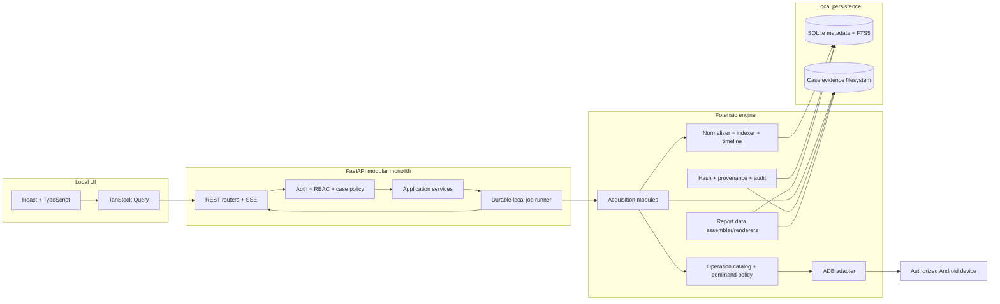
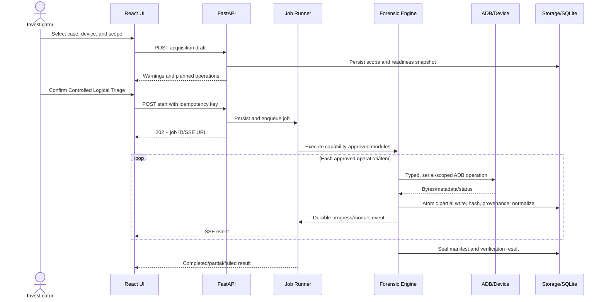
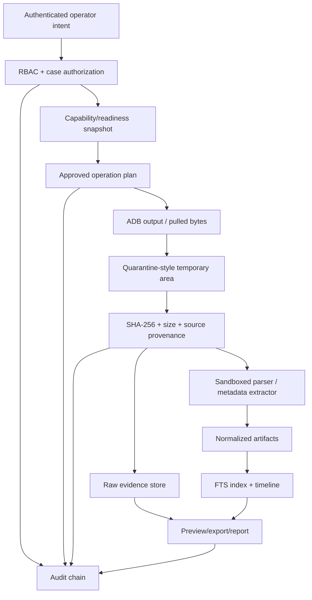
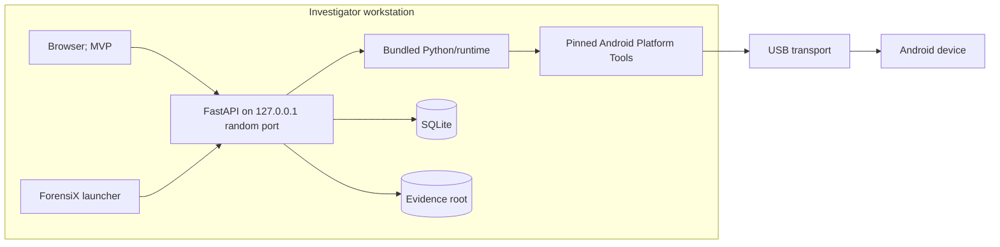
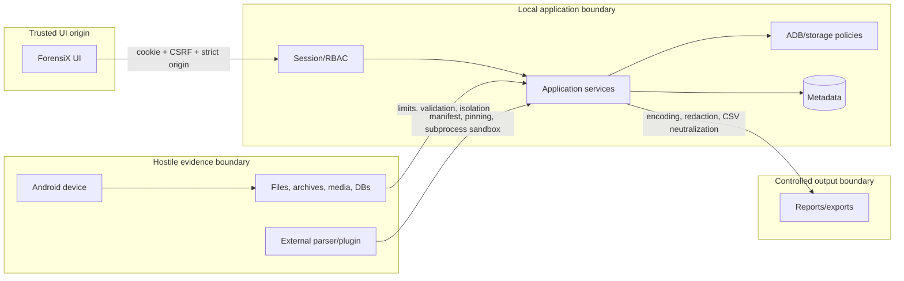

# ForensiX Implementation Plan

**Product:** ForensiX - Android Rapid Evidence Triage and Forensic Preview Platform  
**Document status:** Architecture baseline for engineering review  
**Source:** `android_forensic_triage_srs.pdf`, version 1.0, dated 14 July 2026  
**Planning assumption:** 3-5 engineers, eight-week prototype/MVP window, production hardening afterward

> ForensiX is a workstation application, not an Android APK. Its default mode is **Controlled Logical Triage Mode**. ADB is not a hardware write blocker: operations can change device state, timestamps, logs, caches, or USB/ADB state. The product must disclose those limitations in the UI, command ledger, acquisition manifest, and every report.

## 1. Executive Summary

ForensiX should be built as a modular local application with a React/TypeScript browser UI, a localhost-only FastAPI backend, an isolated Python forensic engine, SQLite metadata storage, and an append-oriented evidence filesystem. The MVP deliberately targets what is repeatable on a modern, unlocked, ADB-authorized, non-rooted Android device: device metadata, package metadata, accessible shared-storage media/documents, hashes, provenance, indexing, evidence preview, timeline derivation, audit/custody records, and preliminary reports.

The SRS contains 100 functional requirements. Fifty-eight can be implemented directly or with ordinary product constraints in the MVP; 18 are suitable for Version 1; 24 require elevated access, controlled inputs, research validation, or are not reliably supportable on stock modern Android. In particular, ADB authorization does not grant access to private application sandboxes. SMS, call logs, contacts, Wi-Fi credentials, private browser history, notifications, and messaging/social-app databases are generally unavailable to `shell` on non-rooted production devices. Deleted-file recovery is not a defensible MVP promise because file-based encryption, flash translation layers, and TRIM prevent dependable unallocated-space recovery.

The MVP architecture is a modular monolith rather than microservices. A durable single-process job runner persists work state to SQLite and publishes progress through Server-Sent Events (SSE). Evidence bytes are never stored in the database; they are written through a storage service into UUID-based case/acquisition paths, hashed during or immediately after collection, and referenced by immutable provenance records. A strict operation catalog maps approved acquisition modules to fixed ADB command templates. No API accepts arbitrary shell text.

The eight-week target is credible only if the team freezes the MVP scope and uses a mock ADB adapter plus pre-seeded evidence for deterministic demonstrations. Production readiness requires a later validation campaign across Android/OEM versions, parser isolation, signed releases, encryption-at-rest policy integration, and external review of forensic methodology.

## 2. SRS Analysis

### 2.1 Requirement inventory

| Group | IDs | Count | Planning interpretation |
|---|---:|---:|---|
| Device detection and validation | FR-1..10 | 10 | MVP; capability results must be evidence, not assumptions |
| Case management | FR-11..16 | 6 | MVP except multi-device UX may be limited |
| Acquisition control | FR-17..26 | 10 | MVP after replacing “read-only” with controlled logical triage; full resume is V1 |
| Artifact extraction | FR-27..51 | 25 | Nine accessible-storage/metadata modules in MVP; private/system artifacts are research/elevated-access |
| Evidence preview and analysis | FR-52..65 | 14 | MVP, with timeline limited to available source timestamps |
| Deleted-data recovery | FR-66..70 | 5 | Research only; data model/UI states may ship without recovery capability |
| Integrity and audit | FR-71..77 | 7 | MVP; “immutable” is corrected to tamper-evident and append-oriented |
| Reporting and export | FR-78..85 | 8 | PDF/JSON/CSV MVP; HTML and final approval workflow V1 |
| Security and administration | FR-86..95 | 10 | MVP core; encryption configuration and concurrent multi-device execution V1 |
| Extensibility/interoperability | FR-96..100 | 5 | REST/schema migrations MVP; ALEAPP/plugin SDK/downstream formats V1 |
| **Total** | **FR-1..100** | **100** | Traceable through this plan and the detailed design backlog |

Non-functional requirements group into performance (5 s detection, 30 s first preview, 3 s search), scalability (1,000 cases and database migration path), reliability/recovery, offline availability, maintainability/versioning, security, evidence integrity, portability, accessibility, auditability, compliance support, usability, interoperability, resource use, backup, and privacy/redaction.

### 2.2 Actors and responsibilities

| Actor | Core authority | Explicit boundaries |
|---|---|---|
| Administrator | bootstrap/manage users, settings, paths, parser policy, audit access | cannot rewrite evidence, hashes, audit, or custody history |
| Investigator | create/manage assigned cases, assess devices, run acquisitions, review/export evidence | no arbitrary ADB commands; cannot finalize own report unless policy allows |
| Analyst | search, correlate, bookmark, tag, note, verify hashes, draft reports | no acquisition by default; no source modification |
| Supervisor | review cases/custody, approve/finalize reports, view audit | approval creates a new signed/hashed version; does not mutate drafts |
| Reviewer | read approved report packages and explicitly shared evidence | no write or acquisition authority |
| System/operator service | execute policy-approved jobs, write manifests/audit entries | acts only under authenticated user intent and records initiator |

### 2.3 Primary workflows

1. Bootstrap an offline administrator and configure an approved evidence root.
2. Authenticate; create or reopen a case with legal-authority/agency metadata.
3. Detect a USB device; classify missing, unauthorized, offline, authorized, or multiple-device state.
4. Assess capabilities from fixed commands; show supported, unsupported, unknown, and warning states.
5. Select acquisition scope; review commands, side effects, storage estimate, and limitations; confirm.
6. Execute modules; preserve partial files, hash, normalize, index, and publish durable progress.
7. Review evidence, provenance, thumbnails, search, timeline, bookmarks, tags, and analyst notes.
8. Verify hashes; add custody events; assemble a preliminary report and structured exports.
9. Close or suspend the case without deleting evidence; later reopen with an audit event.

### 2.4 Major components and dependencies

The system consists of a browser/Tauri-ready UI, versioned REST API, SSE event stream, local job runner, ADB adapter/command policy, capability assessor, acquisition orchestrator, module/parser registry, storage service, normalizer/indexer, timeline/hash/report engines, SQLite database, and case filesystem. External dependencies are Android Platform Tools, operating-system USB support/drivers, PDF renderer, image/metadata libraries, optional ALEAPP, and future downstream export adapters. Core workflows have no cloud dependency.

### 2.5 Security and forensic-integrity interpretation

- Treat every device-derived file, filename, metadata value, archive, image, and database as hostile input.
- Bind the backend to loopback, use an unpredictable local port, strict CORS/origin checks, secure HttpOnly cookies, CSRF protection, RBAC, and object-level case authorization.
- Canonicalize and contain all paths under a configured evidence root; reject symlinks/reparse-point escapes.
- Permit only registered ADB operations with typed arguments and command-specific validation.
- Keep raw evidence append-only; derived thumbnails/text live separately and can be regenerated.
- Hash files, manifests, exports, and reports with SHA-256. Chain audit entries using canonical serialization, while clearly calling the result tamper-evident, not immutable or tamper-proof.
- Preserve original timestamps and source strings; normalized UTC values include source, timezone basis, parser version, and confidence.
- Do not state legal admissibility. The product supports documented handling and repeatability; admissibility remains jurisdiction-, process-, operator-, and court-dependent.

### 2.6 Ambiguous, constrained, and missing requirements

| SRS requirement | Concern | Realistic interpretation | Disposition |
|---|---|---|---|
| FR-9, “determine USB debugging status” | If no ADB transport is exposed, the workstation cannot distinguish disabled debugging from cable/driver/port failure | Report observed transport state and troubleshooting hypotheses, never a definitive device setting unless ADB responds | MVP with limitations |
| FR-17, “read-only logical acquisition” | ADB can create device-side side effects and is not a write blocker | Rename to Controlled Logical Triage Mode; catalog/log commands and side-effect class | MVP with limitations |
| FR-20, “broader logical acquisition” | Undefined scope and privilege assumptions | Execute only capability-approved modules; display exclusions before start | MVP with limitations |
| FR-26, resumable sessions | ADB pull is not universally resumable and remote files can change | MVP restarts incomplete items and deduplicates verified files; byte-range resume only after validation | V1 |
| FR-28..30 | Contacts/SMS/calls typically live behind protected providers/databases | Import only from lawfully obtained backups/exports or validated elevated-access adapters | Research/elevated access |
| FR-36..44 | Browser, clipboard, Wi-Fi, Bluetooth, notifications, calendar, notes, and location are OS/app-private on modern Android | Per-artifact research matrix; no default non-rooted promise | Research spike |
| FR-45..51 | App sandboxing and encryption protect social/messaging databases; schemas change frequently | Parse only lawfully acquired databases/backups with versioned parsers and validation corpora | Future release |
| FR-66..70 | FBE, TRIM, flash controllers, and no block access defeat generic recovery | Data model supports recovered states; recovery engine accepts controlled images/databases later | Research only |
| FR-75, “immutable audit trail” | Local administrators can alter SQLite/files | Hash-chain and export/sign checkpoints; call it tamper-evident | MVP corrected |
| FR-85, report finalization | Approval authority and signature semantics are unspecified | Preliminary-only MVP; supervisor approval produces a new immutable report version in V1 | MVP/V1 split |
| “evidence admissibility” language | Software cannot guarantee admissibility | Report methodology, tool version, limitations, provenance, and validation status | Never guarantee |

Missing decisions that must become policy/ADRs: lawful-authority fields and retention rules; supported Android/OEM matrix; minimum workstation specification; timezone rules; maximum file/archive/report sizes; encryption-at-rest/key recovery; malware handling; case export/import; backup verification; report approval; plugin trust/signing; dependency update policy; audit checkpoint export; data purge authorization; localization; and incident-response procedures for suspected evidence tampering.

### 2.7 Phase 0 proof-of-concept gates

Phase 0 must validate: ADB discovery/version; device-state parsing; serial-scoped property reads; package listing; shared-storage listing/pull/stat; source and destination hash behavior; filename/path edge cases; progress and cancellation; disconnect/reconnect; Windows driver, Linux udev, and macOS USB behavior; non-rooted Android 10-16 access matrix; and ALEAPP’s supported input/output contract. A failed gate removes or narrows the corresponding MVP feature rather than delaying the entire product.

## 3. Requirement Feasibility Matrix

Legend: **H** high, **M** medium, **L** low, **X** experimental, **E** unsupported without elevated/lawfully obtained access. “Unlocked” means screen unlocked where an operation/OEM requires it, not a bypass.

| ID | Requirement / module | Feas. | Device state and Android limitation | Root | USB debug | Unlocked | Release | Test and risk |
|---|---|:---:|---|:---:|:---:|:---:|---|---|
| FR-1..3 | Detection/state/authorization | H | Driver/cable/OEM can mask state | No | Yes | For authorization | MVP | Recorded `adb devices -l`; medium |
| FR-4..8 | Serial/properties/first seen | H | Some properties redacted/spoofable | No | Yes | Usually no | MVP | Device matrix; low |
| FR-9..10 | Debug/readiness assessment | M | No transport cannot prove debug setting | No | For positive result | Sometimes | MVP | Negative-state matrix; medium |
| FR-11..16 | Case management | H | Workstation-only | No | No | No | MVP | API/RBAC/migration tests; low |
| FR-17..25 | Acquisition control | M | ADB is not write-blocked; pulls can interrupt | No | Yes | Usually | MVP | Fault injection; high |
| FR-26 | True resume | M | Remote changes and pull semantics | No | Yes | Usually | V1 | disconnect/restart KAT; high |
| FR-27 | Device metadata | H | Capability/property variance | No | Yes | Usually no | MVP | Golden outputs; low |
| FR-28 | Contacts | E | Protected provider/app data | Usually | Yes | Yes | Research | Controlled backup/root fixtures; high |
| FR-29 | SMS/MMS | E | Protected telephony provider/database | Usually | Yes | Yes | Research | Known database fixture; high |
| FR-30 | Call logs | E | Protected provider/database | Usually | Yes | Yes | Research | Known database fixture; high |
| FR-31 | Installed applications | H | Package list visibility can vary | No | Yes | Usually no | MVP | Android/OEM matrix; medium |
| FR-32 | Photos/EXIF | H | Only shared/accessible paths; media may be cloud-only | No | Yes | Sometimes | MVP | Known media/hash set; medium |
| FR-33 | Videos | H | Shared/accessible files only | No | Yes | Sometimes | MVP | Large-file/disconnect tests; medium |
| FR-34 | Audio | H | Shared/accessible files only | No | Yes | Sometimes | MVP | MIME/hash fixtures; medium |
| FR-35 | Documents/download files | H | Scoped storage and app-specific areas excluded | No | Yes | Sometimes | MVP | Filename/path corpus; medium |
| FR-36 | Browser history | E | App-private databases; browser-specific | Usually | Yes | Yes | Research | Versioned database fixtures; high |
| FR-37 | Download history | L | Files accessible; system history provider often not | Maybe | Yes | Sometimes | MVP files only | Compare Files/Downloads; medium |
| FR-38 | Clipboard | E | Foreground/default-IME restrictions and no historical store | Usually | Yes | Yes | Excluded | Controlled research only; high |
| FR-39 | Wi-Fi records | E | Credential/config files protected | Yes | Yes | Yes | Research | Rooted fixtures, redact secrets; high |
| FR-40 | Bluetooth records | E | System data protected; OEM schemas | Usually | Yes | Yes | Research | Rooted device matrix; high |
| FR-41 | Notifications | E | Requires notification listener/app or protected DB | Usually | Yes | Yes | Excluded | Controlled app PoC; high |
| FR-42 | Calendar | E | Provider access not granted to shell | Usually | Yes | Yes | Research | Export/root fixtures; high |
| FR-43 | Notes | E | Vendor/app-specific private databases | Usually | Yes | Yes | Research | Parser corpora; high |
| FR-44 | Location | E | Multiple encrypted/private sources | Usually | Yes | Yes | Research | Known tracks/database KAT; high |
| FR-45 | WhatsApp | E | Sandbox + encrypted/versioned stores | Usually | Yes | Yes | Future | Lawfully acquired backup fixtures; critical |
| FR-46 | Telegram | E | Sandbox, caches, cloud/session semantics | Usually | Yes | Yes | Future | Versioned fixtures; critical |
| FR-47 | Signal | E | Strong local database/key protection | Yes/backup | Yes | Yes | Future research | Controlled fixtures only; critical |
| FR-48 | Messenger | E | Sandbox/versioned stores | Usually | Yes | Yes | Future | Versioned fixtures; critical |
| FR-49 | Instagram | E | Sandbox/versioned caches | Usually | Yes | Yes | Future | Versioned fixtures; high |
| FR-50 | Facebook | E | Sandbox/versioned stores | Usually | Yes | Yes | Future | Versioned fixtures; high |
| FR-51 | Snapchat | E | Ephemeral/cloud semantics + sandbox | Usually | Yes | Yes | Future research | No coverage claim; critical |
| FR-52..62 | Preview/search/bookmark/note/dashboard | H | Operates on acquired data | No | No | No | MVP | UI/API/a11y/load tests; medium |
| FR-63..65 | Timeline/conflicts | M | Source timestamps can be absent/ambiguous | No | No | No | MVP | Timezone/conflict corpus; high |
| FR-66..70 | Deleted recovery/status | X | No block access; FBE/TRIM | For device recovery | Yes | Yes | Research | Controlled images/databases; critical |
| FR-71..74 | Hash/verification | H | Workstation data path | No | No | No | MVP | NIST vectors and tamper tests; low |
| FR-75 | Tamper-evident audit | M | Local admin can alter storage | No | No | No | MVP corrected | Chain mutation tests; high |
| FR-76..77 | Custody/action history | H | Depends on operator correctness | No | No | No | MVP | Append/amend/RBAC tests; medium |
| FR-78..81,83..84 | Preliminary PDF/JSON/CSV | H | Derived from normalized evidence | No | No | No | MVP | Golden report/schema tests; medium |
| FR-82,85 | HTML/final approval | H | Needs template/approval policy | No | No | No | V1 | Snapshot/signoff tests; medium |
| FR-86..94 | Auth/RBAC/admin/settings/offline | H | Local credential/key recovery policy needed | No | No | No | MVP | OWASP auth/RBAC tests; high |
| FR-95 | Concurrent multi-device execution | M | ADB/USB/disk contention | No | Yes | Usually | V1 | Two-device stress; high |
| FR-96 | ALEAPP integration | M | ALEAPP inputs/support change | Depends on input | Depends | Depends | V1 | Pinned-version contract tests; high |
| FR-97 | Downstream export | M | Target formats must be specified | No | No | No | V1 | Import into target tool; medium |
| FR-98 | Plugin SDK | M | Untrusted code isolation/signing | No | No | No | V1 | Malicious plugin tests; high |
| FR-99..100 | Schema migrations/REST API | H | Version discipline required | No | No | No | MVP | Migration/API contract tests; medium |

## 4. Assumptions and Constraints

- The investigator has lawful authority, physical possession, and organizational approval; ForensiX records but does not determine authority.
- MVP reference device: Android 10-16, screen unlock available, USB debugging enabled and authorized, no root, accessible shared storage present.
- No USB debugging, no authorization, lock, encryption, OEM policy, work profile, or damaged transport can be bypassed.
- Evidence collection is local and offline. Optional updates/cloud features remain disabled in core flows.
- One acquisition executes at a time in MVP; additional detected devices can be assessed but are queued.
- SQLite runs in WAL mode for metadata durability, with a single writer policy. Evidence files remain outside SQLite.
- Supported ordinary workload target: 1,000 cases, 1 million normalized artifacts per large case, 2 GB RAM ceiling, and storage sized by the operator.
- MVP stores UTC plus original timestamp text/offset/source. Investigator-selected case timezone is presentation-only.
- Encryption at rest depends on OS full-disk encryption in MVP; application-managed encryption and key escrow are V1 after policy design.
- Production evidence claims require validation against named devices, Android versions, module/parser versions, and known-answer datasets.

## 5. Product Scope Definition

ForensiX is a forensic triage and preview tool for accessible logical evidence. It is not a physical imaging tool, exploit platform, mobile-device-management agent, password cracker, malware execution sandbox, cloud evidence collector, or legal case-management system. The supported boundary begins at an observable ADB transport or an explicitly imported lawful evidence package and ends at hashed local evidence, normalized metadata, analysis views, custody/audit history, and preliminary exports.

Success means an operator can understand device readiness, perform a reproducible supported collection, see exactly what was and was not collected, inspect provenance, and generate a limitation-aware report without internet access.

## 6. MVP Scope

MVP includes local bootstrap/authentication (administrator, investigator, analyst, supervisor, reviewer permission model), case lifecycle, one-device-at-a-time detection and capability assessment, Controlled Logical Triage Mode, configurable scopes, device/package metadata, accessible shared-storage inventory and collection, images/videos/audio/documents/download-folder files, EXIF/basic metadata, durable jobs/SSE progress, cancellation/interruption preservation, hashing/manifests, normalization, FTS5 search/filter/sort, thumbnails and safe preview, timeline, bookmarks/tags/notes, tamper-evident audit records, append-only custody events, preliminary PDF, JSON/CSV export, dark mode, keyboard-accessible primary flow, backup/export, mock device, and Windows/Linux/macOS developer validation.

MVP explicitly excludes private app/system artifacts, deleted recovery, arbitrary shell access, byte-perfect resume, simultaneous acquisition, HTML report, final approval/digital signatures, ALEAPP execution, public plugin SDK, Autopsy-specific export, built-in evidence encryption, cloud sync, iOS, OCR, and AI features.

## 7. Version 1 Scope

Version 1 adds validated ALEAPP import/orchestration, multi-device cases and resource-controlled concurrent jobs, item-level resume where source identity can be proven, improved correlation, HTML/versioned templates, redaction, supervisor finalization workflow, evidence bundles/import, Autopsy-targeted output, parser SDK with signed manifests and process isolation, enhanced RBAC, external audit-chain checkpoints, application-managed encryption when policy/key recovery are defined, signed installers, and a Tauri desktop shell.

Every V1 parser must declare supported evidence-source versions, access requirements, expected inputs, limitations, confidence rules, side effects, fixtures, and validation report. “Plugin installed” never implies “parser output forensically validated.”

## 8. Future Scope

Research tracks may evaluate imported Android backups, rooted-device and filesystem-image adapters, SQLite WAL/journal/free-page recovery, thumbnail/cache remnants, OCR, media classifiers, investigator-assist summaries, iOS adapter interfaces, agency-controlled metadata synchronization, digital signatures/timestamps, and memory acquisition. These remain separately labeled prototypes until repeatability, false-positive/negative rates, operator safeguards, privacy, and validation are documented.

No roadmap item includes lock bypass, exploit development, guaranteed deleted recovery, or guaranteed evidentiary admissibility.

## 9. System Architecture

### 9.1 Architectural style and communication

Use a modular monolith with explicit ports/adapters. React calls versioned FastAPI endpoints through a generated TypeScript client. Commands enter application services, which authorize case access, persist intent, enqueue durable jobs, and call forensic interfaces. The forensic layer cannot import web routers or UI code. All ADB processes go through `AdbRunner` and `CommandPolicy`; all filesystem mutations go through `EvidenceStorage`. Domain events feed the audit/custody ledger and SSE stream. SQLAlchemy repositories own metadata transactions; raw bytes never pass through JSON APIs.

### 9.2 Component diagram



### 9.3 Acquisition sequence



### 9.4 Data-flow diagram



### 9.5 Deployment diagram



MVP deployment is a launcher plus local browser. Docker is for reproducible development/backend testing, not the primary acquisition runtime because container USB passthrough is inconsistent across desktop operating systems. A polished release uses Tauri to manage the local backend sidecar while keeping the same API boundary.

### 9.6 Trust-boundary diagram



The authenticated browser is not trusted for authorization or command construction. Device data and plugins are hostile. The localhost network boundary is still security-relevant: another local process or malicious site must not be able to drive ForensiX through CORS, DNS rebinding, guessed ports, or CSRF.

## 10. Repository Structure

```text
ForensiX/
├── apps/
│   ├── web/                       # React/Vite application
│   │   └── src/{app,features,components,lib,generated,styles}/
│   └── api/                       # FastAPI composition root
│       └── src/forensix_api/{routers,dependencies,middleware}/
├── packages/
│   ├── ui/                        # Accessible design-system components
│   └── api-client/                # Generated OpenAPI TypeScript client
├── forensic/
│   └── src/forensix_forensic/
│       ├── adb/                   # Adapter, runner, policy, recorded/mock clients
│       ├── capabilities/          # Device assessment and readiness
│       ├── acquisition/           # State machine, plans, orchestrator, checkpoints
│       ├── modules/               # Built-in acquisition modules
│       ├── parsers/               # Parser contracts/registry and isolated workers
│       ├── normalization/         # Artifact/timestamp/provenance normalization
│       ├── storage/               # Safe filesystem port and implementation
│       ├── hashing/               # Streaming hashes/manifests/verification
│       ├── timeline/              # Timeline materialization/correlation
│       └── reporting/             # Data assembly and render adapters
├── server/
│   └── src/forensix_server/
│       ├── auth/                  # Password, sessions, CSRF, RBAC
│       ├── cases/                 # Domain/service/repository per feature
│       ├── devices/
│       ├── acquisitions/
│       ├── artifacts/
│       ├── reports/
│       ├── custody/
│       ├── audit/
│       ├── jobs/
│       ├── settings/
│       ├── db/{models,migrations}/
│       └── schemas/               # Pydantic transport contracts
├── plugins/
│   ├── sdk/                       # V1 versioned interfaces and manifest schema
│   └── bundled/                   # Reviewed, pinned first-party plugins only
├── infrastructure/
│   ├── docker/                    # Dev/test images and Compose
│   ├── packaging/                 # PyInstaller/Tauri/installer definitions
│   └── scripts/                   # Bootstrap, OpenAPI generation, validation
├── docs/
│   ├── adr/                       # Architecture decision records
│   ├── architecture/
│   ├── api/
│   ├── forensic-validation/
│   ├── schemas/
│   └── user-guides/
├── tests/
│   ├── fixtures/{adb,files,media,databases}/
│   ├── integration/
│   ├── security/
│   └── e2e/
├── sample-data/                   # Synthetic/non-sensitive demo data
├── pyproject.toml                 # Python workspace/tool configuration
├── pnpm-workspace.yaml
├── package.json
└── docker-compose.yml
```

Import rules are enforced by tests/linting: routers may import schemas and application services, never repositories/ADB directly; server services depend on forensic ports, not concrete subprocess/filesystem implementations; `forensix_forensic` does not import FastAPI/SQLAlchemy; frontend feature modules import `packages/ui`, generated API types, and shared primitives but not other feature internals. OS-specific process/path/permissions code lives behind `PlatformAdapter` in `forensic/adb/platform` and `forensic/storage/platform`.

OpenAPI is the transport source of truth. CI starts the API schema generator, produces `packages/api-client`, and fails on an uncommitted generated diff. Domain models remain Python-native and are not falsely shared with TypeScript. Plugin imports are forbidden in the core process in V1; the registry launches a pinned worker protocol with a versioned JSON/Protobuf-like message schema, restricted working directory, resource limits, and no implicit network access.

## 11. Frontend Architecture

### 11.1 Technology choices and state ownership

Use React 19 + TypeScript strict mode + Vite; React Router for route/data boundaries; TanStack Query for all server state, invalidation, retries, pagination, and SSE reconciliation; Zustand only for ephemeral cross-route UI preferences such as panel sizes and masked/unmasked display; React Hook Form + Zod for forms; TanStack Table + Virtual for large evidence grids; Radix primitives with a project-owned Tailwind design system; `react-aria` patterns where Radix does not supply the required semantics; date-fns for presentation; and Vitest/RTL/axe/Playwright for tests. Do not mirror case/evidence records into Zustand.

Sessions use `Secure`, `HttpOnly`, `SameSite=Strict` cookies issued by the local API. A readable CSRF token is delivered separately and echoed on state-changing requests. The UI keeps no bearer token in localStorage. A route loader calls `/auth/me`, and server-side authorization remains definitive.

### 11.2 Route and layout map

```text
/login
/dashboard
/cases
/cases/new
/cases/:caseId                       CaseLayout
  /overview
  /devices
  /acquisitions
  /acquisitions/:acquisitionId
  /evidence
  /evidence/:artifactId
  /timeline
  /reports
  /custody
  /audit
/audit                               global audit; Admin/Supervisor
/users                               Admin
/settings                            Admin; personal subset for all users
```

`AppShell` owns skip link, top bar, role-aware navigation, connection/job indicators, theme, and global errors. `CaseLayout` owns case identity/status and tabs. Feature routes own queries, forms, and permission-specific actions. Every route has a typed error boundary; skeletons preserve layout; empty states explain prerequisites and offer one permitted next action; stale SSE reconnects fall back to polling the persisted job state.

### 11.3 Screen specification

Common acceptance rule: every page is keyboard operable, warnings use text/icon plus color, loading announces status, failures expose a request ID without secrets, and unauthorized actions are absent from navigation and rejected by the API.

| Screen | Purpose/users | Data, actions, API | Empty/loading/error and permission acceptance |
|---|---|---|---|
| Login | All users authenticate | username/password; `POST /auth/login`, `GET /auth/me` | Generic failure, lockout countdown; focus moves to error; successful login redirects safely |
| Dashboard | Assigned work and system readiness | recent cases/jobs/devices, integrity warnings; cases/jobs/health endpoints | No-cases CTA; cards skeleton; only authorized case summaries appear |
| Cases | Search/create/reopen cases | server-paginated list, status/agency filters; cases endpoints | Empty create CTA; closed-case edits disabled by policy |
| Case overview | Case summary and next action | metadata, members, devices, acquisitions, counts; case endpoints | Missing case -> 404; unauthorized -> generic 404; status transitions confirmed |
| Devices | Detect, select, assess | device states, properties, capabilities/warnings; detect/assess endpoints | Explains missing/unauthorized/offline/multiple states; unsupported modules cannot be selected |
| Acquisition wizard | Define and confirm scope | readiness snapshot, modules, side-effect classes, disk estimate; acquisitions | Confirmation records exact plan version; start disabled on stale readiness/high-risk unresolved warning |
| Acquisition progress | Monitor/cancel/recover | job/module/item progress, command summaries, errors; acquisition/events/SSE | Refresh reconstructs state; cancellation is two-step; partial evidence remains navigable |
| Evidence explorer | Search/filter/sort/preview | virtualized rows, categories, dates, tags, status; artifacts endpoints | URL stores filters; first page under target; preview never executes active content |
| Artifact detail | Inspect provenance and derivations | raw/normalized metadata, hashes, relationships, preview, bookmark/tag/note | Sensitive values masked by default; source bytes read-only; download is audited |
| Timeline | Correlate available events | virtualized events, confidence/source/timezone filters; timeline endpoint | Uncertain/conflicting time visually and textually marked; source link opens artifact |
| Reports | Draft, generate, download, verify | templates, selection, redaction, jobs, hashes; reports endpoints | Preliminary label always visible in MVP; generation errors preserve job diagnostics |
| Custody | Append/review custody | chronological events, amendments; custody endpoints | No edit/delete controls; correction links prior event and requires reason |
| Case audit | Inspect case action chain | filter/export/verify chain; audit endpoints | Chain failure is a high-severity persistent banner; access limited by role |
| Users | Administer local accounts | create/disable/reset roles; users endpoints | Cannot remove last active admin; self-demotion guarded; actions audited |
| Settings | Paths/policy/theme/logging | validated settings and capability checks; settings endpoints | Evidence-root change requires empty/new policy or migration workflow; secrets never echoed |

Evidence preview supports safe server-generated thumbnails, escaped text, metadata, and explicit download. PDFs/HTML/archives are never embedded with active content in MVP. Image decoding for thumbnails occurs in a limited worker, output is re-encoded, dimensions/pixels are capped, and failures display metadata-only.

## 12. Backend Architecture

`create_app(settings)` is the composition root. It initializes structured logging/request IDs, database/migrations check, storage-root validation, platform/ADB adapters, repositories, services, durable job runner, routers, security middleware, and shutdown hooks. Pydantic Settings reads defaults, OS-specific config, an optional protected config file, and environment overrides used in development; startup logs effective non-secret settings.

Routers are thin: validate transport input, require permissions/case scope, call a service, and map domain errors. Services own transaction boundaries and idempotency. Repositories expose aggregate-focused operations and never return ORM entities past the service boundary. SQLAlchemy 2 models and Alembic migrations are used instead of SQLModel to keep persistence and transport schemas separate. SQLite uses foreign keys, WAL, `busy_timeout`, explicit indexes, and serialized write jobs.

Use a durable custom local job runner, not FastAPI `BackgroundTasks`, Celery, RQ, or Dramatiq. A dispatcher claims persisted jobs with a lease, executes bounded async orchestration plus subprocess/thread workers, checkpoints steps, observes cancellation, and recovers abandoned leases at startup. This avoids a broker for a single workstation while retaining an upgrade path: keep `JobRepository`, `JobExecutor`, and event interfaces so a PostgreSQL/worker implementation can replace the dispatcher.

Use SSE for one-way job/event progress. SSE reconnects with `Last-Event-ID`, works through ordinary HTTP, and is simpler than WebSockets because commands still use authenticated REST. Persisted events are authoritative; SSE is a delivery optimization.

API prefix is `/api/v1`. OpenAPI defines tagged operations and generated clients. All list endpoints use cursor pagination where stable event/artifact ordering matters and bounded offset pagination for small admin lists. Exports stream from opened, authorized file handles and set safe filenames. Health endpoints are `/health/live` and `/health/ready`; readiness verifies database, evidence-root writability policy, runner state, and ADB availability separately without requiring a device.

Security middleware enforces host/origin allowlists, CORS for the launched UI origin only, CSRF, session lookup, request/body limits, content security headers, and no-store on sensitive API responses. Rate limits target login and expensive generation endpoints; normal localhost reads are bounded by pagination/concurrency rather than a cosmetic global limiter.

## 13. Forensic Engine Architecture

The engine exposes typed ports: `DeviceTransport`, `CapabilityAssessor`, `AcquisitionPlanner`, `AcquisitionExecutor`, `EvidenceStorage`, `Hasher`, `ParserRegistry`, `ArtifactSink`, `TimelineBuilder`, and `ReportDataAssembler`. Each operation receives an immutable `OperationContext` containing case/device/acquisition/operator IDs, plan/readiness versions, cancellation token, storage capability, clock, and audit sink.

Execution stages are plan -> acquire to `.partial` -> fsync/atomic finalize -> hash -> provenance record -> parse derived output -> normalize -> index/timeline -> verify manifest -> seal result. A failure after finalization does not delete prior evidence; it records stage, error code, retryability, and validation status. Parsers never rewrite raw files. Derived output contains parent hashes and tool/parser versions.

The MVP modules are `device_metadata`, `package_inventory`, `shared_storage_inventory`, `image_files`, `video_files`, `audio_files`, `document_files`, `downloads_files`, `exif_metadata`, and `generic_file_metadata`. The recovery manager exists only as an interface and maturity registry in MVP; it must not label an artifact recovered without a validated recovery method.

## 14. ADB Communication Design

### 14.1 Interfaces and operation policy

```python
class AdbClient(Protocol):
    async def server_info(self) -> AdbServerInfo: ...
    async def list_transports(self) -> tuple[AdbTransport, ...]: ...
    async def get_properties(self, serial: DeviceSerial) -> DeviceProperties: ...
    async def list_packages(self, serial: DeviceSerial, options: PackageListOptions) -> PackageResult: ...
    async def list_files(self, serial: DeviceSerial, request: RemoteListRequest) -> RemoteListResult: ...
    async def pull_file(self, serial: DeviceSerial, request: PullRequest, sink: BinarySink) -> PullResult: ...
    async def stat_file(self, serial: DeviceSerial, path: ApprovedRemotePath) -> RemoteStat: ...
    async def cancel(self, operation_id: UUID) -> CancelResult: ...
```

There is intentionally no public `shell(serial, string)`. Built-in operations may use an internal runner only after the `OperationCatalog` resolves an operation ID to an executable, fixed argument template, typed parameters, timeout/output limits, allowed states/paths, and side-effect classification. Remote paths are opaque typed values validated against module-declared roots; serials must match an enumerated transport exactly; subprocess invocation always uses an argument array with `shell=False`.

ADB discovery order is explicit setting -> bundled signed/pinned Platform Tools -> PATH. Validate executable identity, `adb version`, supported version range, and file hash for bundled binaries. The service may start the ADB server, but records that side effect. Every device command includes `-s <serial>`. Multiple transports without an explicit serial cause a safe error.

Runner behavior: platform-specific hidden process group; monotonic timeout; cooperative cancellation followed by bounded process-tree termination; separate bounded stdout/stderr capture; streaming for pulls; exit-code and known-error classification; no retry for authorization/policy failures; at most one jittered retry for proven transient transport errors; reconnect requires identity/readiness revalidation. Output truncation is recorded, never silently accepted for evidence-producing commands.

Each command ledger entry stores operation/command ID, catalog version, case/device/acquisition/operator, sanitized argv, start/end wall and monotonic times, exit code/signal, byte counts, result/error summary, retry number, device state before/after when observable, and side-effect class (`none_observed`, `transport`, `read_like_with_possible_os_side_effect`, `device_mutating`, `prohibited`). MVP catalogs no `device_mutating` operations.

### 14.2 Capability assessment

`DeviceCapabilitySnapshot` stores serial, manufacturer/model, Android/API version, fingerprint, patch level, transport/authorization state, observed screen/unlock indicators with confidence, `adbd` privilege, `su` observation, accessible storage roots, package-list access, deprecated backup-command observation, encryption indicators, module decisions, warnings, evidence commands, assessment time, and assessor version.

Each module decision is `supported`, `unsupported`, `unknown`, or `blocked`, with reason code, required state, confidence, and evidence. The UI renders this snapshot and cannot enable a module unless the current plan references the same unexpired snapshot. Device reconnect, serial/fingerprint mismatch, authorization change, or configurable age invalidates it.

Example reasons include `ADB_UNAUTHORIZED`, `DEVICE_OFFLINE`, `SCREEN_UNLOCK_REQUIRED`, `REMOTE_ROOT_UNREADABLE`, `PRIVATE_APP_DATA_INACCESSIBLE`, `ELEVATED_ACCESS_REQUIRED`, and `MODULE_NOT_VALIDATED_FOR_API_LEVEL`. “Unknown” is never treated as supported.

### 14.3 Mock and recorded adapters

`MockAdbClient` is scenario-driven and deterministic: no device, authorized, unauthorized, offline, multiple devices, timeout, disconnect at byte N, corrupt output, changing remote file, and low disk. `RecordedAdbClient` replays redacted command outputs with fixture version/schema and expected parser results. Neither fixture may contain real personal data or stable real-device identifiers.

## 15. Artifact Extraction Framework

```python
class AcquisitionModule(Protocol):
    descriptor: ModuleDescriptor
    def evaluate(self, capabilities: DeviceCapabilitySnapshot) -> ModuleDecision: ...
    def plan(self, context: PlanningContext) -> tuple[PlannedOperation, ...]: ...
    async def acquire(self, context: OperationContext, operation: PlannedOperation) -> AsyncIterator[AcquiredItem]: ...
    async def validate(self, item: AcquiredItem) -> ValidationResult: ...
    async def derive(self, item: AcquiredItem) -> AsyncIterator[DerivedArtifact]: ...
```

`ModuleDescriptor` declares ID/name/version, categories, required capabilities/access, supported API/OEM evidence, input roots, operation IDs (not raw commands), outputs, parser IDs, time/size limits, risk/side effects, validation method, fixture set/version, maturity, and known limitations. `plan` is pure and produces a reviewable frozen operation plan. Cleanup only removes module-owned temporary/partial files after their state is recorded; it cannot delete sealed raw evidence.

| MVP module | Acquisition and output | Validation |
|---|---|---|
| Device metadata | Fixed `getprop`/transport observations -> JSON snapshot | Required properties parsed; raw output hash retained |
| Package inventory | Fixed package-manager listing -> package artifacts | Count/format checks; raw listing retained; visibility limitation reported |
| Shared-storage inventory | Bounded traversal of approved roots -> remote file candidates | Root/readability, path/type/size, duplicate identity checks |
| Images/videos/audio/documents | Pull selected candidates through streaming sink | Destination size, transfer status, SHA-256, optional source hash if safe/available |
| Downloads | Same engine with Downloads roots and category tag | Root mapping, file metadata/hash |
| EXIF metadata | Parse a sealed local copy in constrained worker | Parser success, bounded fields, parent SHA-256/version |
| Generic metadata | MIME sniffing, size, local timestamps, remote stat | Original/raw values preserved; contradictions flagged |

Research modules for contacts, SMS/MMS, calls, Wi-Fi, Bluetooth, browsers, notifications, calendar, notes, location, and named messaging/social apps begin with an acquisition-source study, legal/access assumptions, versioned fixture corpus, parser KATs, false-positive/negative measurement, and an explicit decision. A parser for an imported database does not imply ForensiX can acquire that database from a stock phone.

## 16. Evidence Normalization Model

`Artifact` fields: UUID, case/device/acquisition IDs, category/subtype, title/summary/content text, source URI/path, evidence-file ID, original filename, detected/declared MIME, size, created/modified/accessed/event timestamp values, original timestamp strings, timestamp source, UTC value, offset/timezone basis, confidence, active/deleted/recovered/partial/corrupted/unverified status, parser/module ID and version, primary SHA-256, provenance ID, tags/bookmark projections, metadata JSON, schema version, and created time.

Provenance is a graph, not a free-text field. A provenance node records source device/path, operation and command-ledger IDs, acquisition time, raw evidence hash, transformation/parser/tool versions, input parent hashes, output hash, operator/job, and validation status. Artifact relationships model parent-child, attachment, conversation membership, duplicate-of, derived-from, and temporal correlation.

Timestamp rules: retain integer/text source exactly; parse with overflow/range checks; store UTC only when a timezone/offset is known or a documented case assumption is explicitly applied; store naive values separately; record precision; do not invent seconds; conflicting sources create separate values and a conflict flag. Presentation can use case/local timezone without rewriting stored values.

Duplicate detection uses SHA-256 for identical acquired bytes. A remote path/size/mtime tuple may optimize planning but never proves identity. Cross-acquisition duplicates remain distinct provenance instances linked to a canonical content object. FTS indexes only normalized/escaped searchable text and selected metadata, not secrets excluded by policy.

## 17. Database Design

IDs are UUIDv7 text (time-sortable without exposing case numbers). Timestamps are RFC 3339 UTC text plus source-specific fields where needed. Enumerations use checked text values. JSON is reserved for versioned, non-relational extension metadata; searchable/authorized fields are columns. Foreign keys are `RESTRICT` for evidence/case lineage. Evidence has no cascade delete. Soft deletion means an administrative tombstone request, never hidden row removal; actual purge is a separate policy workflow excluded from MVP.

| Table | Purpose and principal columns | Constraints and indexes |
|---|---|---|
| `users` | id, username, display_name, password_hash, active, failed_count, locked_until, created/updated | unique normalized username; last-admin guard in service |
| `roles` / `user_roles` | role code/description; user_id, role_id | unique role code and user-role pair |
| `sessions` | id hash, user_id, CSRF hash, issued/expires/last_seen/revoked, client metadata | index user/expiry; never store raw token |
| `cases` | id, case_number, title, agency, authority_ref, description, status, presentation_tz, owner, opened/closed, version | unique case number; status/updated indexes |
| `case_members` | case_id, user_id, case_role, added_by/at, removed_at | unique active membership; object authorization index |
| `devices` | id, case_id, stable display label, serial protected/display hash, manufacturer/model, first/last seen | case FK restrict; case/serial-hash index |
| `device_capabilities` | id, device_id, snapshot/version/assessed_by/at, transport/fingerprint/API, result JSON, invalidated_at | device/time index; immutable snapshots |
| `acquisitions` | id, case/device/operator, scope/plan versions, state, readiness_id, started/ended, progress, error, manifest_file_id, version | state/updated, case/time indexes; optimistic version |
| `acquisition_modules` | id, acquisition_id, module/version, order, state/progress, checkpoint JSON, result/error | unique acquisition/module/order |
| `acquisition_events` | id sequence, acquisition/job, type, payload JSON, created | unique job sequence; acquisition/time index |
| `command_records` | id, acquisition/module/operation/catalog, sanitized argv JSON, timings, exit/bytes/results, side_effect | acquisition/time; append-only service |
| `evidence_files` | id, case/device/acquisition, storage key, source path, name, size, status, sealed_at, primary_hash_id | unique storage key; source/acquisition indexes; no cascade |
| `artifacts` | normalized fields described in section 16, evidence_file_id, metadata JSON | case/category/event-time, acquisition, status, parser indexes |
| `artifact_relationships` | from_id, to_id, relationship, confidence, provenance | unique triple; both-direction indexes |
| `tags` / `artifact_tags` | case-scoped tag; artifact/tag/actor/time | unique normalized tag per case and pair |
| `bookmarks` | artifact_id, user_id, reason, created/removed | unique active user/artifact; case via artifact |
| `analyst_notes` | id, artifact/case, author, body, created, supersedes_id, withdrawn_at | append/amend; artifact/time index |
| `timeline_events` | id, case/artifact/acquisition, category, UTC/original time, source, confidence, conflict_group, summary | case/time/category compound indexes |
| `hashes` | id, object_type/id, algorithm, value, size, tool/version, calculated_at | unique object/algorithm/value; hash lookup |
| `hash_verifications` | id, hash_id, verifier, observed_value, result, verified_at, tool/version | hash/time index; append-only |
| `jobs` | id, type/state, owner, case/acquisition, progress/step/module, lease, cancel, resume, result/error, timestamps, version | state/lease/updated indexes |
| `reports` | id, case, creator, template/version, state, selection/redaction JSON, file_id, SHA-256, preliminary, created/completed | case/time/state; immutable completed versions |
| `report_artifacts` | report_id, artifact_id, inclusion reason/order | unique pair; restrict deletes |
| `custody_events` | id, case, object refs, event type, actor/time/location/purpose/from/to/notes, acknowledgement, amendment_of, audit_id | case/time; no update/delete |
| `audit_logs` | sequence, event_id, case/user/action/outcome, canonical payload, previous_hash, entry_hash, created | unique sequence/event/hash; append-only |
| `settings` | scope/key, typed value JSON, schema version, updated_by/at | unique scope/key; secrets are references, not values |
| `parser_registry` | parser/module ID/version, manifest hash, status, validation level, installed/enabled info | unique ID/version; enabled/version index |
| `export_jobs` | job/report/case, format/schema version, file_id/hash/state | case/time; file restrict |
| `system_events` | id, severity/type, request/job, safe detail, created | severity/time/type indexes; retention policy |

FTS5 uses an external-content `artifact_search` table keyed by artifact rowid with title, summary, content, source name, and tags. Application code updates it transactionally through one indexing service; a rebuild command verifies counts. Start with prefix-enabled Unicode tokenizer; record tokenizer/schema version. Migrations create identity/security, cases/members, devices/capabilities, acquisitions/jobs/events, evidence/hashes, artifacts/FTS/timeline, reports/custody/audit, then settings/registry. Every migration has upgrade, downgrade where safe, fixture migration, and copy-and-verify backup for destructive SQLite changes. PostgreSQL migration later replaces UUID/timestamp/JSON types and FTS implementation behind repositories; do not use SQLite-specific SQL outside adapters.

## 18. API Design

### 18.1 Conventions

All responses include `request_id`; errors use `{error:{code,message,details,request_id}}`, with `details` allowlisted. Validation is 422, unauthenticated 401, unauthorized case access is usually 404 to reduce enumeration, conflict/stale version is 409, policy refusal 403, storage exhaustion 507, dependency unavailable 503. Mutation requests accept `Idempotency-Key` where retries could duplicate work; persisted responses are scoped to user+route+body hash. Lists use `limit<=200`, stable sort allowlists, and opaque cursors. Every mutation and every sensitive read/download emits an audit action and outcome.

### 18.2 Endpoint catalog

Abbreviations: A administrator, I investigator, N analyst, S supervisor, R reviewer; case membership and object permission always apply.

| Method/path | Roles | Request -> response | Validation, errors, audit, idempotency, acceptance |
|---|---|---|---|
| POST `/auth/login` | public | credentials -> user/session | bounded fields; generic `AUTH_FAILED`/423; audit success/fail; idempotency N/A; cookie+CSRF issued |
| POST `/auth/logout` | all | CSRF -> 204 | revoke current session; audit; repeat is 204 |
| GET `/auth/me` | all | - -> user/roles/session expiry | 401 if expired; no sensitive profile fields |
| POST `/auth/refresh` | all | CSRF -> renewed session | rotation/revocation checks; audit anomalies; old token unusable |
| GET/POST `/cases` | all / A,I | filters or create schema -> page/case | unique case number, authority fields; audit create; POST idempotent; membership filtering proven |
| GET/PATCH `/cases/{id}` | members / A,I | versioned patch -> case | field/status permission; 404/409; audit changed fields, not secrets; idempotency key; stale update rejected |
| POST `/cases/{id}/close` | A,I,S | version/reason -> case | active-job/custody policy; 409; audit; duplicate returns same closed version |
| POST `/devices/detect` | A,I | optional timeout<=5 -> observed transports | runner availability/multiple states; 503; audit invocation; short-lived idempotency; states correctly classified |
| GET `/devices` | case members | case cursor/filter -> page | case required; safe serial display; read audit by policy |
| GET `/devices/{id}` | case members | - -> device/latest assessment | object auth; no raw secrets; 404 concealment |
| POST `/devices/{id}/assess` | A,I | expected transport -> job/snapshot ref | case/device state; 409/503; audit; idempotent; unsupported remains disabled |
| POST `/acquisitions` | A,I | case/device/scope -> draft plan | snapshot current, modules supported; 409; audit; idempotent; returns operations/warnings |
| POST `/acquisitions/{id}/start` | A,I | plan version/confirmation -> job | exact readiness/plan, disk check; 409/507; audit; idempotent; one execution only |
| POST `/acquisitions/{id}/cancel` | A,I | reason/version -> accepted state | terminal-state handling; audit; idempotent; partials preserved |
| POST `/acquisitions/{id}/resume` | A,I | checkpoint/version -> job | V1 capability/source identity; 409; audit; idempotent |
| GET `/acquisitions/{id}` | members | - -> state/progress/summary | object auth; reconstructs after refresh |
| GET `/acquisitions/{id}/events` | members | cursor -> event page or SSE | cursor/Last-Event-ID; heartbeat; reconnect no gaps |
| GET `/artifacts` | members | case, query, filters, sort, cursor -> page/facets | allowlists/date parsing; 422; sensitive query audit; target latency met |
| GET `/artifacts/{id}` | members | - -> artifact/provenance/relations | object auth; preview URLs short-lived/session-bound |
| POST/DELETE `/artifacts/{id}/bookmark` | I,N,S | reason / - -> bookmark/204 | append/remove marker; audit; idempotent |
| POST `/artifacts/{id}/notes` | I,N,S | body/supersedes -> note | length/content, no source change; audit; idempotent; amendments linked |
| POST `/artifacts/{id}/tags` | I,N,S | tag IDs/names -> tags | case-scoped normalization; audit; idempotent set semantics |
| GET `/cases/{id}/timeline` | members | filters/cursor -> events/facets | ambiguous timezone filter; source links valid; target latency |
| POST `/hashes/verify` | A,I,N,S | object IDs -> job/result | case auth/file containment; audit; idempotent; mismatch raises system event |
| POST/GET `/reports` | I,N,S / members | case/template/selection/redaction -> job; filters -> page | valid artifact set/template; audit; POST idempotent; preliminary enforced |
| GET `/reports/{id}` | members | - -> metadata/status/hash | reviewer only if approved/shared policy; object auth |
| GET `/reports/{id}/download` | members | - -> stream | file containment/hash state; download audit; safe disposition/name |
| GET/POST `/cases/{id}/custody` | members / A,I,S | cursor or event schema -> page/event | event types/actor/transfer fields; no update/delete; audit; idempotent |
| GET `/audit-logs` | A,S; case I by policy | case/action/time/cursor -> entries | payload redaction; access audited; chain status included |
| GET/POST `/users` | A | filters or user/roles -> page/user | password/role policy, unique name; audit; idempotent create; no hash returned |
| PATCH `/users/{id}` | A | versioned status/roles/reset -> user | last-admin/self-lockout guards; 409; audit; idempotent |
| GET/PATCH `/settings` | A; personal subset all | keys or versioned values -> settings | schema/path probes; secrets masked; audit; 409 stale; atomic application |
| GET `/health/live` | launcher/local | - -> status | no sensitive details; process liveness only |
| GET `/health/ready` | authenticated/launcher token | - -> dependency states | DB/storage/runner/ADB distinct; 503 when core not ready |

Generated OpenAPI examples include all state/error variants. Contract tests assert role matrix, case isolation, pagination stability, idempotency replay/mismatch, request IDs, and that no endpoint accepts ADB command text or raw filesystem destination paths.

## 19. Authentication and RBAC

Passwords use Argon2id with parameters calibrated to roughly 250-500 ms and bounded memory on recommended hardware; store algorithm/parameters in the encoded hash and rehash after successful login when policy changes. Minimum 12 characters, reject known-compromised/common passwords using an offline bundled list/filter, allow long passphrases, do not impose composition rules, and never truncate silently.

Sessions use 256-bit random opaque tokens; store only a keyed hash, rotate on login/refresh/privilege change, expire after 30 minutes idle and 8 hours absolute by default, and revoke on logout, disable, password reset, or role change. Five failed attempts trigger escalating time-based lockout without revealing account existence. First launch requires an interactive bootstrap secret and creates exactly one admin; the secret is invalidated. Offline reset uses a local recovery procedure requiring OS-level access plus a recorded recovery event; it never exposes the old password.

| Permission | Admin | Investigator | Analyst | Supervisor | Reviewer |
|---|:---:|:---:|:---:|:---:|:---:|
| Manage users/system policy | Yes | No | No | No | No |
| Create/manage assigned case | Policy/all | Yes | No | Review | No |
| Detect/assess/start/cancel acquisition | Policy | Yes | No | Optional policy | No |
| Search/view assigned evidence | Policy | Yes | Yes | Yes | Selected only |
| Bookmark/tag/note | Policy | Yes | Yes | Yes | No |
| Verify hashes | Yes | Yes | Yes | Yes | Read result |
| Draft report/export | Yes | Yes | Yes | Yes | No |
| Finalize report (V1) | Policy | No | No | Yes | No |
| Append custody event | Yes | Yes | No | Yes | No |
| View global audit | Yes | No | No | Yes | No |

Permissions are checked as `(role capability) AND (active case membership/object policy) AND (case state allows action)`. UI guards improve usability only. Repository queries require a `PrincipalScope` so accidental unscoped reads are difficult. Authentication events record username hash/display-safe identifier, outcome/reason class, time, request/session IDs, and local client metadata without passwords/tokens.

## 20. Case Management Design

A case aggregate contains immutable internal ID and case number, title/description, agency and lawful-authority reference, owner/members, status, presentation timezone, retention classification, devices/acquisitions, and optimistic version. Suggested states are `open`, `suspended`, `under_review`, and `closed`; closed cases are read-only except custody, audit, verification, and supervisor-approved reopen. Reopen records reason and creates audit/custody events.

Case number generation is configurable, defaulting to `FX-YYYY-NNNNNN`, allocated transactionally with a unique constraint. User-supplied case numbers remain metadata and never become paths. Linking a device creates a case-scoped device record; observed serial/fingerprint changes require explicit confirmation and never merge evidence automatically. MVP queues acquisitions globally, so multiple cases/devices do not race ADB/disk resources. Case deletion is not exposed. Export/backup produces a manifest-hashed package; restore/import is V1 after collision and trust rules are specified.
