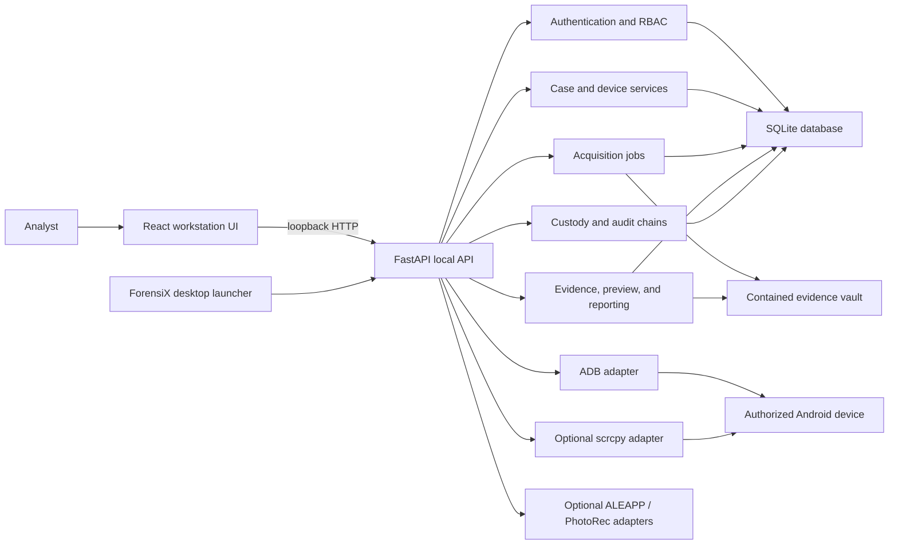

# ForensiX Technical Repository

This document is the technical handover for the ForensiX repository. It maps the source code, runtime architecture, API surface, database schema, dependencies, deployment process, and validation commands.

## 1. Complete Source Code

The complete source is contained in this repository. The primary implementation areas are:

| Area | Location | Responsibility |
| --- | --- | --- |
| Web application | `apps/web/src` | React, TypeScript, routing, workstation UI, evidence and report screens |
| Local API | `apps/api/src/forensix_api` | FastAPI composition root, routers, request validation, authentication dependencies |
| Domain services | `server/src/forensix_server` | Cases, authentication, jobs, acquisitions, evidence, reports, custody, recovery, integrations |
| Android/forensic adapters | `forensic/src/forensix_forensic` | ADB policy, device parsing, artifact providers, media processing, scrcpy and PhotoRec adapters |
| Database schema | `server/src/forensix_server/db` | SQLAlchemy models, SQLite lifecycle, session management, durability settings |
| Migrations | `server/alembic/versions` | Versioned schema migrations `0001` through `0041` |
| Desktop launcher | `apps/api/src/forensix_api/desktop.py` | Loopback server, native WebView window, native file-download bridge |
| Packaging | `packaging`, `scripts/build-release.py` | PyInstaller bundle, web assets, migrations, SBOM, manifest, checksums |
| Tests | `apps/web/src/**/*.test.*`, `apps/api/tests`, `server/tests`, `forensic/tests`, `tests` | Frontend, API, service, adapter, integration, and validation coverage |

## 2. Project Folder Structure

```text
ForensiX/
├── apps/
│   ├── api/                  FastAPI application package
│   └── web/                  React/Vite workstation frontend
├── forensic/                 ADB policies, Android providers, media, recovery adapters
├── server/                   Domain services, SQLAlchemy models, Alembic migrations
├── docs/                     Setup, release, research, and technical documentation
├── packaging/                PyInstaller desktop specification
├── scripts/                  Start, test, install, validation, backup, and release scripts
├── tools/                    Optional local tools such as scrcpy
├── tests/                    Cross-module tests and validation fixtures
├── .github/workflows/        CI and tagged portable-release workflows
├── package.json              Workspace scripts and Node/pnpm requirements
├── pnpm-workspace.yaml       JavaScript workspace definition
├── pyproject.toml            Python tooling, test, Ruff, and mypy configuration
├── requirements-dev.txt      Development and test dependencies
└── requirements-release.txt  Portable-build dependencies
```

The `build/`, `data/`, `.venv/`, `node_modules/`, and `release-*` directories are local working or generated directories. They are not required source modules and should not be treated as the application architecture.

## 3. System Architecture



### Runtime boundaries

- The default desktop application binds the API to `127.0.0.1` and serves the bundled React application from the same origin.
- Authentication, CSRF checks, permissions, case membership, and device ownership are enforced by the API rather than trusted to the browser.
- Browser requests select typed operations and opaque database identifiers. The browser does not submit arbitrary ADB commands or arbitrary remote device paths.
- SQLite stores operational metadata, hashes, jobs, case events, custody events, audit events, and report metadata. Acquired bytes and generated exports live in the contained data directory/vault.
- ADB is the Android transport. scrcpy is started only for an explicitly selected device and requested mirror, control, or documentation action.
- Optional external tools are hash-pinned and capability-gated. Their absence does not prevent the core workstation from starting.

## 4. Major Code Flows

### Application startup

1. `forensix_api.desktop:main` selects a loopback port and data directory.
2. `create_app` composes routers, services, middleware, error handlers, and the database.
3. The database enables SQLite foreign keys, WAL mode, full synchronous writes, and a busy timeout.
4. Alembic upgrades the workstation schema to the current revision and performs restart recovery for jobs and evidence processing.
5. The desktop launcher opens the bundled UI in a native WebView. `--browser` enables browser fallback and `--no-browser` runs the API only.

### Device readiness

1. ADB discovery validates the selected executable and transport state.
2. The device is detected and linked to a case through a case-scoped readiness record.
3. Fixed property/package operations assess Android version, model, authorization, storage access, and provider capabilities.
4. The explicit root probe records whether a root UID is available.
5. The UI exposes only capabilities supported by the current transport, device state, root result, and provider policy.

### Acquisition and evidence

1. An immutable plan binds scope, operator, case, device, and readiness snapshot.
2. A durable job inventories or previews approved providers.
3. The analyst selects permitted records or inventory items.
4. The backend revalidates case, device, root state, capability, and path policy before transfer.
5. Files are streamed into contained storage, hashed, sealed atomically, and registered as evidence with a manifest.
6. Evidence metadata, thumbnails, previews, bookmarks, tags, notes, and verification results remain case-scoped.

### Reports and custody

1. A report snapshot reads the case, acquired files, hashes, capability results, and custody history.
2. PDF, JSON, and CSV outputs are sealed and linked to the case.
3. The analyst can download reports, acquired evidence, custody checkpoints, and either the global or case-specific audit log.
4. Custody and audit events use append-only hash chains. Checkpoint exports are tamper-evident and are not externally anchored until an agency-controlled process preserves or publishes them.

## 5. API Documentation

The API is FastAPI-based and publishes generated documentation when the local service is running:

```text
http://127.0.0.1:8765/docs
http://127.0.0.1:8765/redoc
http://127.0.0.1:8765/openapi.json
```

The desktop launcher uses its selected loopback port instead of always using `8765`. The generated OpenAPI document is the authoritative request/response reference.

### API route families

| Prefix or route family | Purpose |
| --- | --- |
| `/health/*` | Liveness and readiness checks |
| `/api/v1/auth/*` | Bootstrap, login, session, logout, and current-user operations |
| `/api/v1/cases/*` | Case lifecycle, memberships, events, command center, completeness, and case devices |
| `/api/v1/devices/*` | ADB detection, assessment, provider preview, media inventory, live screen, and capture |
| `/api/v1/cases/{case_id}/devices/{device_id}/root-probes` | Explicit rooted/non-rooted access probes |
| `/api/v1/cases/{case_id}/acquisitions/*` | Plans, jobs, inventory, selected file acquisition, progress, cancellation, and recovery |
| `/api/v1/cases/{case_id}/artifacts/*` | Evidence search, metadata, safe previews, content downloads, annotations, bookmarks, and tags |
| `/api/v1/cases/{case_id}/evidence-sources/*` | Evidence Twin imports, verification, working copies, parsers, and tool outputs |
| `/api/v1/cases/{case_id}/reports/*` | Report generation, review, listing, and PDF/JSON/CSV downloads |
| `/api/v1/audit-logs/*` and `/api/v1/cases/{case_id}/audit-logs/*` | Global and case-specific audit listing, verification, and downloads |
| `/api/v1/cases/{case_id}/custody/*` | Custody events, checkpoints, anchors, signatures, and checkpoint downloads |
| `/api/v1/cases/{case_id}/timeline/*` | Deterministic evidence timelines |
| `/api/v1/cases/{case_id}/media/*` | Bounded media analysis and similarity operations |
| `/api/v1/integrations/*` | ADB, scrcpy, ALEAPP, PhotoRec, physical-acquisition, and artifact diagnostics |
| `/api/v1/validation/*` | Controlled validation records and known-answer checks |
| `/api/v1/cases/{case_id}/extractions/*` | Experimental, explicitly gated extraction research endpoints |

Protected routes require the local session and the relevant permission. State-changing requests also require the CSRF token returned by the authentication flow. Errors use the API's structured error envelope and include a request ID for investigation.

## 6. Database Schema

The default database is SQLite at `<data_dir>/forensix.db`. The portable Windows application uses `%LOCALAPPDATA%\\ForensiX`; source runs default to `data/`.

### Schema groups

| Group | Representative tables/models | Purpose |
| --- | --- | --- |
| Platform and jobs | `system_events`, `jobs`, `job_events` | Startup state, durable work, progress, cancellation, restart recovery |
| Authentication | `users`, `roles`, `user_roles`, `auth_sessions`, `auth_events` | Local identity, RBAC, sessions, lockout, and authentication history |
| Cases and devices | `cases`, `case_members`, `case_events`, `case_devices`, readiness and assessment records | Case ownership, membership, device identity, readiness, and lifecycle |
| Root and transport | `device_detection_runs`, `device_capability_runs`, `root_access_probes`, `physical_block_probes` | ADB state, provider decisions, root probes, and experimental probes |
| Acquisition | `acquisition_plans`, `acquisition_inventories`, `acquisition_inventory_items`, `acquired_evidence_files`, `acquisition_partials` | Immutable scopes, inventories, transfers, hashes, and recovery state |
| Evidence | `artifacts`, `artifact_previews`, `evidence_verifications`, `timeline_events`, tags, bookmarks, notes, key evidence | Case-scoped indexing, safe previews, annotation, and integrity verification |
| Evidence Twin | `evidence_sources`, chunks, working copies, inspections, parser runs, tool outputs, recovery records | Verified source imports and bounded offline analysis |
| Reporting and custody | `reports`, `report_outputs`, `report_review_events`, `custody_events`, `custody_checkpoints`, anchors, signatures, `audit_logs` | Report outputs, chain of custody, audit chains, and external-anchor metadata |
| Media and recordings | `media_analyses`, `screen_recording_sessions` | Bounded media analysis and documented scrcpy sessions |

Schema changes are applied by Alembic. Do not edit an existing migration after it has been used; add a new migration under `server/alembic/versions` and run the migration test suite.

## 7. Dependencies and Requirements

### Development

- Node.js 24+ and pnpm 11+
- Python 3.12+
- React 19, TypeScript 6, Vite, Tailwind CSS, TanStack Query, and `lucide-react`
- FastAPI, Uvicorn, Pydantic Settings, SQLAlchemy, Alembic, SQLite, Argon2, ReportLab, and pywebview
- Pytest, pytest-asyncio, HTTPX, Ruff, mypy, PyInstaller, and CycloneDX tooling

The authoritative manifests are `package.json`, `pnpm-lock.yaml`, `requirements-dev.txt`, `requirements-release.txt`, and the `pyproject.toml` files in the Python packages.

### Workstation integrations

- Android SDK Platform-Tools/ADB is required for real-device work.
- The Windows portable release bundles the official scrcpy runtime.
- ALEAPP and PhotoRec are optional external tools and are enabled only with explicit path and SHA-256 configuration.
- USB drivers, device authorization, and Developer Options remain operating-system/device prerequisites.

## 8. Installation and Deployment

### Source checkout

```powershell
pnpm install
python -m venv .venv
.\.venv\Scripts\python.exe -m pip install -r requirements-dev.txt

# Terminal 1: API
$env:FORENSIX_ADB_MODE = "mock"
$env:FORENSIX_MOCK_ADB_SCENARIO = "authorized"
.\.venv\Scripts\python.exe -m uvicorn forensix_api.main:app --host 127.0.0.1 --port 8765

# Terminal 2: frontend
pnpm dev
```

For real-device development, use `scripts/start-forensix.ps1 -AdbPath <path>` on Windows or `scripts/start-forensix.sh` on Linux/macOS.

### Portable release

1. Download the platform ZIP from the GitHub Releases page.
2. Verify `SHA256SUMS.txt` or the archive sidecar checksum.
3. Extract into a trusted local folder.
4. Install Platform-Tools and the correct USB driver.
5. Enable Developer Options and USB debugging, connect an unlocked device, and accept its RSA prompt.
6. Run `ForensiX.exe` on Windows or the platform executable on Linux/macOS.
7. Complete local administrator bootstrap, detect the device, create a case, assess capabilities, and acquire only supported items.

The application is intentionally a local workstation deployment. Plain HTTP is restricted to loopback; it should not be exposed through a public reverse proxy or hosted as an internet-facing service. See [workstation setup](WORKSTATION_SETUP.md) and [release packaging](RELEASE_PACKAGING.md).

### Building a release

```powershell
.\.venv\Scripts\python.exe -m pip install -r requirements-release.txt
.\.venv\Scripts\python.exe scripts/build-release.py --version 1.0.1 --output-dir release
```

The tagged GitHub Actions workflow builds Windows, Linux, and macOS bundles, generates SBOMs and attestations, writes checksums, and publishes the normalized release assets.

## 9. Validation and Quality Checks

```powershell
pnpm lint
pnpm typecheck
pnpm test
pnpm build
.\.venv\Scripts\ruff.exe check .
.\.venv\Scripts\ruff.exe format --check .
.\.venv\Scripts\mypy.exe forensic/src server/src apps/api/src
.\.venv\Scripts\pytest.exe
```

The CI workflow runs the frontend checks and backend checks on every push and pull request. Physical-device validation records are separate from mock validation and must not be represented as equivalent coverage.

## 10. Capability and Research Boundaries

The current product supports capability-gated logical workflows for authorized rooted and non-rooted devices. It does not claim universal private-app extraction, hardware write blocking, locked-device bypass, deleted-data recovery, or support for every OEM/Android security patch level.

The older Android 7-10 and pre-October-2019 track is research-only. APK downgrade, temporary rooting, password brute force, lock bypassing, Qualcomm/EDL extraction, and proprietary Oxygen-style acquisition are not implemented product features. They must remain labelled research or planned until lawful, device-specific implementations and validation evidence exist.
