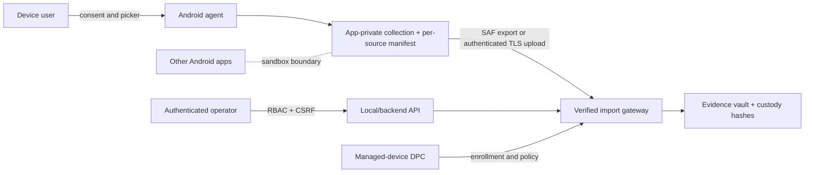

# ForensiX security audit — 2026-09-27

## Scope and evidence

This is a source and focused-test audit of the Android agent, its ADB collector/installer, local API authentication, and APK downgrade path. It is **not** a certification of the whole repository. No physical device, emulator, signed release APK, backend deployment, traffic capture, or authorized target account was available. Dynamic exploitability and Android-version behavior therefore remain unverified. The follow-up [no-ADB review](no-adb-agent-review-2026-09-27.md) records the private-storage, SAF export, and desktop-import changes made after the initial findings.

Focused tests: `py -m pytest forensic/tests/test_agent_apk.py -q` (13 passed); `py -m pytest server/tests/test_auth.py forensic/tests/test_apk_downgrade.py -q` (21 passed). These use fakes for ADB and do not prove device behavior.

## Executive summary

The agent's exported foreground service allowed another installed app to request collection after permissions were granted. The permission callback also started collection after denial. Both paths are now gated by a visible button and permission checks, and the service is no longer exported. The default collection path now uses app-private storage, SAF export, and a desktop importer without ADB. The legacy ADB collector still writes sensitive JSON to `/sdcard/forensix_out`; that direct path is unreliable on modern Android and inappropriate for production evidence handling.

The local API has Argon2 password hashing, per-account lockout, hashed session tokens, CSRF checks, role permissions, and loopback-only plain HTTP configuration. Those controls should be preserved. No general-purpose login abuse test, real-device downgrade test, or release signing verification was performed.

## Attack-surface and data-flow map

| Component | Entry/trust boundary | Observation |
|---|---|
| `MainActivity` | Exported launcher activity | Now requires a visible tap before requesting permissions and starting the service. |
| `AgentService` | Same-app service | Changed `exported` to `false`; reads contacts, SMS, call log, package metadata, device metadata, and shared-storage artifact names. |
| App-private `files/collection` | Agent → user-selected SAF destination | Default no-ADB output; `.fxz` bundle is verified for consistency by the desktop importer. |
| `/sdcard/forensix_out` | Legacy shared external storage | ADB-mode JSON evidence and `DONE` marker remain exposed to device storage policy. |
| `AgentInstaller` / `AgentCollector` | Desktop → ADB → Android | Installs, grants permissions, launches UI, polls `DONE`, pulls JSON. This path requires USB or wireless ADB authorization. |
| FastAPI `/api/v1/auth/*` | Browser → local backend | Bootstrap/login issue cookie sessions; refresh/logout use CSRF checks. |
| Other API routers | Browser → local backend → filesystem/ADB | Many sensitive routes use `require_device_operator`; complete route-by-route authorization was outside this focused audit. |
| APK downgrade extractor | Operator → backend → ADB → third-party package manager | Uses caller-supplied SHA-256 values, captures original APKs, attempts temporary downgrade and restore. Test coverage uses a fake ADB client. |

No agent WebView, receiver, provider, deep link, PendingIntent, agent network client, agent login, agent OTP, or agent cryptography appears in the inspected Android source. These are absent features, not audited controls. The agent asks for `READ_CONTACTS`, `READ_SMS`, `READ_CALL_LOG`, legacy external-storage/media permissions, foreground-service permissions, and `POST_NOTIFICATIONS`. Its sole exported component is the launcher activity after this change. `allowBackup=false` is set.

## Findings and exploitability matrix

### SEC-001 — Exported collection service

- **Severity:** High before the fix; **status:** confirmed in previous manifest/source, fixed in source.
- **Affected component:** `agent_apk/forensix_agent/AndroidManifest.xml` `AgentService`; `AgentService.onStartCommand`.
- **Root cause:** `android:exported="true"` without a caller permission, combined with immediate extraction on start.
- **Preconditions:** Agent installed and its data permissions granted; a second app can address the exported component. Android's foreground-service start restrictions may constrain the exact invocation on newer versions.
- **Reproduction:** On a controlled emulator with a separate test app and granted agent permissions, start the exported service explicitly and inspect whether `DONE`/JSON appear. **Not run here.**
- **Evidence:** Previous source had `exported="true"` and unconditional extraction. No on-device exploit evidence.
- **Impact:** Unauthorized local triggering of sensitive collection, with output in shared storage.
- **Remediation:** Service now has `exported="false"`; UI tap and service-side permission gate added. The desktop launcher opens `MainActivity`.
- **Regression:** `test_agent_service_is_not_exported`, `test_agent_launch_opens_ui_for_user_approval`. Add a real-device negative test from a second app.
- **Exploitability:** Source-confirmed exposure; real-device trigger **unverified**.

### SEC-002 — Sensitive evidence in shared external storage

- **Severity:** High; **status:** confirmed source design, device-specific exploitability unverified.
- **Affected component:** `AgentService.STAGING_DIR`, `AgentCollector`, `AgentInstaller`.
- **Root cause:** Legacy ADB mode serializes contacts, SMS, and call logs as plaintext JSON under `/sdcard/forensix_out` for polling. Default no-ADB mode now uses app-private storage.
- **Preconditions:** Successful collection and another actor with legitimate or elevated access to that shared path.
- **Reproduction:** On a controlled device, collect a synthetic contact/SMS; inspect file access with an unrelated test app under each supported Android version. **Not run here.**
- **Evidence:** `STAGING_DIR` constant and `writeToFile`; collector pulls the same path.
- **Impact:** Evidence disclosure or tampering; direct path may fail under scoped storage.
- **Remediation:** Default mode now uses app-private storage and user-selected SAF export with collection ID and hashes. Legacy ADB shared staging remains open. Exported ZIP files contain unencrypted personal data and require a trusted destination and retention policy.
- **Regression:** Device matrix for API 26, 28, 30, 33, 34+; verify unrelated apps cannot read raw evidence and imports verify hashes.
- **Exploitability:** Source-confirmed exposure; read access on particular devices **unverified**.

### SEC-003 — Permission-denial callback started extraction

- **Severity:** Medium; **status:** confirmed source behavior, fixed in source.
- **Affected component:** `MainActivity.onRequestPermissionsResult`.
- **Root cause:** Callback called `startAgentService()` without inspecting permission state.
- **Preconditions:** User denied one or more requested permissions.
- **Reproduction:** Deny SMS in an emulator and inspect whether service starts. **Not run here.**
- **Evidence:** Previous callback invoked the service unconditionally; current callback checks all core grants and reports denial.
- **Impact:** Partial or misleading collection and security exceptions.
- **Remediation:** Permission check before and inside service. A device UI test is still needed.
- **Regression:** UI denial/regrant test on each supported API family.
- **Exploitability:** Confirmed in previous source; runtime effect **unverified**.

### SEC-004 — USB-debugging-independent transfer path was absent

- **Severity:** High functional/security architecture gap; **status:** source path added, device validation pending.
- **Affected component:** `AgentInstaller`, `AgentCollector`, acquisition pipeline.
- **Root cause:** The original installer/collector use ADB for every step. A separate in-app path now starts via user UI, stores privately, exports with SAF, and imports via CLI.
- **Preconditions:** User has not enabled/authorized debugging.
- **Reproduction:** On a clean non-debug device, attempt the existing agent workflow; no transport exists. **Not run here.**
- **Impact:** No-USB use was previously unavailable. The new user-mediated path still needs APK build/device validation and case-vault integration.
- **Remediation:** Normal installation, visible consent, app-private storage, SAF export, and local hash-verified import are implemented in source. Authentic provenance, case-vault ingestion, and managed-device enrollment remain open.
- **Regression:** End-to-end test with developer options off and no ADB authorization.
- **Exploitability:** Original absence confirmed; new path is source-tested only.

### SEC-005 — Update/integrity validation is not established

- **Severity:** Medium; **status:** potential weakness, no downgrade exploit established.
- **Affected component:** Agent `versionCode 1`, release Gradle config, `AgentInstaller.install`, APK downgrade workflow.
- **Root cause:** No agent update channel, trusted signing-certificate allowlist, trusted release hash, anti-rollback state, or server minimum version is visible. Installer computes the hash of the chosen file, which proves only what was read; it does not authenticate a trusted publisher. The agent installer now uses host-side ADB install without `-d` and checks its exit result; the separate downgrade extractor intentionally retains `-d` for authorized third-party acquisition and accepts hashes provided with the request.
- **Preconditions:** Attacker can influence APK selection/update metadata or operator action; package manager signing and version checks still apply.
- **Reproduction:** Build two **test package** versions with the same signing key, attempt normal replacement and downgrade on an emulator, record actual package-manager result and data state. No real-device test was run; fake ADB downgrade tests are not proof.
- **Impact:** Potential installation of an untrusted or older build if the operator/workflow supplies it and platform rules permit it.
- **Remediation:** Signed release build, protected signing lineage, trusted certificate/public key or pinned release manifest, strictly increasing version policy in backend and client, and explicit recovery policy. Preserve forensic downgrade functionality only behind separate case-scoped authorization and audit trail.
- **Regression:** Test same-signature older/newer, different-signature, tampered APK, reinstall after uninstall, and recovery states on supported APIs.
- **Exploitability:** **Potential**, not lab-confirmed.

### SEC-006 — Completion can misrepresent partial extraction

- **Severity:** Medium; **status:** partly fixed.
- **Affected component:** `AgentService.runExtraction`, individual extraction methods.
- **Root cause:** Previous file-write errors were swallowed and a stale `DONE` marker could remain. These two behaviors are fixed: the desktop clears the marker before opening the UI, the service clears it before work, and write failure prevents new completion. The follow-up no-ADB change records denied/unavailable sources in a manifest and marks imported results partial; some provider/parsing edge cases still need device tests.
- **Preconditions:** Provider denial/error, storage failure, or process interruption.
- **Impact:** Missing evidence could be mistaken for a complete empty result.
- **Remediation:** Per-source success/error manifest, record counts, SHA-256 per output, atomic write/rename, and completion only after verification.
- **Regression:** Inject provider and disk failures; assert failed/partial status and no misleading complete state.
- **Exploitability:** Confirmed reliability defect in source; not an attacker exploit claim.

### SEC-007 — Installed-app inventory overstates visibility

- **Severity:** Low; **status:** potential data-quality issue.
- **Affected component:** `AgentService.extractInstalledApps`.
- **Root cause:** `getInstalledPackages` is used without an Android 11+ package-visibility strategy, yet output is presented as installed-app inventory. Labels such as `shared_storage=available` and `app_export=available` are generated for every package without checking actual access.
- **Impact:** False forensic conclusions.
- **Remediation:** Declare bounded `<queries>` for justified packages, label results as visible subset, derive capability from tested access, and distinguish observed from inferred fields.
- **Regression:** Fixture device with visible and hidden packages on API 30+.
- **Exploitability:** Potential; device confirmation pending.

## APK, authentication, and CVE assessment

**APK:** Android package-manager signing/version enforcement is a platform boundary, but this repository has no test APK pair or signed release to demonstrate its exact behavior. The `apk_downgrade.py` tests validate orchestration with fake dumps and install results. They cannot establish that an old vulnerable app is installable. Do not label the agent vulnerable to APK rollback until an on-device same-signature test and the actual update channel exist.

**Authentication:** `AuthService` uses Argon2, a dummy hash for nonexistent users, per-account failure counters/lockout, random session and CSRF tokens stored as SHA-256 hashes, expiration, rotation, and revocation. API cookies are HttpOnly for sessions, SameSite strict, and Secure in HTTPS mode. Local plain HTTP is restricted to loopback in `Settings`. The focused auth tests passed. No OTP, password-reset, account-recovery, or agent-side account system is present in inspected code. Distributed rate limiting, concurrent login races, and full router authorization need separate load/integration tests; no brute-force weakness is asserted here.

**CVE relevance:** The code contains a CVE-2024-31317-specific extractor, but the [Android June 2024 bulletin](https://source.android.com/docs/security/bulletin/2024-06-01) identifies this as an Android 12–14 platform elevation-of-privilege issue, not evidence that this app is vulnerable. Applicability requires an unpatched lab device and the vulnerability's platform preconditions. Do not run exploit code on user devices; verify patch level and device image in a controlled emulator. Dependency CVE mapping requires a resolved dependency/SBOM scan and vendor advisories; manifest versions alone do not justify a CVE claim.

## USB-independent collection capability map

| Data | Normal-app path and authorization | Managed-device path | Limit |
|---|---|---|---|
| User-selected files | SAF `ACTION_OPEN_DOCUMENT` / `ACTION_OPEN_DOCUMENT_TREE`; explicit system picker; no broad storage grant | Managed file policy where supported | No private data of other apps; Android 11+ restricts some tree roots. |
| Photos/videos | Photo picker or MediaStore with version-specific media grant; user selection/permission | DPC can govern work-profile media | Android 14 selected-photo scope can be partial. |
| Contacts | Contacts provider with `READ_CONTACTS` runtime grant | Work-profile contacts only according to policy | Permission denial and profile boundaries apply. |
| SMS/call logs | Provider with `READ_SMS` / `READ_CALL_LOG` grants, subject to distribution/default-handler restrictions | Enterprise policy does not automatically grant all personal messages | Google Play distribution has additional restricted-permission rules. |
| Installed apps | `PackageManager` with Android 11+ visibility limits | DPC-managed package inventory | Ordinary app cannot assume global inventory. |
| Notifications | `NotificationListenerService` with explicit user special-access grant | Policy-dependent | Only notifications delivered after access; redaction possible. |
| Screen content | `MediaProjection` with user consent per session and foreground service | Enterprise/OEM-specific alternatives | Secure windows can be blocked; no silent capture. |
| Network activity | `VpnService` with user approval, app-level telemetry | DPC network logging on device owner API 26+ or managed profile API 31+ | No guaranteed payload visibility; TLS stays encrypted. |
| Security/system logs | Own-app logs only | DPC security logging for authorized owner/delegated roles | Normal app cannot read system-wide logcat/private app logs. |
| Other apps' private databases/keys | No normal-app API | Generally still isolated; use app export/backup APIs where offered | Device Owner is not root and does not remove sandboxing. |

Android's [Storage Access Framework](https://developer.android.com/training/data-storage/shared/documents-files) supports user-selected import/export without storage permission. [DevicePolicyManager](https://developer.android.com/reference/android/app/admin/DevicePolicyManager) and [Enterprise network logging](https://developer.android.com/work/dpc/logging) define managed-device capabilities and limits. [SMS/call-log default-handler guidance](https://developer.android.com/guide/topics/permissions/default-handlers) affects Play distribution. The no-ADB path is implemented in source but has not been exercised on a device.

## Target architecture and trust boundaries

Treat device content, imported APKs, caller-provided hashes, and operator-supplied paths as untrusted. The backend owns authorization and case scope; the Android package manager owns install/signing enforcement; a normal agent never owns other apps' private data. Bind each collection to an operator/case ID and a user-visible consent record, while keeping raw content out of monitoring events.

## Production-readiness gates

1. Build a complete signed Android project with a reproducible Gradle wrapper, release signing policy, SBOM, and merged-manifest review.
2. Exercise the app-private collection, SAF export, and desktop import on devices without ADB; retire legacy shared staging after its consumers migrate.
3. Run emulator/device matrix tests for permissions, denied/revoked access, scoped storage, package visibility, foreground-service lifecycle, battery, crashes, and collection completeness.
4. Run controlled two-version APK tests for signature mismatch, tampering, downgrade, uninstall/reinstall, and minimum-version policy; record package-manager outputs.
5. Run backend integration tests for all sensitive routes, object-level authorization, concurrent login failures, recovery/session rotation, CSRF, and audit-event minimization.
6. Scan resolved dependencies against vendor advisories and review Android security patch levels before making CVE applicability claims.
7. Establish consent, retention, deletion, encryption/key management, secure export, chain of custody, and monitoring for failed collections and unauthorized access.
